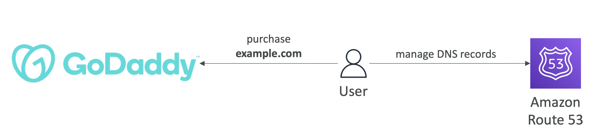
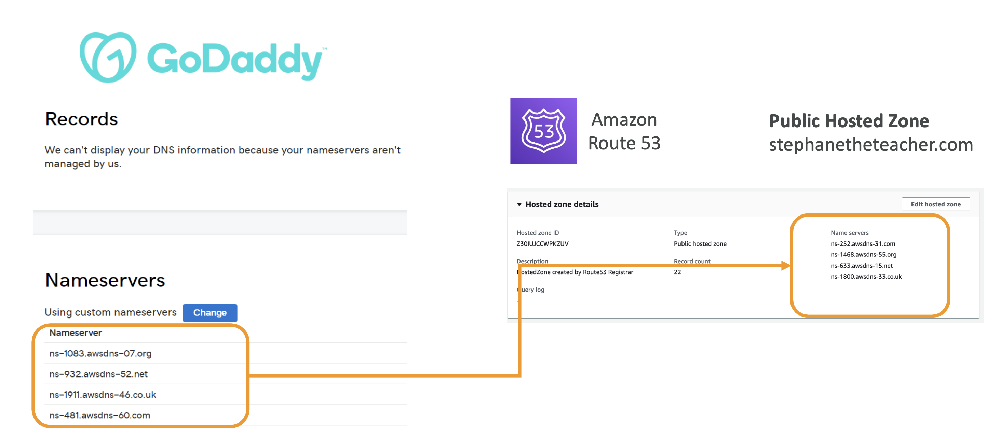

# 3rd Party Domains & Route 53

## Domain Registar vs. DNS Service (이하, 도메인 등록 대행자 vs. DNS 서비스)

- 고객은 주로 연 단위로 도메인 이름을 구매하거나 등록 (e.g., GoDaddy, Amazon Registrar Inc., ... )
- 도메인 등록 대행자는 일반적으로 DNS 서비스를 제공하여 DNS 레코드를 관리할 수 있도록 함
- 그러나 다른 DNS 서비스를 사용하여 DNS 레코드를 관리할 수도 있음
- 가령, **GoDaddy**에서 **도메인을 구매**하고 **Route 53**을 사용하여 **DNS 레코드를 관리**할 수 있음

  

 

## GoDaddy as Registrar & Route 53 as DNS Service

써드 파티 등록 대행자에서 도메인을 구매하고, Route 53을 DNS 서비스 제공자로 사용하는 방법

  

1. GoDaddy에서 **도메인을 등록register**
2. Route 53에서 원하는 도메인에 대한 공개 호스티드 존 생성
3. 호스티드 존 세부 정보의 **네임서버 리스트** 확인
4. GoDaddy에서 등록한 도메인에 대해 네임서버 변경: Route53에서 확인한 네 개의 네임서버 입력

→ GoDaddy가 "어떤 네임서버 사용?"라는 쿼리에 응답할 때 Amazon Route 53의 이름 서버를 가리키게 됨

 

## 3rd Party Registrar with Amazon Route 53

- 만약 써드 파티 등록 대행자에서 도메인을 구매했다면, Route 53을 DNS 서비스 제공자로 사용할 수 있음

1. Route 53에서 공개 호스티드 존을 생성
2. 도메인을 구매한 제3자 웹사이트에서 NS(네임 서버) 레코드를 업데이트하여 Route 53 네임 서버를 가리키도록 설정

즉, **Domain Registrar != DNS Service**

사실, 대부분의 Domain Registrar는 DNS 기능을 제공함

 

# DNS Migration in Route 53

## 사용중인 Route 53을 DNS 서비스로 사용하기 위한 도메인 마이그레이션 (사용자 접근 중)
 
1. 현재 DNS 설정 가져오기 (복제할 레코드)
2. Route 53에서 공개 호스티드 존 생성
3. 새로 생성된 호스티드 존에 모든 레코드 생성
4. NS 레코드의 TTL 설정을 15분으로 낮추기 (롤백을 위해)
5. 새 NS 레코드 TTL이 전파되도록 이틀 기다리기
6. NS 레코드를 Route 53 네임 서버로 업데이트
7. 도메인 트래픽 모니터링
8. Route 53의 NS 레코드 TTL을 더 높은 값(이틀)로 변경
9. 도메인 등록을 Amazon Route 53으로 이전 (선택)

 
