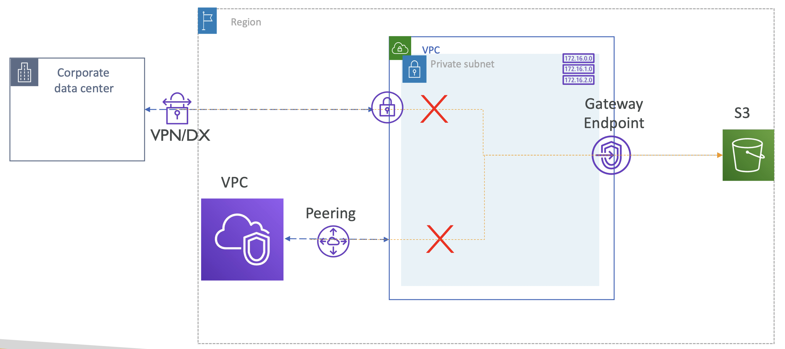

# VPC Gateway endpoint access from Remote Networks

On-premises network 에서 VPC Gateway endpoint에 연결된 S3에 접근할 수 있을까?

  

VPC 내 ENI가 위치하고, 이를 통해 접근한다면, 대부분의 경우 접근 가능할텐데,
VPC Gateway endpoint를 통해서는 우리가 관리할 수 있는 ENI가 없기 때문에 VPC의 Route Table을 수정해야 함

VPN이나 DX를 통해 들어오는 트래픽은 어디로 전송되어야 할지 모름.

- 따라서, VPC Peering로 인입된 트래픽이 Gateway Endpoint를 통해 S3로 전달될 수 없음
- 마찬가지로, VPN/DX로 인입된 트래픽이 VPC Gateway Endpoint를 통해 S3로 전달될 수 없음
