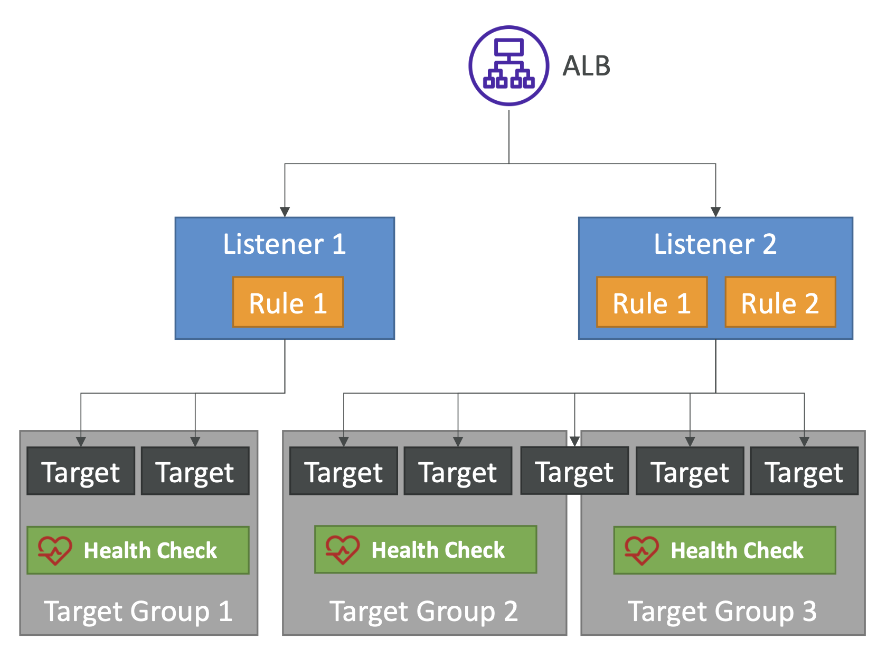
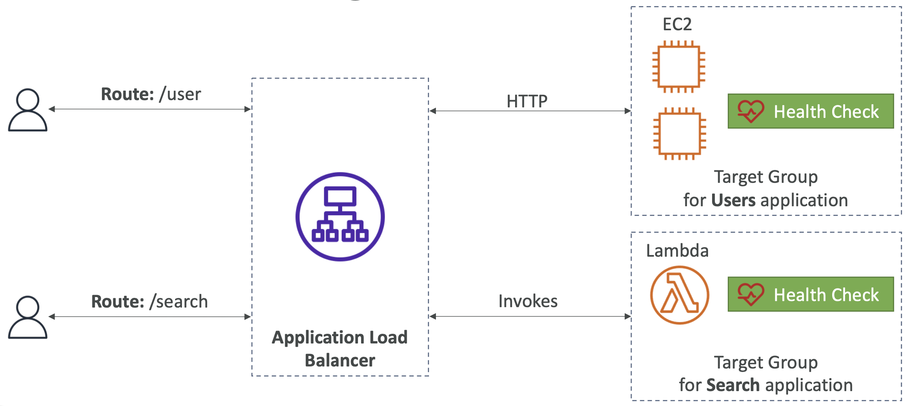
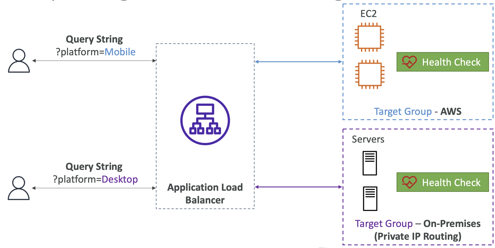
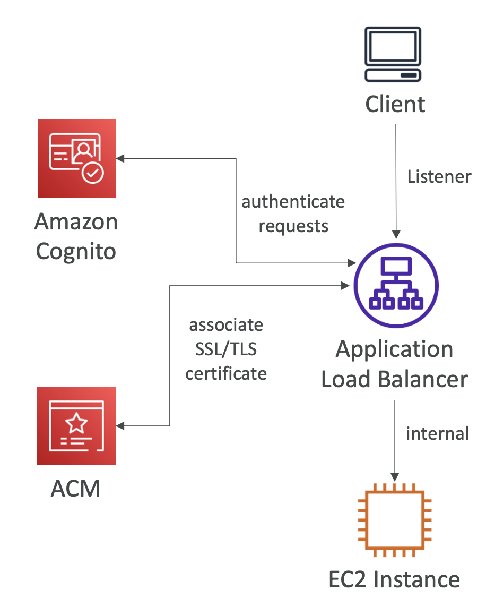
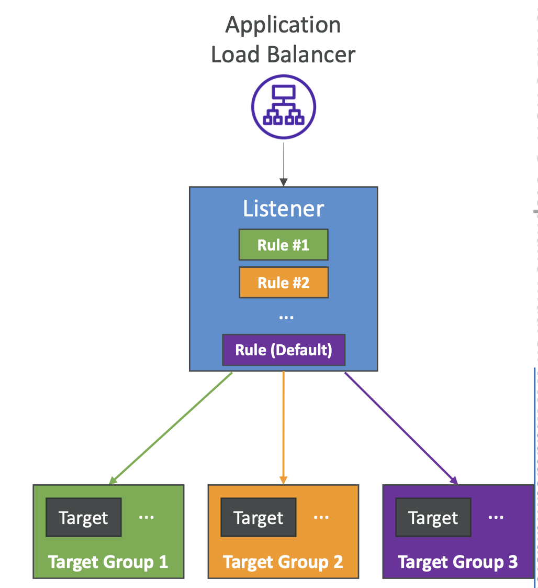
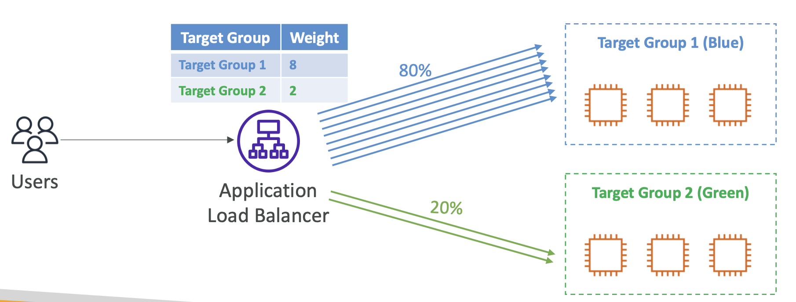

# Application Load Balancer

- Layer 7 (HTTP)에서 작동
- 지원 프로토콜: HTTP, HTTPS, WebSocket, HTTP/2, gRPC
- 머신들 (타겟 그룹) 간에 여러 HTTP 애플리케이션으로 로드 밸런싱
- 동일한 서버에서 여러 애플리케이션/포트를 사용할 때, 동적 포트 매핑 지원하여 로드밸런싱 (e.g. 컨테이너)
- 사용자 정의 HTTP 응답을 반환하는 지원
- 리디렉션 지원 (e.g. HTTP에서 HTTPS로)

  

<pre>
ALB는 여러 개의 리스터를 가질 수 있고, 각 리스너는 하나 이상의 규칙을 가질 수 있음.
위 예시에서, 리스너 1은 하나의 규칙을 가지고 있고, 그 규칙은 트래픽을 타겟 그룹으로 보내는 것일 수 있음.
타겟은 예를 들어 EC2 인스턴스일 수 있고, 헬스 체크도 가질 수 있음.
<small>* 타겟 그룹은 여러 개의 타겟을 가질 수 있고, 때로는 타겟 그룹 간에 타겟이 공유되기도 함. 또, 헬스 체크를 가질 수 있음.</small>

리스너 2는 두 개의 규칙을 가지고 있고, 각 규칙은 서로 다른 타겟 그룹으로 트래픽을 보낼 수 있음.
리스너는 HTTP, HTTPS, WebSocket, HTTP/2 및 gRPC 프로토콜을 지원함.
</pre>

 

## Application Load Balancer

- Target Groups
  - **EC2 Instances** (can be managed by an Auto Scaling Group (이하 ASG)) – HTTP 
  - **ECS Tasks** (managed by ECS itself) – HTTP
  - Lambda functions – HTTP request를 JSON event로 변환
  - IP Addresses – private IP addresses만 가능 (e.g., EC2 instances in peered VPC, on-premises servers accessed over AWS Direct Connect or VPN connection)
- Weighted Target Groups 지원
  - e.g. 여러 버전의 애플리케이션, blue/green deployment
- 헬스 체크는 HTTP 또는 HTTPS일 수 있음 (WebSocket은 지원하지 않음)
- 각 서브넷은 최소 `/27`과 8개의 여유 IP 주소를 가져야 함
- 모든 서브넷에서 ALB당 최대 100개의 IP 주소를 사용할 수 있음

 
<pre>
🚨 기억할 부분
- 최소 <b><code>/27</code></b> 범위의 서브넷이 필요하고, 할당되지 않은 IP 최소 <b>8개</b>라는 점
- ALB당 <b>모든 서브넷</b>에 걸쳐 <b>최대 100개의 IP 주소</b>를 사용할 수 있음
</pre>
 

## Application Load Balancer

- 서로 다른 타겟 그룹들로 트래픽을 라우팅
  - URL Path에 따라 라우팅
    - <code>example.com<b>/users</b></code>, <code>example.com<b>/posts</b></code>
  - Hostname에 따라 라우팅
    - `one.example.com`, `other.example.com`
    - `*.example.com`, `example.com`
  - Query String, HTTP Headers, Source IP Address에 따라 라우팅
    (example.com/users?**id=123&order=false**)
- ALB는 마이크로 서비스 및 컨테이너 기반 애플리케이션에 적합함 (e.g., Docker & Amazon ECS)
- **포트 매핑 기능**이 있어 ECS에서 동적 포트로 리디렉션할 수 있음
  - **vs. Classic Load Balancer**: 애플리케이션당 여러 개의 Classic Load Balancer가 필요함

 

## Application Load Balancer Path-based Routing

  

ALB에 두 개의 타겟 그룹이 있을 때, 
첫 번째 타겟 그룹은 EC2 인스턴스의 타겟 그룹이고,
두 번째 타겟 그룹은 Lambda 함수의 타겟 그룹이라고 가정.

이 때, Route `/user` 로 들어오는 모든 사용자를 사용자의 타겟 그룹으로 라우팅하고,
Route `/search`로 들어오는 모든 사용자를 Lambda 타겟 그룹으로 라우팅할 수 있음.

 

## Application Load Balancer Query String/Parameters Routing

  

Query String 이나 Parameters 를 기반으로 라우팅할 수 있음.

ALB에 두 개의 타겟 그룹이 있을 때, 
첫 번째 타겟 그룹은 EC2 인스턴스의 타겟 그룹이고,
두 번째 타겟 그룹은 On-Premise 서버의 타겟 그룹이라고 가정.

- 쿼리 문자열이 `platform=Mobile`인 경우, ALB는 EC2 인스턴스의 타겟 그룹으로 트래픽을 라우팅
- 쿼리 문자열이 `platform=Desktop`인 경우, On-Premise 서버의 타겟 그룹으로 트래픽을 라우팅.

 

## Application Load Balancer

- 등록된 타겟으로 요청을 전달하기 전에 사용자를 인증할 수 있는 기능
  - Amazon Cognito User Pools 및 Identity Providers
  - Microsoft Active Directory, OIDC, SAML, LDAP, OpenID
  - 소셜 ID 공급자 (Amazon, Facebook, Google)
- TLS 인증서 (여러 리스너 및 SNI)

  

| Listener                      | Internal                                           |
| ----------------------------- | -------------------------------------------------- |
| HTTP                          | HTTP or HTTPS (Must install certificate on target) |
| HTTPS – SSL Termination (ACM) | HTTP or HTTPS (Must install certificate on target) |

 

## ALB - Listener Rules

- 순서대로 처리됨 (마지막은 Default Rule)
- 지원되는 액션 (forward, redirect, fixed-response)
- 규칙 조건:
  - host-header
  - http-request-method
  - path-pattern
  - source-ip
  - http-header
  - query-string

  

 

## Target Group Weighting

- ALB는 하나의 규칙에 대해 각 타겟 그룹에 대한 가중치를 지정할 수 있음
- **애플리케이션의 여러 버전**하거나 **blue/green 배포** 등에 유용함
- 애플리케이션에 대한 트래픽 분배를 제어할 수 있음

  

 

