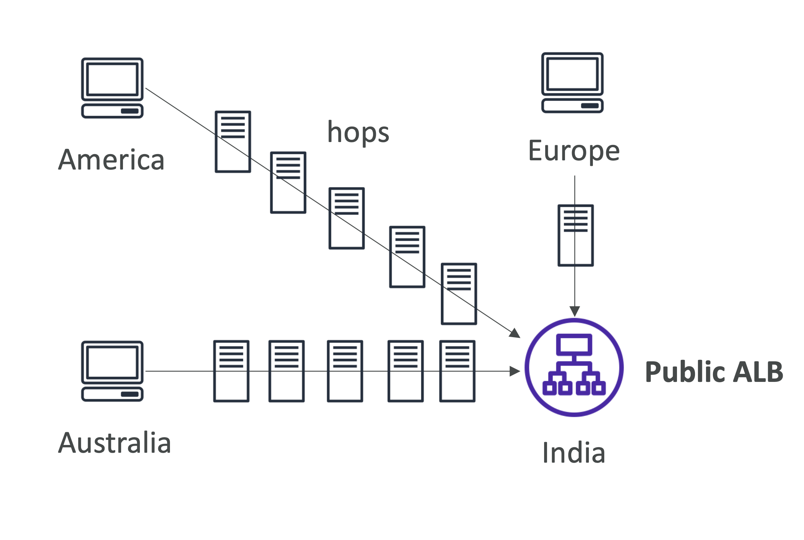
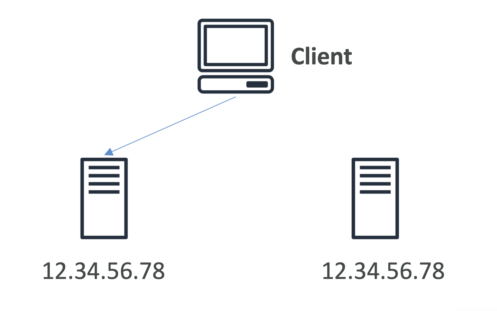
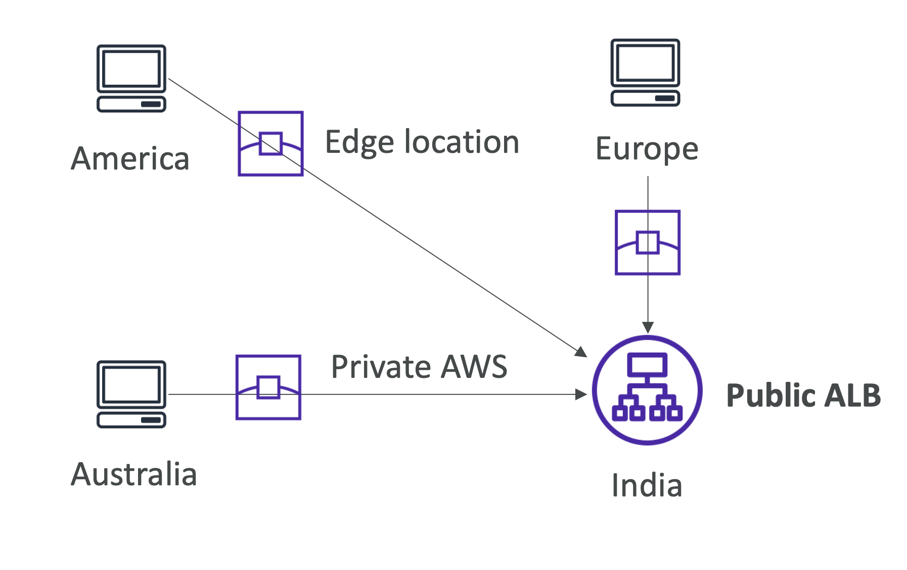

# AWS Global Accelerator

## Global users for our application

- 전세계 사용자들이 애플리케이션에 접근할 수 있도록 배포
- 퍼블릭 인터넷을 통해 접근하는데, 많은 홉을 거치기 때문에 지연시간이 발생
- AWS 네트워크를 통해 지연시간을 최소화하고 싶음

  

**Example.**
- Inda에 Public ALB가 있고, America, Europe, Australia 내 여러 나라에서 해당 ALB에 접근하고 싶음
- 많은 홉들을 지나쳐야 하고, 가면서 커넥션을 읽을 수도 있음
- → **AWS Global Accelerator** 로 해결

 

### Unicast IP vs Anycast IP

<table>
<tr>
<th>Unicast IP</th>
<th>Anycast IP</th>
</tr>
<tr>
<td>Unique Sender and Sole Receiver</td>
<td>Sender to Individual Representative of a Group</td>
</tr>
<tr>
<td></td>
<td></td>
</tr>
<tr>
<td>하나의 서버가 하나의 IP 주소를 가짐</td>
<td>모든 서버가 동일한 IP 주소를 가지고 있으며, 클라이언트는 가장 가까운 서버로 라우팅됨</td>
</tr>
</table>

 

### AWS Global Accelerator

- AWS 인터널 네트워크를 활용하여 애플리케이션으로 라우팅하도록 레버리지하는 서비스

1. **2개의 Anycast IP**가 생성되어 애플리케이션으로 트래픽을 전송
2. Anycast IP는 트래픽을 **엣지 로케이션으로 직접** 전송
3. 엣지 로케이션은 애플리케이션으로 트래픽을 전송

  

<pre><b>India에 있는 ALB에 접근하고 싶다고 가정</b>
다른 나라에서부터 (America, Australia, Europe, ...) AWS 네트워크를 통해 가장 가까운 엣지 로케이션으로 바로 접근. 
내부적으로는, 애플리케이션을 위해 두 개의 Anycast IP가 생성되는데, 전 세계에서 접근이 가능하도록 글로벌로 생성됨.
Anycast IP는 사용자에게 가장 가까운 엣지 로케이션으로 트래픽을 전송. 이후 엣지 로케이션에서 트래픽을 애플리케이션으로 전송.
프라이빗 AWS 네트워크를 통하기 때문에 지연시간이 적고 안정적임.
그림에서는 ALB를 한 리전에 두고 있지만, 여러 리전에서 여러 ALB를 가질 수도 있음.
</pre>

 

### AWS Global Accelerator
- Elastic IP, EC2 instances, ALB, NLB 와 함께 동작하고, public 하거나 private 할 수 있음
- **Consistent Performance**
  - 지능형 라우팅: 가장 낮은 지연시간으로 라우팅하고, 빠른 리전 장애 조치 가능
  - 클라이언트 캐시 문제 없음 (IP가 바뀌지 않기 때문)
  - AWS 내부 네트워크를 사용
- **Health Checks**
  - Global Accelerator는 애플리케이션의 헬스 체크를 수행
  - 애플리케이션을 글로벌하게 만들 수 있음 (헬스 체크를 통해 1분 이내에 장애 조치 가능)
  - 훌륭한 재해 복구 (disaster recovery, 헬스 체크 덕분)
- **Security**
  - 단 2개의 외부 IP 주소만 화이트리스트에 추가하면 됨
  - AWS Shield 덕분에 DDoS 공격으로부터 보호됨

### AWS Global Accelerator vs. CloudFront
- AWS Global Accelerator와 CloudFront는 모두 AWS 글로벌 네트워크와 전 세계의 엣지 로케이션을 사용
- AWS Shield와 통합되어 DDoS 보호 기능 제공

- **CloudFront**
  - **캐시 가능한 콘텐츠**와 **동적 콘텐츠**의 성능 개선
    - e.g. **캐시 가능한 콘텐츠**: 이미지, 비디오 등
  - **동적 콘텐츠**: API 가속화 및 동적 사이트 배포 시
  - 콘텐츠는 엣지에서 제공됨
- **Global Accelerator**
  - TCP 또는 UDP를 통해 다양한 애플리케이션의 성능을 개선
  - 엣지에서 애플리케이션으로 패킷을 프록시함
  - 게임(UDP), IoT(MQTT), VoIP와 같은 HTTP를 사용하지 않는 사례에 적합
  - HTTP 이용 사례에 적합
    - 정적 IP 주소가 필요한 경우
    - 결정론적이고 빠른 리전 장애 조치가 필요한 경우

 