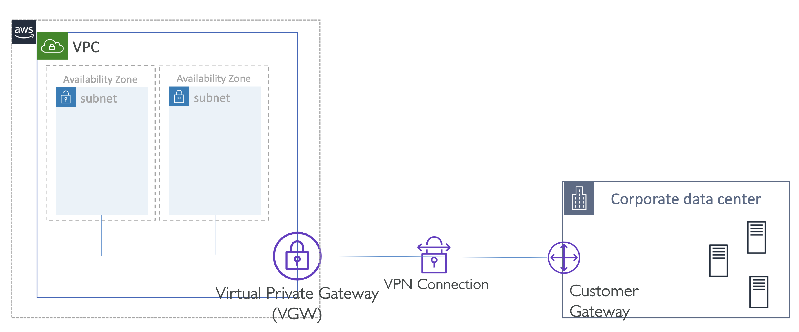
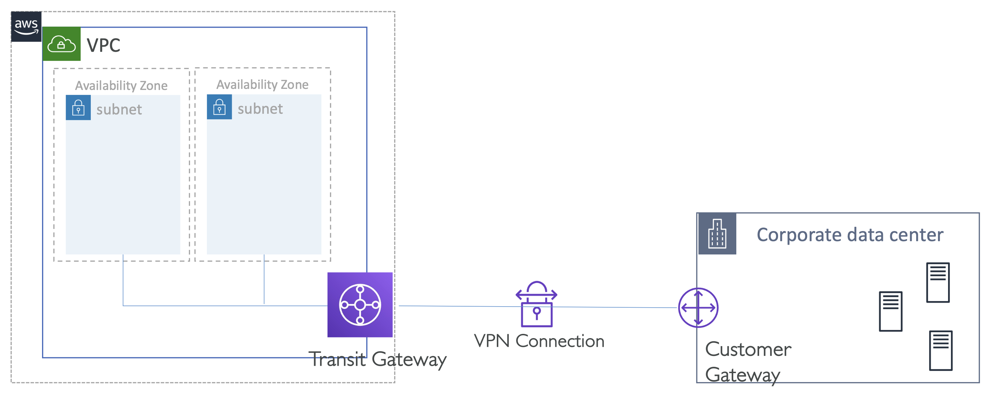
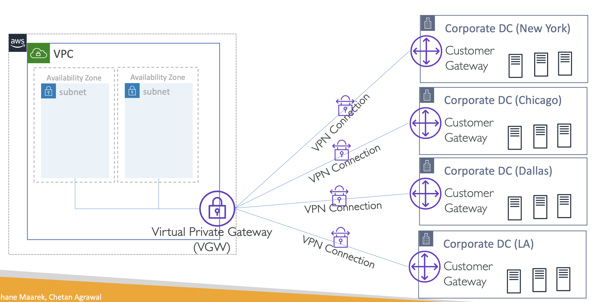
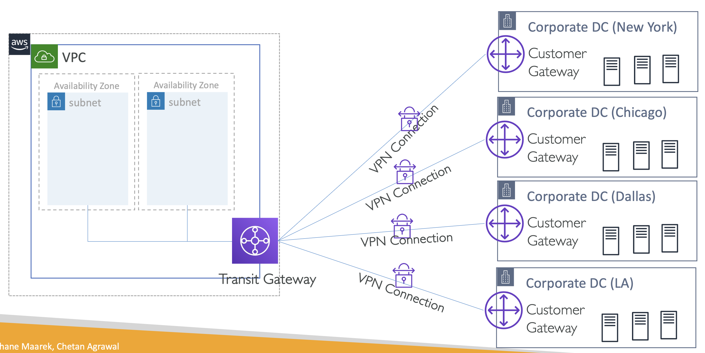
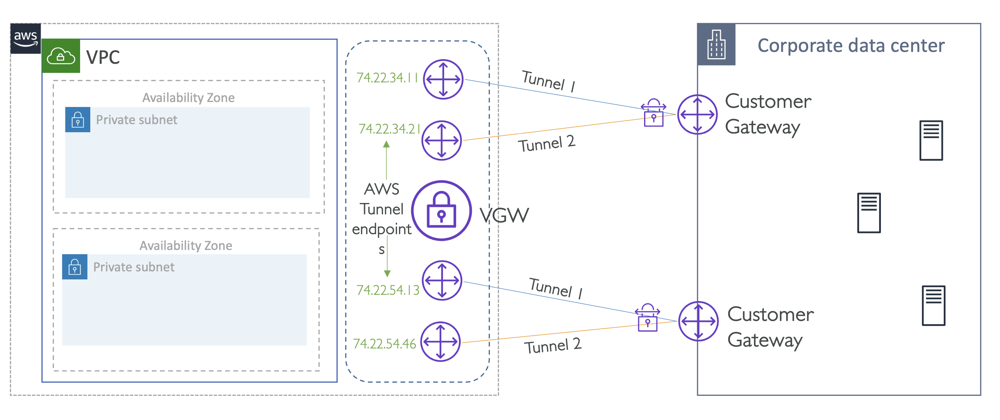

# AWS Site-to-Site VPN Architectures

- VGW: Virtual Private Gateway, 가상 프라이빗 게이트웨이. (이하 VGW)
- Customer Gateway, 고객 게이트웨이. (이하 Customer Gateway)
- Transit Gateway: 트랜짓 게이트웨이. (이하 Transit Gateway)

VPN 연결의 고가용성과 여러 데이터 센터 또는 사무실의 지점을 AWS VPC에 다중 연결을 사용하는 방법을 다룸.

 

## 1. **Single Site-to-Site VPN connection**

VGW를 사용하여 AWS VPC를 사내 네트워크 또는 데이터 센터에 연결.

  

 

### with Transit Gateway

여러 VPC를 온프레미스 네트워크에 연결하기 위해 가상 프라이빗 게이트웨이를 전송 게이트웨이로 대체

  

- Transit Gateway가 동일한 기능을 수행하기 때문에 **대체 가능**.

 

## 2. Multiple Site-to-Site VPN connections to branch offices

하나의 VPC가 여러 지점 사내망에 연결되어 각 지점이 자체 고객 게이트웨이를 가짐.

  

- 여러 개의 가상 VGW는 필요하지 않음.
- VPC에 하나의 가상 프라이빗 게이트웨이만 첨부하면 되며, 다중 VPN 연결이 동일한 게이트웨이에 연결(Terminate)될 수 있음.
- 각 VPN 연결은 동일한 게이트웨이를 통해 관리됨.
- 대역폭 제한(1.25 Gbps)

  

- Transit Gateway는 더 많은 대역폭을 처리할 수 있어, 다중 연결 시 더 나은 옵션.

 

## 3. Redundant VPN connections for High Availability

고가용성을 보장하기 위해 여러 Customer Gateway를 배치

여러 고객 게이트웨이와 이중 Site-to-Site VPN 연결을 통해 유지보수 또는 게이트웨이 장애 이후에도 지속적인 연결을 보장하는 설정

  

- 네 개의 터널 제공
- Customer Gateway가 다운되거나 유지보수가 필요한 경우에도 연결을 보장

https://docs.aws.amazon.com/pdfs/vpn/latest/s2svpn/s2s-vpn-user-guide.pdf

