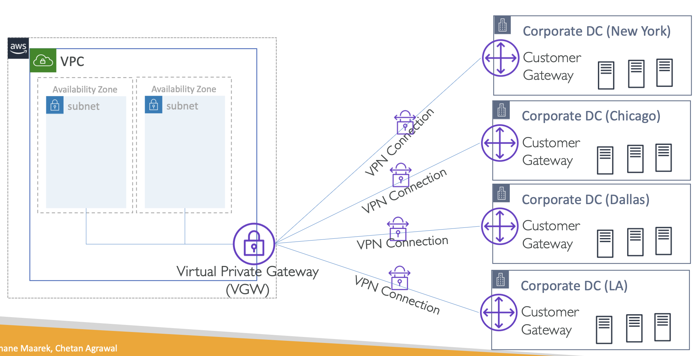
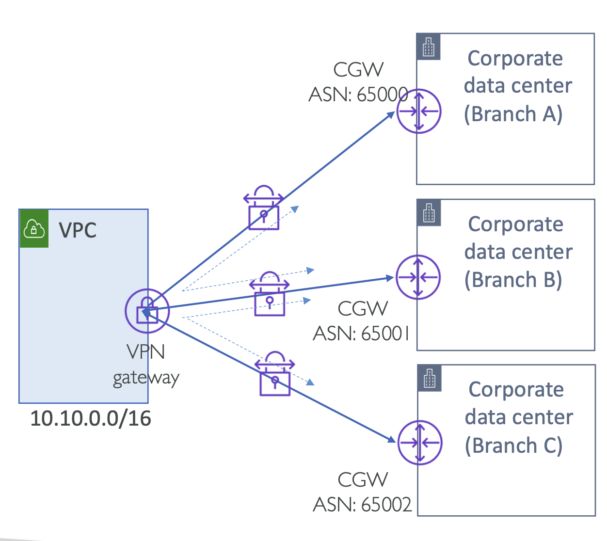
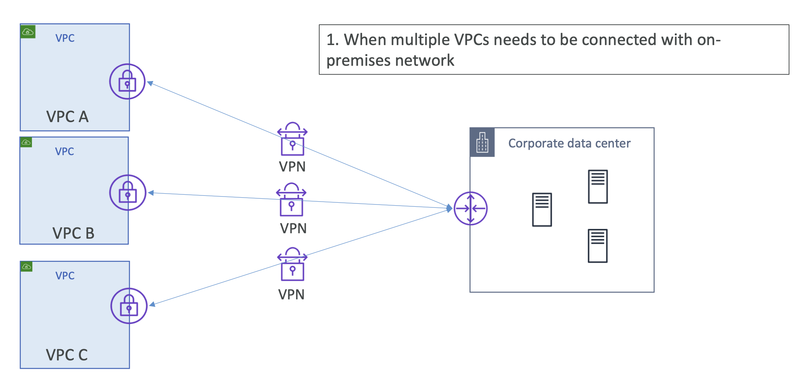
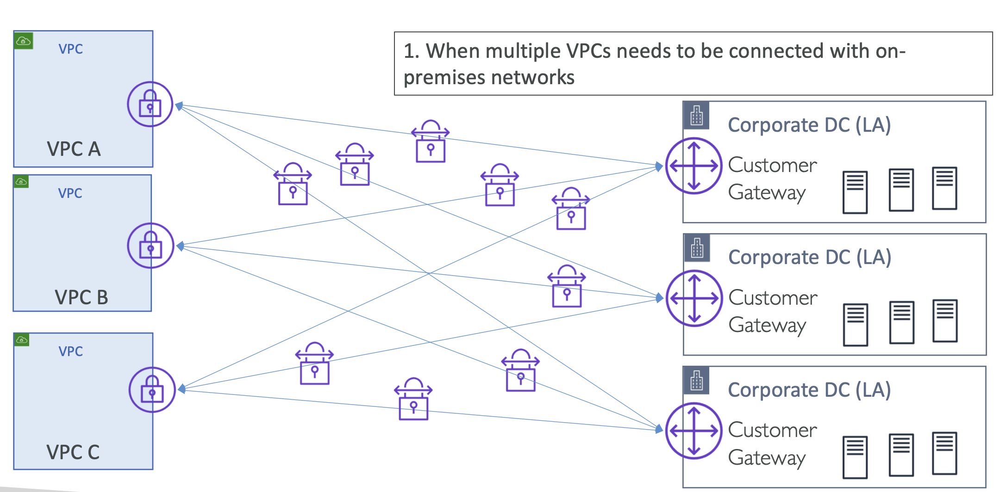
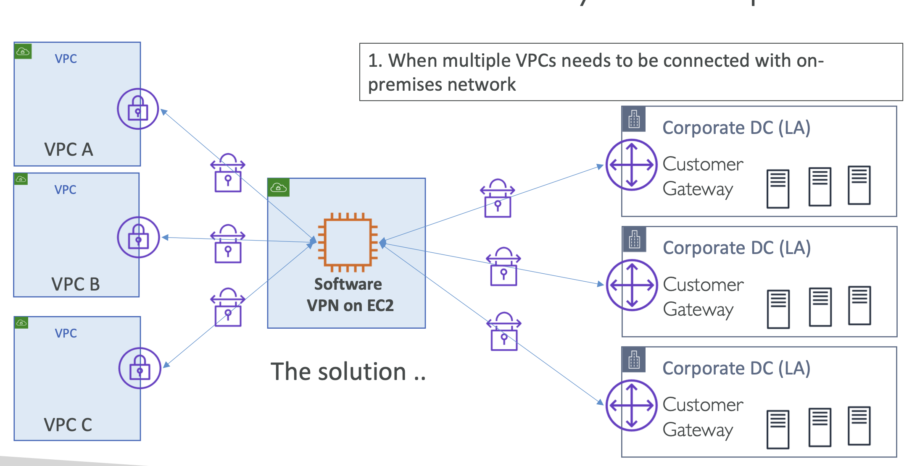
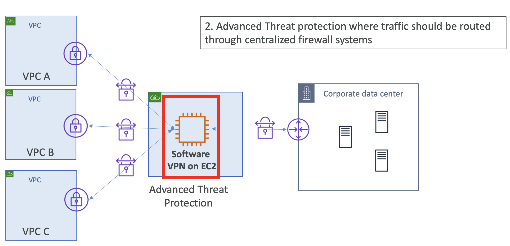
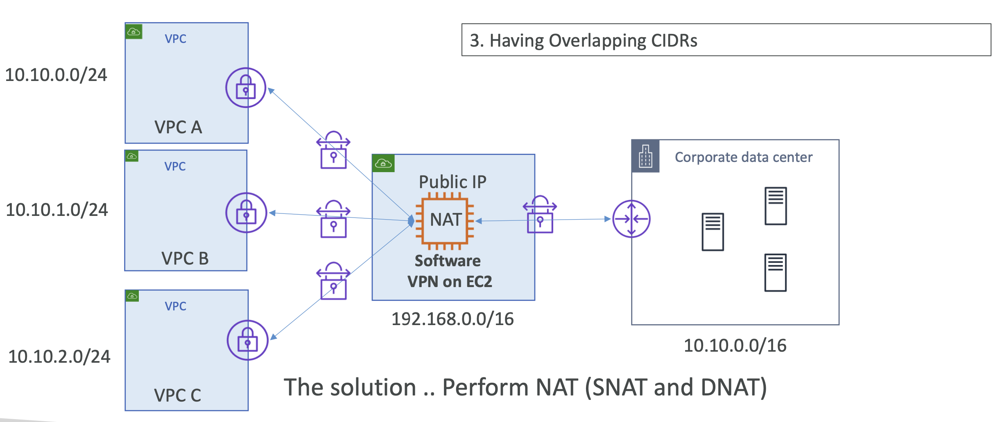
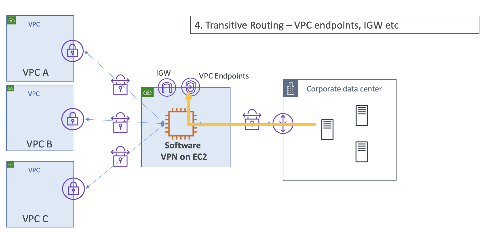
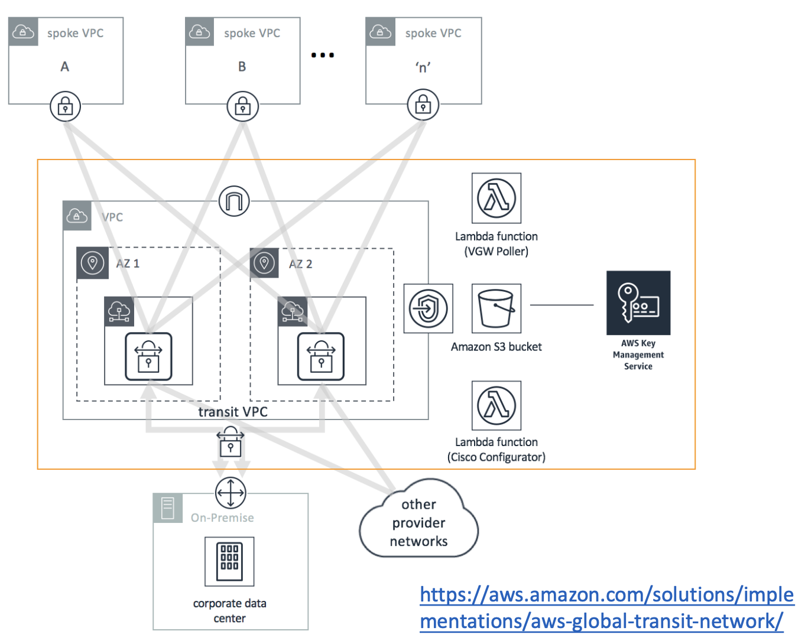
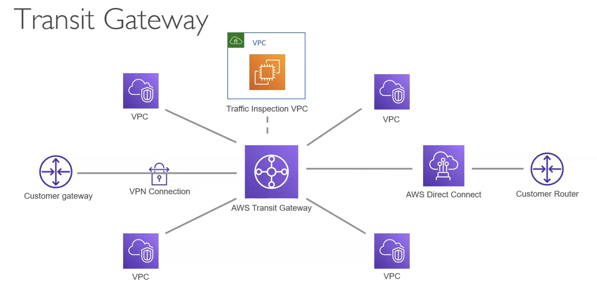

# AWS Transit VPC architecture using VPN connections

Transit VPC는 아키텍처에 가까움

지금까지 확인한 아키텍처를 살펴보면 아래와 같음

 
<table>
<tr>
<th>Multiple Site-to-Site VPN Connections using VGW</th>
<th>VPN CloudHub – Routing between multiple customer sites</th>
</tr>
<tr>
<td></td>
<td></td>
</tr>
</table>
 

**여러 VPC들이 On-Promise 네트워크에 연결되어야 할 때**

아래와 같은 구조가 될 것

  

최소 세 개의 VPN 연결이 필요하며, 작은 규모의 데이터 센터에 적합함.

하지만 규모가 커지면 모든 연결을 관리하는 것이 어려움.

  

9개의 VPN 연결이 필요해짐 

→ **Solution: Transit VPC** ⎯ **AWS 관리 VPN과 EC2 기반 VPN을 함께 사용**하여 해결할 수 있음

 

### Usecase 1. 중앙집중식 라우팅

  

**Transit VPC**는 모든 VPN 연결을 **소프트웨어 VPN이 설치된 EC2 인스턴스**로 연결(Terminate).

- **AWS VPCs -🔗- Software VPN on EC2**: AWS VPC 측에서는 모든 연결이 Virtual Private Gateways를 통해 관리됨
- **Software VPN on EC2-🔗- Data Centers**
  - Customer Gateway 혹은
  - EC2 인스턴스에 종료되는 VPN 연결은 사용자 정의 설정 (EC2 기반 VPN)

→ **중앙집중식 라우팅:** 단일 네트워크에서 모든 라우팅을 중앙 집중적으로 관리할 수 있게 해줌

 

### Usecase 2. Advanced Threat Protection software

  

중앙 방화벽 시스템으로 통해야 할 모든 트래픽을 처리할 때,
**고급 위협 보호 소프트웨어를 Transit VPC의 중앙집중된 EC2 인스턴스에 배포**해서 처리할 수 있음.

 

### Usecase 3. Having Overlapping CIDRs
 
  

**중첩 CIDR:** NAT을 구성하여 EC2 인스턴스에서 중첩 CIDR을 처리

 

### Usecase 4. Transitive Routing – VPC endpoints, IGW etc

  

피어 VPC, VPC 엔드포인트 및 기타 AWS 서비스에 대한 접근을 허용.

VPC 엔드포인트 타입이 다른 S3나 DynamoDB 서비스도 연결될 수 있음

 

### Usecase 4. Client to Site Connection

**Client-to-Site VPN:** 단일 Client-to-Site VPN 연결을 통해 여러 VPC에 접근할 수 있음.

여러 VPC가 있으면서, 클라이언트 머신에서 프라이빗하게 접근하고 싶을 때 활용할 수 있음

 

## Transit VPC scenarios

1. 여러 VPC를 온프레미스 네트워크와 연결해야 할 때
2. 중앙 집중식 방화벽을 통한 고급 위협 방어(Advanced Threat protection)가 필요할 때
3. CIDR가 중복되는 온프레미스 네트워크와 연결해야 할 때
  - Transit VPC는 NAT 역할을 수행하여 IP 주소를 변환하고, 중복된 CIDR을 가진 네트워크 간 통신을 가능하게 함.
4. 원격 네트워크(Spoke VPC 또는 온프레미스 네트워크)가 Transit Hub VPC 내 엔드포인트에 접근해야 할 때
5. 클라이언트-사이트 VPN을 통한 접속이 필요할 때, 개별 클라이언트 디바이스가 VPN 연결을 통해 Transit VPC 내 EC2 인스턴스에 직접 접근할 수 있음.

 

## Transit VPC architecture for Transit Hub

Transit Hub는 VPN 종단과 Direct Connect 연결을 처리하여 VPC 및 온프레미스 네트워크 간의 완전 메쉬 통신을 제공

  

- **Hub/Transit VPC**: VPN 소프트웨어 (가령, PaloAlto, Avitarix, CheckPoint etc)을 설치한 EC2, HA를 위한 multi AZ
- 각 Spoke VPC는 VPN 종점(termination)으로 VGW를 가짐 
- On-premise 는 이 Transit Hub에 VPN connection 연결(establish) 
- Direct Connect을 대신 사용할 수 있음
- VPC, On-premise VPN, AWS Direct Connect 사이 모든 풀 매시 연결 허용 

https://aws.amazon.com/solutions/implementations/aws-global-transit-network/

→ `이 솔루션 구현은 더 이상 제공되지 않습니다.`?!

  

=> **Transit Gateway로도 해결할 수 있음**.

Transit VPC가 지원하는 것과 거의 동일하게, Transit Gateway는 VPC 연결, VPN 또는 Direct Connect 연결, 중앙에서 인스펙션 설정을 지원.

그러나 중첩 네트워크 주소(Overlapping Network Address) 같은 시나리오에서는 여전히 Transit VPC가 유효.

