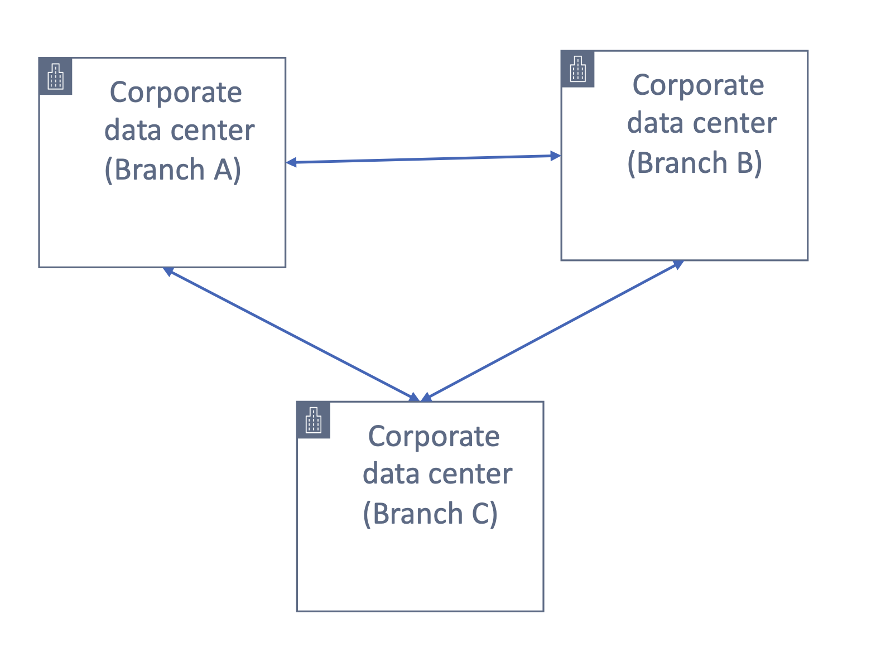
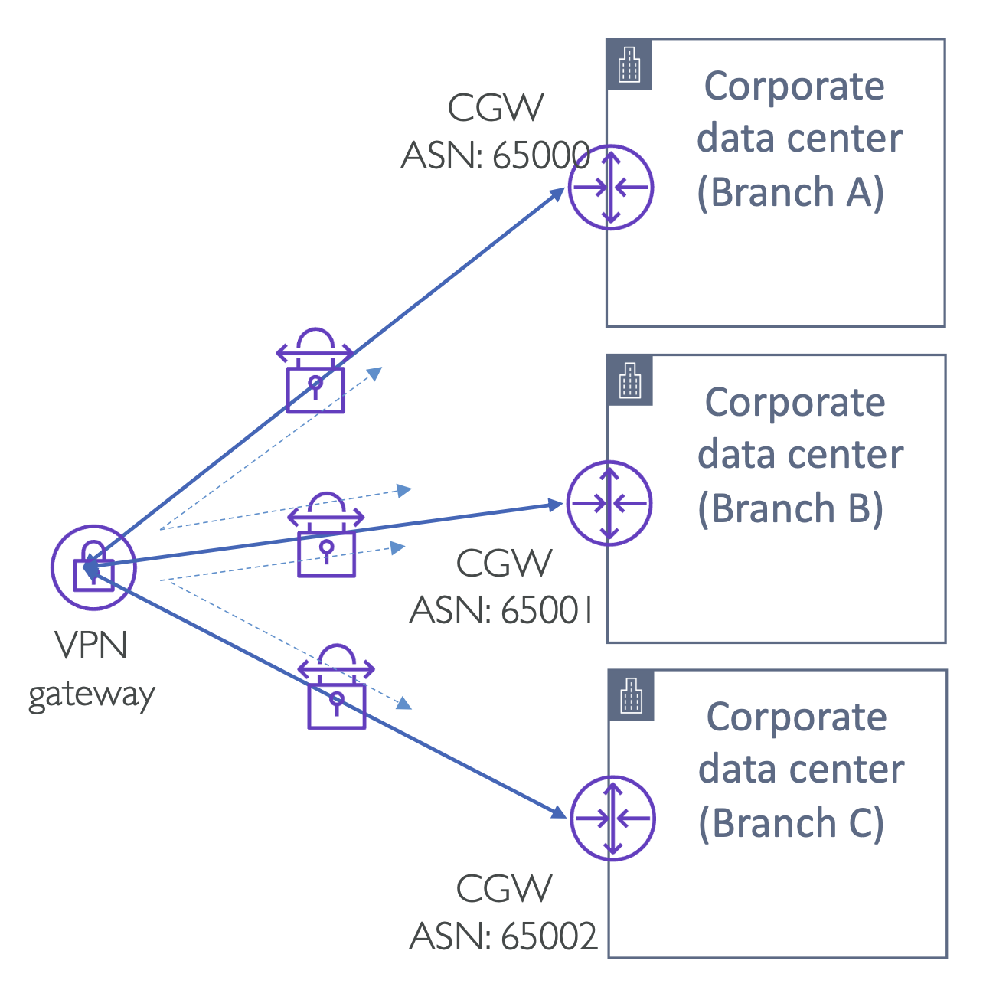
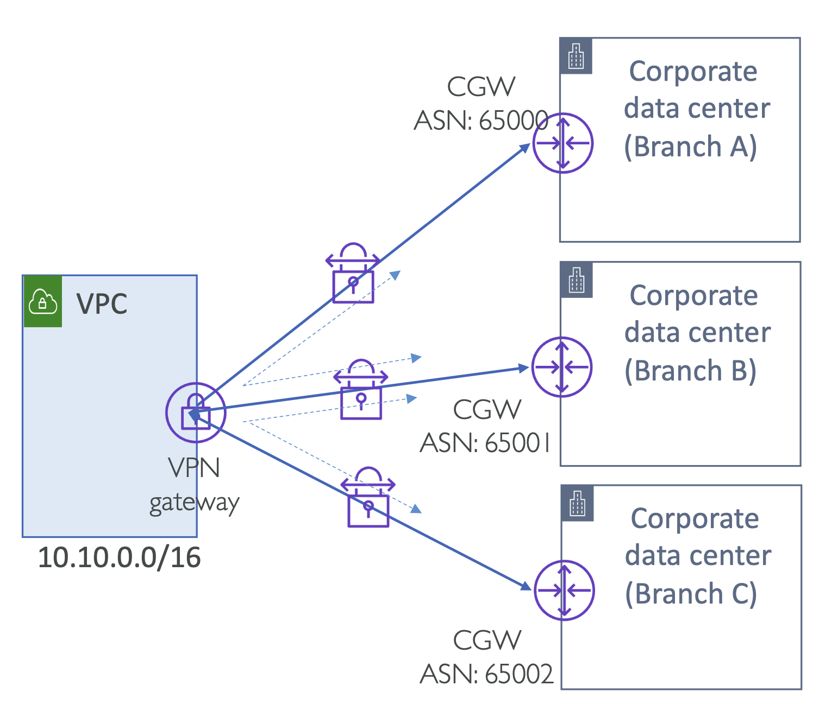

# AWS VPN CloudHub

여러 데이터센터 지점이 있다고 가정.

다른 데이터센터 네트워크에서 기업 데이터 센터에 배포된 리소스나 서버 또는 애플리케이션에 접근할 수 있어야 하기 때문에 지점 간 VPN 연결이 필요.

  

- 일반적으로 데이터 센터는 1:1 VPN 연결을 사용하여 연결하거나, A~B, B~C, A~C를 연결하거나, 트랜짓 라우팅을 사용할 수 있음.
- 혹은, AWS의 가상 프라이빗 게이트웨이(VGW)로 **클라우드 허브**로 제공할 수 있음.
- 즉, 허브는 클라우드에 위치하며 모든 지점을 클라우드 허브에 연결.

 

## VPN CloudHub – Routing between multiple customer sites

- VPN 게이트웨이는 분리된 모드에서 작동하여 IPSec VPN 연결을 사용하여 지사 사무실만 연결되는 클라우드 허브 아키텍처를 제공.
- 각 지점 별 데이터센터와 VPN 게이트웨이가 있으며, 각 지점을 IPSec VPN을 사용하여 연결

  

- '분리된 모드'의 VPN Gateway 사용
  - VPN Gateway를 VPC에 연결하지 않고 작동
- 각 customer gateway는 반드시 유니크한 BGP ASN를 가지면서 동적 라우팅이 활성화되어 있어야 함
- 각 지점의 IP 범위는 절대 겹치면 안됨
- 10개 까지의 Customer Gateways 연결 가능
- on-premises 지점 간 failover 연결로써 동작가능

  

- VPN gateway는 또한 VPC를 붙여 통신할 수도 있음
