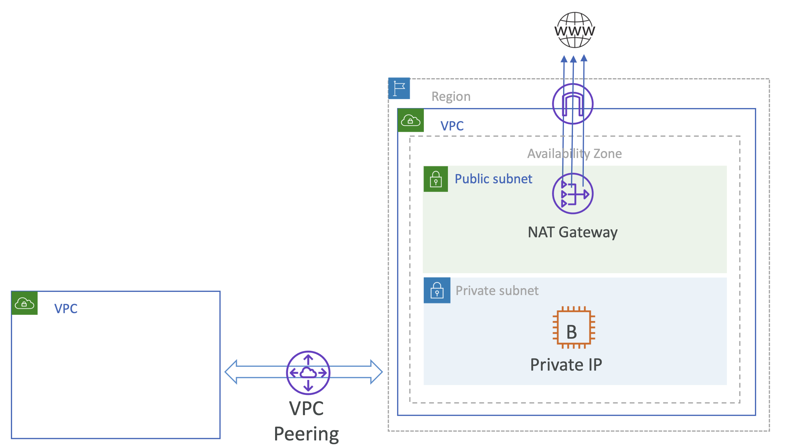
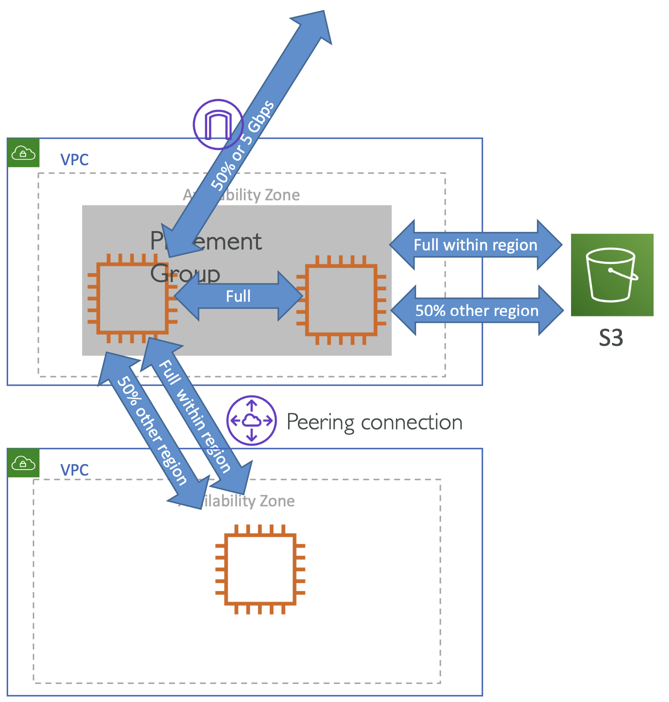
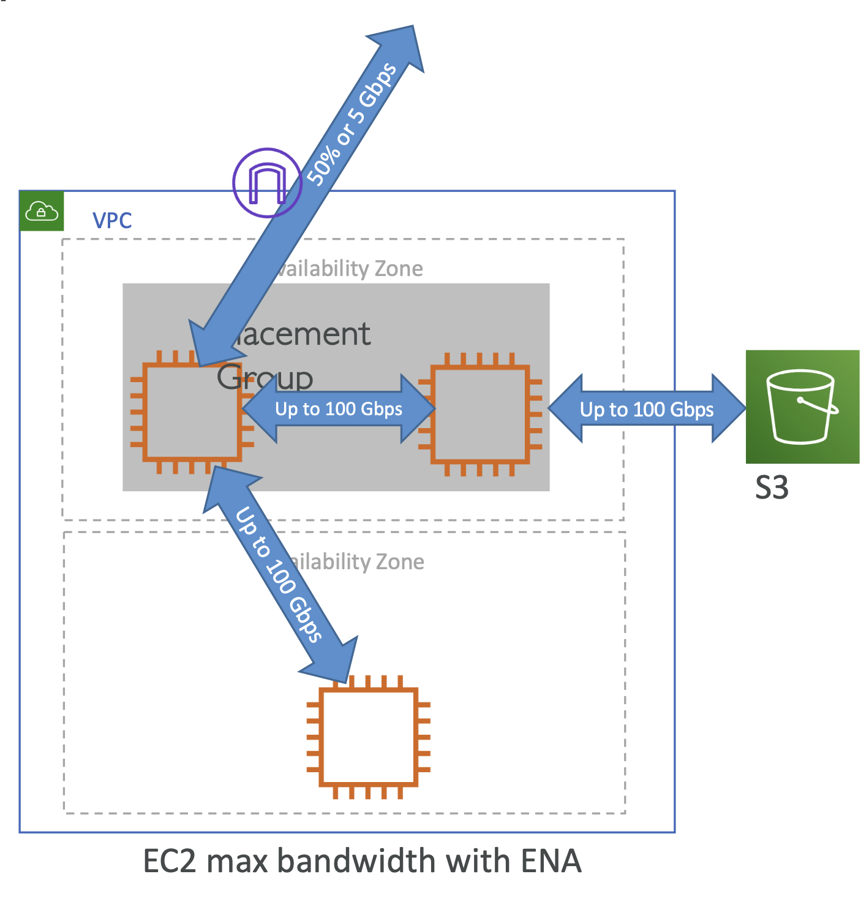
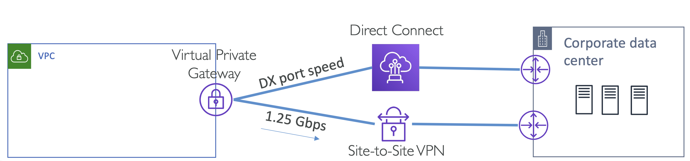

## Network Bandwidth Limits

어떤 Bandwidth (이하 대역폭)는 다양한 요소(EC2, Internet Gateway, NAT gateway, VPC peering connection 등)가 결정하기 때문에 이를 모두 고려해보아야 함.

- VPC Bandwidth Limits - Internet Gateway, NAT Gateway, VPC Peering
- VPC Bandwidth Limits
- Bandwidth over a VPN Connection & AWS Direct Connect & Transit Gateway
- Network Flow
- Network flow 는 커넥션을 가르키는 다섯 요소의 튜플로 정의
  - Tuple: (Source IP, Destination IP, Source Port, Destination Port, Protocol)

<br>

Single Flow: 만약 두 대의 EC2 머신이 있고, 두 EC2 인스턴스 간에 데이터 전송이 이루어질 때, 이는 **하나의 네트워크 플로우**임

```
+-------+          +-------+
|       |          |       |
|  EC2  +----------+  EC2  |
|       |          |       |
+-------+          +-------+
```

일반적으로 대역폭은 플로우마다 각 limit(이하 리밋)이 정해져 있는데, 대역폭을 최대로 확장하고 싶으면 Multiple flows를 사용해야 함

즉, **Multiple flows**로, 네트워크 성능을 확장할 수 있음

```
+-------+          +-------+
|       +----------+       |
|  EC2  +----------+  EC2  |
|       +----------+       |
+-------+          +-------+
```

<br>

### VPC Bandwidth limits

<br><br>

- 지정된 VPC 리밋은 없음
- 어떤 Internet Gateway에도 리밋이 없음
- VPC peering에 리밋이 없음
- 단일 NAT Gateway 당 45Gbps의 리밋이 존재.
    - 여러 NAT Gateway를 사용하면, 45Gbps 넘게 확장시킬 수 있음
    - 이 때, 인스턴스에서 흐르는 트래픽이 다른 AZ로 넘어가지 않게 주의: 추가 데이터 전송 비용 발생

<br>

### EC2 Bandwidth limits

<br><br>

- Instance Family, vCPU, Traffic destination 등 요소에 따라 달라짐
    - 특히, 네트워크 최적화된 인스턴스 타입인 Nitro System에 구축된 인스턴스는 더 높은 대역폭을 제공
    - [🔗 AWS Docs: Instances built on the AWS Nitro System](https://docs.aws.amazon.com/ec2/latest/instancetypes/ec2-nitro-instances.html)
- 동일한 리전: 인스턴스에 Full network bandwidth 로 사용할 수 있음
- 다른 리전에 위치한다면, Internet Gateway나 Direct Connect 는 
    - 32 vCPUs의 최저 사양의 현세대 인스턴스 기준, **50%의 네트워크 대역폭까지만** 제한되어 활용할 수 있음
    - [🔗 AWS Website: Amazon EC2 Instance types](https://aws.amazon.com/ec2/instance-types/?nc1=h_ls) 에서 각 EC2 인스턴스의 대역폭을 확인할 수 있음
    - 보다 작은 사양이라면 5Gbps로 제한됨

<br>

### EC2 Maximum Bandwidth

<br><br>

- Intel 82599 VF 인터페이스
  - 전체 대역폭: 10 Gbps
  - 개별 흐름당 대역폭: 5 Gbps
- AWS ENA driver
  - 플레이스먼트 그룹 내, 10 Gbps Flow 제한
  - 플레이스먼트 그룹 외, 5 Gbps Flow 제한
  - 같은 리전 내 VPC 내 또는 피어링된 VPC, S3 (VPC 엔드포인트 사용) 내에서, Multiple Flow 을 사용한 전체 대역폭은 100 Gbps


<pre>
AWS P4d instances deployed in UltraClusters supercomputer provides 400 Gbps networking


<a href="https://aws.amazon.com/ec2/instance-types/p4/?nc1=h_ls">Amazon EC2 P4 Instances</a>
</pre>

(AWS P4d instances 만 특별한 케이스이며, 현재까지 ENA에 대해 최대 100Gbps까지를 표준으로 지원된다고 보면됨)

<br>

### VPN and DX Bandwidth

- 'AWS → 온프레미스' 트래픽에 대해 Virtual Private Gateway 당 1.25 Gbps의 총 대역폭 제공
- 동일한 가상 사설 게이트웨이에 대한 다중 VPN 연결은 총 처리량 제한에 의해 제약받음
- AWS Direct Connect의 대역폭은 선택한 포트 속도(Port Speed)에 의해 결정됨
  - such as 1 Gbps, 10 Gbps, 100 Gbps or 50 Mbps, ...
- Virtual Private Gateway 과 통신하는 AWS Direct Connect 연결의 처리량은, Direct Connect 물리적 포트 자체에 의해 제한됨
- Transit Gateway는 VPN 터널당 1.25 Gbps, 전체 VPN 대역폭으로 50 Gbps를 지원

<br><br>

<br>

> ⚠️ 모든 숫자를 기억할 필요는 없음 (어차피 바뀔 것) 
> 
> 하지만 네트워킹 성능을 고려할 때 위와 같이 상호작용하는 컴포넌트들을 고려해야함을 염두.

