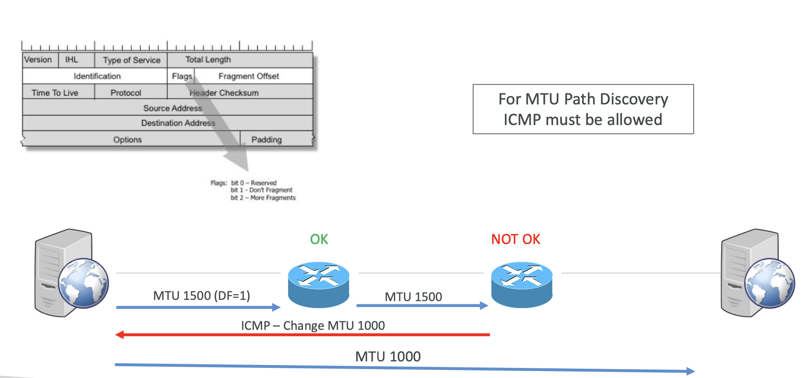

# Basics of Network performance - Bandwidth, Latency, Jitter, Throughput, PPS, MTU

###  VPC Network Performance and Optimization

### Network Performance

✔️ **Bandwidth**
  - The maximum rate at which data can be transferred over a network connection.
  - 네트워크 연결을 통해 데이터를 전송할 수 있는 최대 속도

✔️ **Latency**
  - Delay between two points in a network.
  - 네트워크 상 두 지점 사이의 지연 / 데이터가 소스에서 목적지로 이동하는 데 걸리는 시간
    - 매체 간 이동 시그널을 위한 전파 지연 포함
    - 네트워크 장치에 의해 프로세싱 지연 포함

✔️ **Jitter**
  - Variation in inter-packet delay
  - 패킷 간 지연의 변동
  - 지터는 원활한 네트워크를 방해할 수 있음 (가령, 비디오를 본다고 한다면 일정하지 않은 네트워크 속도를 경험할 수 있음)

✔️ **Throughput**
  - 처리량. 성공적인 데이터 전송 속도 (초당 비트로 측정)
  - 대역폭, 지연 및 패킷 손실이 직접적으로 throughput 에 영향을 줌
  - 1Gbps 대역폭을 가지고 있다고 해도, 실제로는 − 네트워크 지연, 패킷 손실 등의 이유로 − 1Gbps의 Throughput 을 얻지 못할 수 있음

✔️ **Packet Per Second (PPS)**
  - _How many packets can be transmitted per second_
  - 초당 전송 가능한 패킷 수
  - 25Gbps의 대역폭을 가지고 있다고 하더라도, 패킷이 머신에 도달하거나 떠날 때 해당 머신의 CPU의 처리량에 따라 달라질 수 있음. 때문에 PPS를 고려할 때 머신의 컴퓨팅 파워 또한 고려되어야 함.

✔️ **Maximum Transmission Unit (MTU)**
  - _Largest packet that can be sent over the network_
  - 네트워크를 통해 전송할 수 있는 가장 큰 패킷
  - 필수적으로 얼마나 많은 처리율(Throughput)을 얻을 수 있을지, 혹은 네트워크에서 얼마나의 대역폭을 가질 수 있을지 고려되거나 결정되어야 함

<br>

## MTU

- Host A --\[ 1 Packet: 1500 bytes \]-→ Host B
- Host C --\[ 1 Packet: Jumbo Frames > 1500 bytes \]-→ Host D

대부분의 네트워크 장비들은 1500 bytes의 MTU를 지원. (네트워크 장비들이 1500 bytes 이하의 패킷 처리 가능)

**Jumbo Frames**
- 1500 bytes 이상, 9000 bytes 이하의 패킷을 지원하는 네트워크 장비들이 사용하는 기술
- 이익: 적은 Packets, 더 많은 처리량 (Throughput), PPS 를 향상할 수 없을 때 MTU가 처리량을 증가 ```

<br>

### MTU - Maximum Transmission Unit

네트워크를 통해 전송할 수 있는 가장 큰 단위의 패킷

```
Host A — [ 1 Packet: 1,500bytes ] —> Host B
```

HostA가 HostB 한테 패킷을 전달하고 싶고 패킷 하나를 전달하고자 함
패킷은 인터넷 표준인 1500 bytes.

```
Host A — [ 1 Packet: Jumbo Frame > 1,500bytes] —> Host B
```

특정 경우에는 Jumbo Frame 형식의 패킷을 전송할 수 있음
Jumbo Frame은 1500 바이트 이상을 의미
이후, 네트워크 퍼포먼스 향상을 위해 AWS에서 Jumbo Frame을 사용하는 방법을 알아볼것임

```
Host A — [ 1 Packet: 9,000 bytes ] —> Host B
```

가령, Jumbo Frame의 사이즈가 9,000 bytes 이라고 가정하면,
해당 패킷이 전부 전송되기 위해서는 6차례 (1,500 bytes * 6)에 걸쳐 진행되어야 함

- 대부분의 네트워크는 1,500bytes MTU 지원
- Jumbo Frame 패킷: 1,500bytes < MTU < 9,000bytes (9,001bytes in AWS)
- Jumbo Frame 장점
    - Less Packets
    - More throughput
    - PPS 를 증가하지 못하는 경우 MTU를 증가시켜 throughput 을 증가시킬 수 있음

—

_How the Jumbo Frame works?_
## Path MTU Discovery example

HostA에서 HostB 까지 Packet이 전달될 때 2개의 홉이 있다고 해보자.

```
🔀: Router

Host A —— 🔀 —— 🔀 ——> Host B
```

이 때, HostA에서 첫 번째 홉으로 전달될 때 1,500MTU가 소모됨


```
           ✅
Host A ——— 🔀 —— 🔀 ——> Host B
        ➡️ 
       MTU 1500 (DF=1)
```

`DF=1`:  Don’t Fragment. 해당 패킷을 작은 패킷으로 분리하지 말라는 의미

Router 1이 1,500MTU를 지원하면 다음 과정을 처리할 수 있음
(Can I process the MTU of 1,500?)

만약 Router 2 가 1,000 MTU 까지만 지원한다면?

```
           ✅     ❌
Host A ——— 🔀 ——— 🔀 ——> Host B
        ➡️     ➡️ 
       MTU 1500 (DF=1)
```

이 때, DF=1 을 설정되어 있기 때문에 Router 2는 처리하지 못한다는 응답을 전달

```
           ✅     ❌
Host A ——— 🔀 ——— 🔀 ——> Host B
               ⬅️ 
      ❌ “ICMP - Change MTU 1000”
```

호스트는 네트워크에서 오직 1000까지만 지원한다는 것을 알기 때문에 1000 단위로 전송함


```
           ✅     ✅
Host A ——— 🔀 ——— 🔀 ———> Host B
        ➡️     ➡️     ➡️
       MTU 1000 (DF=1)
```

\* FYI. MTU Path Discovery 를 위해 ICMP 허용 정책 필요

<br>
<small><i>이미지 참조</i></small>
<br>

<br>

### Jumbo Frames in AWS

- 9001 MTU 지원 
    - AWS는 9001 MTU를 지원하는데, 상당히 큰 수치
- VPC 내에서 기본값으로 enabled 설정됨
- “**VPC 내부에서**” 허용
    - ⭐️IGW 로 인터넷이 연결되어 있거나 혹은 Peering VPC으로 트래픽이 나가는 경우엔 지원되지 않음 (1,500 bytes 제한)
- AWS Direct Connect 를 사용한 VPC와 on-premises 네트워크 사이에서 지원됨
- EC2 Cluster placement groups 내의 Jumbo Frame을 사용하는 것은 최대 네트워크 throughput 을 제공
    - **EC2 Cluster placement groups**: 특정 EC2들을 최대한 가까이 배치. 사실상 하나의 AZ에 물리적으로 하나의 랙에 배치. 
      - 목적: 네트워크 최적화와 EC2 HPC(High Performance Computing) 워크로드 - 즉, 높은 대역폭 (bandwidth) - 을 위해.
- Jumbo Frames 가 VPC에서 나갈 때 트래픽은 조심:
  - 만약 패킷이 1,500 bytes 를 넘는데 Header에 DF(Don't Fragment) Flag가 설정되어 있으면, 파편화되거나 drop 될 수 있음

<br>

### Defining MTU on EC2 instances

- **MTU는 인스턴스 타입에 따라 달라짐**
  - 타입에 따라 Jumbo Frames 지원 하고 안하고가 다름 (현재 지원되는 EC2 인스턴스는 지원)
- **ENI 레벨에 정의됨**
  - Jumbo Frames을 지원할 수 있을지, Packet의 사이즈는 얼마나 되어야 하는지, ...
- 서버 엔드포인트와 타겟 엔드포인트 사이의 path MTU를 확인할 수 있음
  - `tracepath amazon.com`
- 인터스페이스에서 MTU 확인 가능
  - `ip link show eth0`
- **리눅스에서 MTU 설정 가능**
  - `sudo ip link set dev eth0 mtu 9001`

[🔗 Setting MTU on Amazon EC2 Instances](https://docs.aws.amazon.com/ko_kr/AWSEC2/latest/UserGuide/ec2-instance-mtu.html)

### Demo - MTU for EC2

#### Check MTU using EC2 **Public ip** - `tracepath <public_ip>`

```
[ec2-user ~]$ tracepath  13.234.18.36
1?: [LOCALHOST]     pmtu 9001
1:  no reply
2:  no reply
3:  no reply
...
31:  no reply
Too many hops: pmtu 1500
Resume: pmtu 1500
```

#### Check MTU using EC2 **Private ip** - `tracepath <private_ip>`

```
[ec2-user ~]$ tracepath  10.0.0.18
1?: [LOCALHOST]     pmtu 9001
1:  no reply
2:  no reply
3:  no reply
...
31:  no reply
Too many hops: pmtu 9001
Resume: pmtu 9001
```

#### Check MTU on EC2 interface - `ip link show eth0`

<pre><code lang="bash">
[ec2-user ~]$ ip link show eth0
2: eth0: <BROADCAST,MULTICAST,UP,LOWER_UP> <b>mtu 9001</b> qdisc pfifo_fast state UP mode DEFAULT group default qlen 1000
    link/ether 02:90:c0:b7:9e:d1 brd ff:ff:ff:ff:ff:ff
</code></pre>

<br>

### MTU

- **Within AWS:**
  - Within VPC : Supports Jumbo frames (9001 bytes)
  - Over the VPC Endpoint : MTU 8500 bytes
    - e.g., 다른 AWS 서비스: S3, DynamoDB, SQS, Kinesis 같은 VPC Endpoint.
  - Internet Gateway 외부: MTU 1500 bytes
  - **Intra** region VPC Peering: MTU 9001 bytes
    - VPC 내부 피어링이면 Jumbo Frames 지원
  - **Inter** region VPC Peering : MTU 1500 bytes
    - VPC 외부 피어링이면 Jumbo Frames 지원 안함
- **On-premise network:**
  - Over the VPN using **VGW**(Virtual Private Gateway) : MTU 1500 bytes
  - Over the VPN via **Transit Gateway** : MTU 1500 for traffic for Site to Site VPN
  - Over the **DirectConnect (DX)** : Supports Jumbo frames (9001 bytes)
  - Over the DX via **Transit Gateway** : MTU 8500 for VPC attachments connected over the Direct Connect

**Things to remember**
- Jumbo Frames On-premise:
  - Site-to-Site VPN 지원 X
  - DX 지원 O
- Within AWS 에선 Internet Gateway 타지 않으면 지원