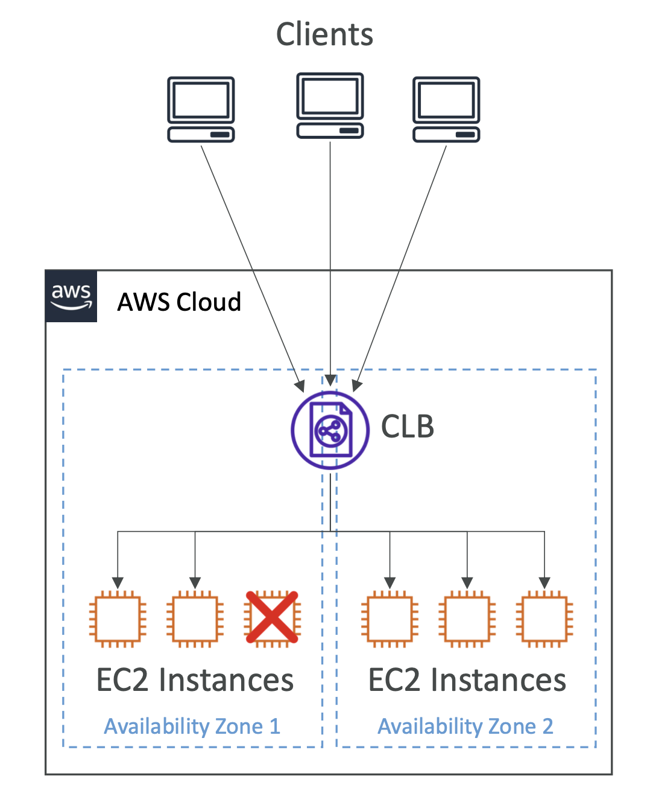
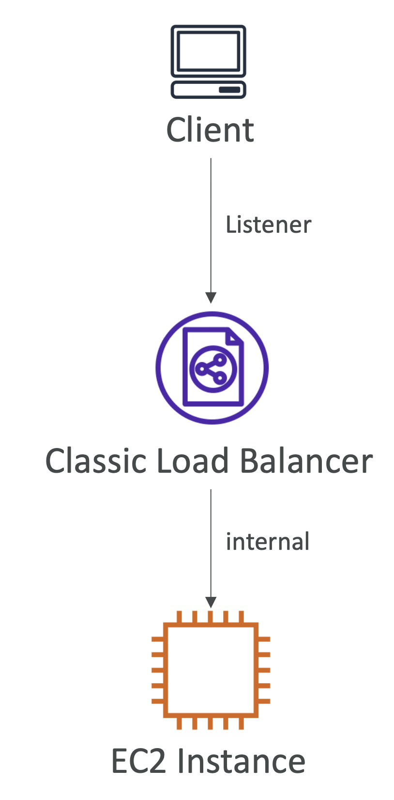
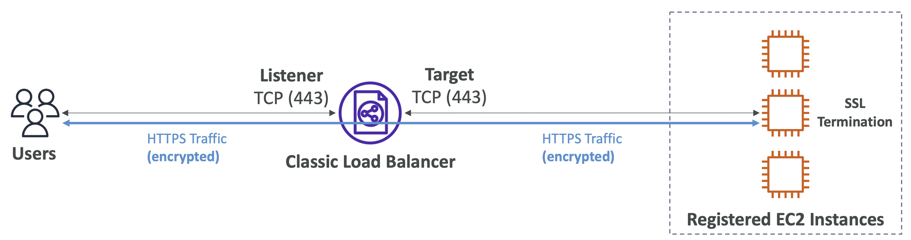
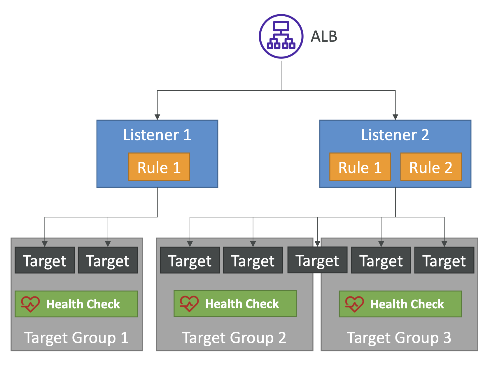

# Classic Load Balancer

  

- Layer 4 (TCP) and Layer 7 (HTTP)에서 작동
- 지원 프로토콜: HTTP, HTTPS, TCP, SSL
- EC2 인스턴스가 Target Group 없이 CLB에 직접 등록됨
- 헬스 체크는 HTTP, HTTPS 또는 TCP일 수 있음
- EC2-Classic 네트워크 지원

 

  

| Listener                                                                           | Internal                                                            |
|------------------------------------------------------------------------------------|---------------------------------------------------------------------|
| HTTP (L7)                                                                          | HTTP or HTTPS <small>(Must install certificate on EC2)</small>  |
| HTTPS (L7) – SSL Termination <small>(Must install certificate on CLB)</small>  | HTTP or HTTPS <small>(Must install certificate on EC2)</small>  |
| TCP (L4)                                                                           | TCP or SSL <small>(Must install certificate on EC2)</small>     |
| SSL (L4) <small>(Must install certificate on CLB)</small>                      | TCP or SSL <small>(Must install certificate on EC2)</small>     |

 

## Classic Load Balancer – SSL considerations

- EC2에 HTTPS 혹은 SSL을 설정하는 것을 "**Backend Authentication**"이라고 함 (CLB와 백엔드 EC2 인스턴스 간의 인증)
- TCP => TCP는 모든 트래픽을 EC2 인스턴스로 전달함 (종료termination 없음):
  - 2-way Mutual SSL Authentication을 수행하는 유일한 방법

  

<small>시험에 나올 수 있는 내용</small>

 

# Application Load Balancer

- Layer 7 (HTTP)에서 작동
- 지원 프로토콜: HTTP, HTTPS, WebSocket, HTTP/2, gRPC
- 머신들 (타겟 그룹) 간에 여러 HTTP 애플리케이션으로 로드 밸런싱
- 동일한 서버에서 여러 애플리케이션/포트로 로드 밸런싱 (e.g. 컨테이너)
- 사용자 정의 HTTP 응답을 반환하는 지원
- 리디렉션 지원 (e.g. HTTP에서 HTTPS로)

  

<pre>
ALB는 여러 개의 리스터를 가질 수 있고, 각 리스너는 하나 이상의 규칙을 가질 수 있음.
위 예시에서, 리스너 1은 하나의 규칙을 가지고 있고, 그 규칙은 트래픽을 타겟 그룹으로 보내는 것일 수 있음.
타겟은 예를 들어 EC2 인스턴스일 수 있고, 헬스 체크도 가질 수 있음.
<small>* 타겟 그룹은 여러 개의 타겟을 가질 수 있고, 때로는 타겟 그룹 간에 타겟이 공유되기도 함. 또, 헬스 체크를 가질 수 있음.</small>

리스너 2는 두 개의 규칙을 가지고 있고, 각 규칙은 서로 다른 타겟 그룹으로 트래픽을 보낼 수 있음.
리스너는 HTTP, HTTPS, WebSocket, HTTP/2 및 gRPC 프로토콜을 지원함.
</pre>

 