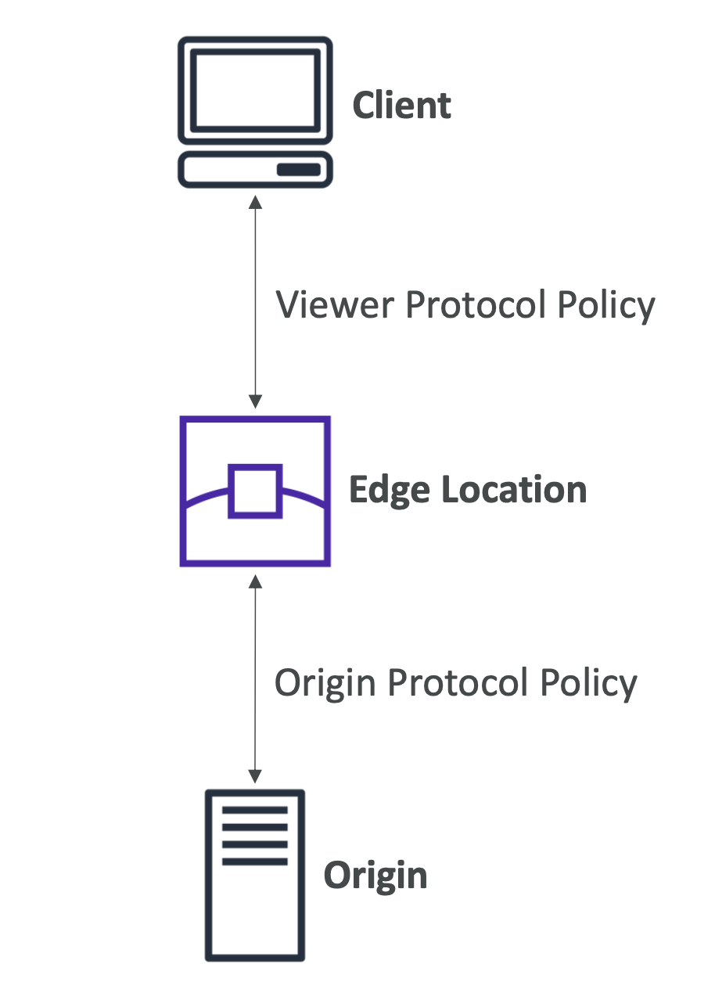
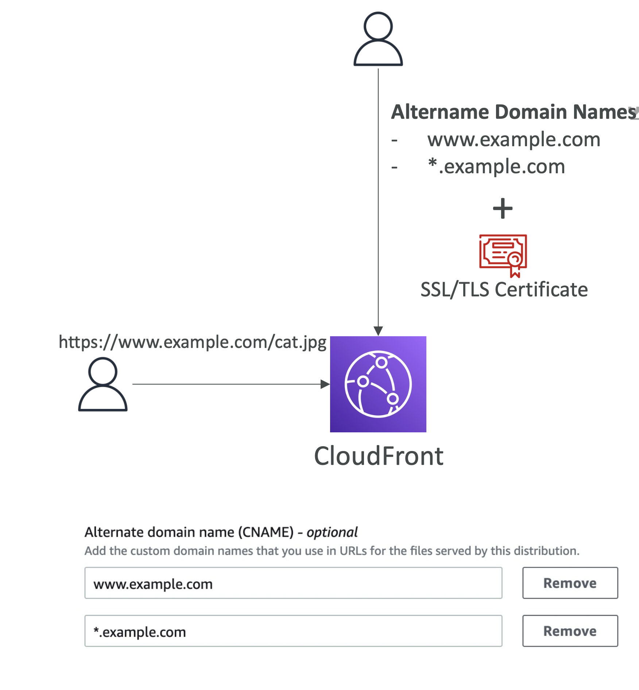

# CloudFront and HTTPS

**두 종류의 연결**

1. 클라이언트와 엣지 로케이션 간 - Viewer Protocol Policy
2. 엣지 로케이션과 기원 간 - Origin Protocol Policy

  

#### 1. **Viewer Protocol Policy**
  - **`HTTP` and `HTTPS`**: `HTTP` 와 `HTTPS` 허용
  - **Redirect `HTTP` to `HTTPS`**: `HTTP`를 `HTTPS`로 리디렉션
  - **HTTPS Only**: `HTTP`는 거부하고 `HTTPS`만 허용

#### 2. **Origin Protocol Policy  (HTTP or S3)**
- **HTTP Only** (default for S3 Static Website)
- **HTTPS Only**
- **Match Viewer**: 뷰어가 사용하는 프로토콜을 일치시키는 것
  - HTTP => HTTP / HTTPS => HTTPS

**Note**:
- S3 bucket 의 **Static Website**는 HTTPS 지원하지 않음
- CloudFront와 오리진 간에는 반드시 **유효한 SSL/TLS 인증서가 필요**
  - self-signed certificates 사용 불가능

 

## Alternate Domain Names

  

- CloudFront에서 할당한 도메인 대신 사용자 지정 도메인 이름 사용
  - e.g. `http://d111111abcdef8.cloudfront.net/cat.jpg` => `http://www.example.com/cat.jpg`
- CloudFront에 대체된 도메인 이름을 추가하고, **반드시** 유효한 SSL/TLS 인증서를 로드해야 함
  - 도메인 이름
  - 추가한 모든 대체된 도메인 이름을 포함하는 인증서 필요
- 대체 도메인 이름에 와일드카드(`*`) 사용 가능 (예: `*.example.com`)

 

## CloudFront – SSL Certificates

- **Default CloudFront Certificate (`*.cloudfront.net`)**
  - CloudFront URL 사용 시 기본 제공되는 인증서
  - e.g. `https://d111111abcdef8.cloudfront.net/cat.jpg`
- **Custom SSL Certificate**
  - 사용자 지정 도메인 이름 사용 시 - **대체 도메인 이름** (e.g., `https://www.example.com`)
  - CloudFront는 다음을 사용하여 HTTPS 요청 제공(serve):
    - **Server Name Indication (SNI) – 권장**
    - 각 엣지 로케이션에 전용 IP 주소 사용 (비용이 많이 듦)
  - 사용 가능한 인증서
    - ACM에서 제공하는 인증서
    - ACM 또는 IAM 인증서 저장소에 직접 업로드한 타사 인증서 (만료 시 수동으로 교체 필요)
  - 인증서는 **US East (N. Virginia) 지역**에 생성/가져와야 함
- **보안 정책 지정**
  - 사용할 최소 SSL/TLS 프로토콜과 암호(ciphers) 지정 가능

<pre><b>ACM: AWS Certificate Manager</b>
AWS Certificate Manager (ACM)는 웹 AWS 사이트와 애플리케이션을 보호하는 퍼블릭 및 프라이빗 SSL/TLS X.509 인증서와 키를 생성, 저장 및 갱신하는 복잡성을 처리</pre>
