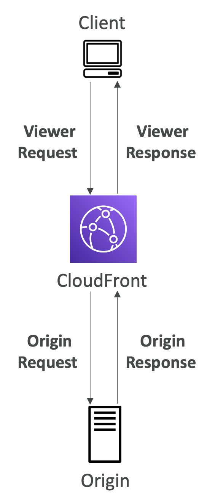
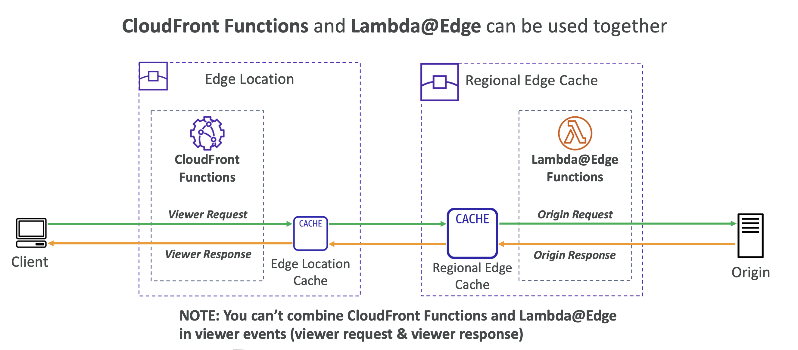
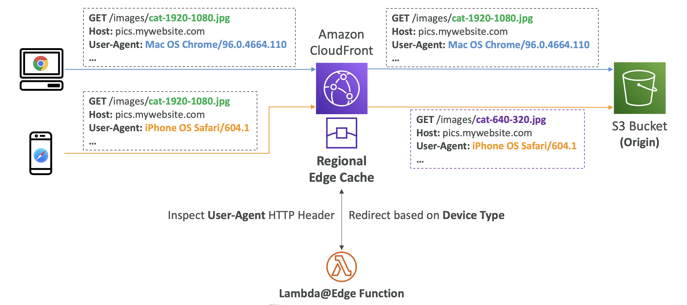
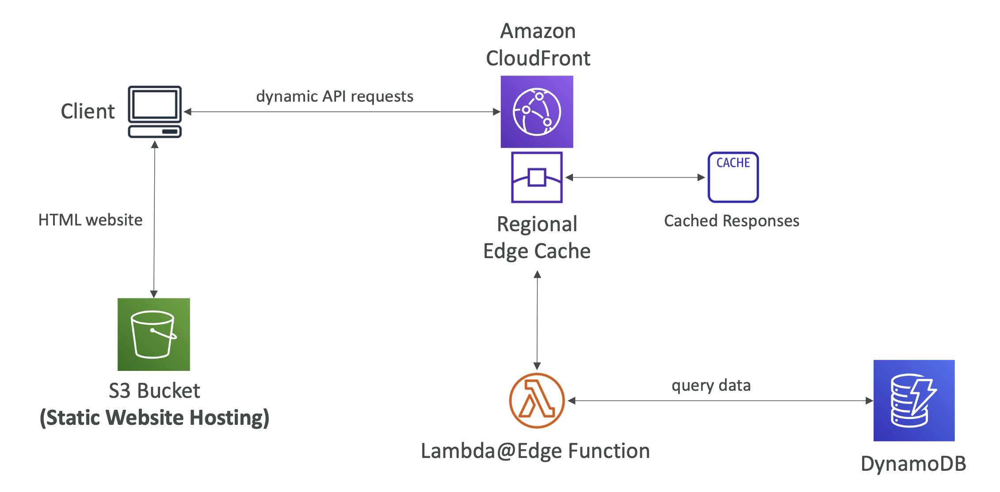

# CloudFront Functions and Lambda@Edge
## CloudFront – Customization At The Edge

- 많은 모던 애플리케이션은 엣지에서 특정 형태의 로직을 실행
- **Edge Function**:
  - CloudFront 배포에 연결하고 작성하는 코드
  - 지연 시간을 최소화하기 위해 사용자 근처에서 실행
  - 캐시 없음, 요청/응답 변경만 가능
  - CloudFront는 두 가지 유형 제공
    - CloudFront Functions
    - Lambda@Edge
- **사용 사례**:
  - HTTP 요청 및 응답 조작
  - 애플리케이션에 도달하기 전에 요청 필터링 구현
  - 사용자 인증 및 권한 부여
  - 엣지에서 HTTP 응답 생성
  - A/B 테스트
  - 엣지에서 봇 방지
- 서버를 관리할 필요 없음, 전 세계적으로 배포

  

**CloudFront의 전통적인 구조**
- 클라이언트가 Edge Locations과 통신
- Edge Locations는 Regional Edge Cache와 통신
- Regional Edge Cache는 오리진과 통신

**Functions 배포에는 두 개의 레벨이 있음**
- **Lambda@Edge Functions**는 **Regional Edge Cache**에 배포 됨
- **CloudFront Functions**는 **Edge Locations**에 배포 됨

→ 원하는 위치를 선택해서 배포하면 됨

 

## CloudFront – CloudFront Functions

<table>
<tr>
<th colspan="2">CloudFront – CloudFront Functions</th>
</tr>
<tr>
<td></td>
<td>

- 가벼운 JavaScript로 작성된 함수
- 대규모, 지연 시간에 민감한 CDN 사용자 정의
- 서브 밀리초(ms) 시작 시간, 초당 수백만 요청
- 엣지 로케이션에서 실행
- 프로세스 기반 격리
- 뷰어 요청 및 응답 변경에 사용
  - **Viewer Request**: 뷰어에서 요청을 받은 후
  - **Viewer Response**: 뷰어로 응답을 전달하기 전
- CloudFront의 네이티브 기능 (CloudFront 내에서 코드 관리)

</td>
</tr>
<tr>
<th colspan="2">CloudFront – Lambda@Edge</th>
</tr>
<tr>
<td></td>
<td>

- NodeJS 또는 Python으로 작성된 Lambda 함수
- 초당 수천 개의 요청 처리
- 가장 가까운 Regional Edge Cache에서 실행
- VM 기반 격리
- CloudFront 요청 및 응답 변경에 사용
  - **Viewer Request**: 뷰어에서 요청을 받은 후
  - **Origin Request**: CloudFront가 오리진에 요청을 전달하기 전
  - **Origin Response**: CloudFront가 오리진에서 응답을 받은 후
  - **Viewer Response**: 뷰어로 응답을 전달하기 전
- 함수는 `us-east-1` 한 리전에서 작성하고 CloudFront가 위치에 복제
- Lambda@Edge는 CloudFront의 엣지 캐시에 배포

</td>
</tr>
</table>
  

**→ 비교 표로 정리**

| 항목                 | CloudFront Functions                                                   | Lambda@Edge                                                                                                                                                                                                                  |
|--------------------|------------------------------------------------------------------------|------------------------------------------------------------------------------------------------------------------------------------------------------------------------------------------------------------------------------|
| Language           | JavaScript                                                             | NodeJS 또는 Python                                                                                                                                                                                                             |
| Use Case           | 뷰어 요청 및 응답 변경                                                          | 뷰어 및 오리진 요청, 응답 변경                                                                                                                                                                                                           |
| Isolation          | 프로세스 기반 격리                                                             | VM 기반 격리                                                                                                                                                                                                                     |
| Performance        | 서브 밀리초(ms) 시작 시간, 초당 수백만 요청                                            | 초당 수천 개의 요청 처리                                                                                                                                                                                                               |
| Execution Location | 엣지 로케이션                                                                | 가장 가까운 Regional Edge Cache                                                                                                                                                                                                   |
| Creation Location  | -                                                                      | `us-east-1` 리전에서 작성, CloudFront 위치로 복제                                                                                                                                                                                       |
| Deployment         | CloudFront 내에서 코드 관리                                                   | CloudFront의 엣지 캐시에 배포                                                                                                                                                                                                        |
| Event Trigger      | - Viewer Request: 뷰어에서 요청을 받은 후  - Viewer Response: 뷰어로 응답을 전달하기 전 | - Viewer Request: 뷰어에서 요청을 받은 후   - Origin Request: CloudFront가 오리진에 요청을 전달하기 전  - Origin Response: CloudFront가 오리진에서 응답을 받은 후  - Viewer Response: 뷰어로 응답을 전달하기 전                                                |

 

## CloudFront Functions with Lambda@Edge

  

Edge Location Cache와 Regional Edge Cache가 있음

1. Client → Edge Location 요청         ← **Viewer Request**  / Cloud Front Functions
2. Edge Location → Regional Edge 요청
3. Regional Edge → Origin 요청         ← **Origin Request**  / Lambda@Edge Functions
4. Origin → Regional Edge 응답
5. Regional Edge → Edge Location 응답  ← **Origin Response** / Lambda@Edge Functions
6. Regional Edge → Edge Location 요청
7. Edge Location → Client 응답         ← **Viewer Response** / Cloud Front Functions

- **Cloud Front Functions**는 Edge Locations에서 **Viewer Request** 및 **Viewer Response** 에서 실행.
- **Lambda@Edge Functions**는 **Origin Request** 및 **Origin Response** 에서 실행

 

## Using Lambda@Edge Only

  

- **Lambda@Edge Functions**는 **Viewer Request**, **Origin Request**, **Origin Response**, **Viewer Response** 에서 실행
- **CloudFront Functions** 사용 불가: 이미 **Lambda@Edge Functions**에서 **Viewer Request** 및 **Viewer Response**를 처리
- 동시에 Viewer Request/Viewer Response 에 대한 Lambda@Edge Functions와 CloudFront Functions를 사용할 수 없음

 

### CloudFront Functions vs. Lambda@Edge

|                                    | CloudFront Functions                      | Lambda@Edge                                                       |
| ---------------------------------- | ----------------------------------------- | ----------------------------------------------------------------- |
|                                    |
| Runtime Support                    | JavaScript                                | Node.js, Python                                                   |
| Execution Location                 | Edge Locations                            | Regional Edge Caches                                              |
| CloudFront Triggers                | - Viewer Request/Response                 | - Viewer Request/Response - Origin Request/Response           |
| Isolation                          | Process-based                             | VM-based                                                          |
| Max. Execution Time                | < 1 ms                                    | - 5 seconds (viewers triggers) - 30 seconds (origin triggers) |
| Max. Memory                        | 2 MB                                      | - 128 MB (viewer triggers) - 10 GB (origin triggers)          |
| Total Package Size                 | 10 KB                                     | - 1 MB (viewer triggers) - 50 MB (origin triggers)            |
| Network Access, File System Access | No                                        | Yes                                                               |
| Access to the Request Body         | No                                        | Yes                                                               |
| Pricing                            | Free tier available, 1/6th price of @Edge | No free tier, charged per request & duration                      |

## CloudFront Functions vs. Lambda@Edge – Use Cases

<table>
<tr>
<th>CloudFront Functions</th>
<th>Lambda@Edge</th>
</tr>
<tr>
<td>

- Cache key normalization
  - 요청 속성(헤더, 쿠키, 쿼리 문자열, URL)을 변환하여 최적의 캐시 키 생성
- 헤더 조작
  - 요청 또는 응답에서 HTTP 헤더 삽입/수정/삭제
- URL 재작성 또는 리디렉션
- 요청 인증 및 권한 부여
  - 사용자 생성 토큰(JWT 등)을 만들고 유효성 검사하여 요청 허용/거부

</td>
<td

- 더 긴 실행 시간(몇 ms)
- CPU 또는 메모리 조정 가능
- 코드가 3rd 라이브러리에 의존 (예: 다른 AWS 서비스에 접근하기 위한 AWS SDK)
- 처리를 위해 외부 서비스에 액세스하는 네트워크 접근
- 파일 시스템 접근 또는 HTTP 요청의 본문에 접근

></td>
</tr>
</table>

 

## CloudFront Functions vs. Lambda@Edge – Authentication and Authorization

<table>
<tr>
<th>CloudFront Functions</th>
<th>Lambda@Edge</th>
</tr>
<tr>
<td>

- Edge Location에서 요청을 가로채고 헤더에 있는 디지털 JWT 토큰 확인
- 올바르지 않은 경우 요청이 오리진으로 전달되지 않고 클라이언트에게 오류 메시지 전달

</td>
<td>

- Regional Edge Cache 요청 인입 시, Lambda 함수가 해당 요청을 가로채고 사용자 지정 로직을 수행
- Lambda 함수는 서드파티 API 호출을 수행하여 인증 및 권한 부여가 올바르게 설정되어 있는지 확인

</td>
</tr>
</table>

 

## Lambda@Edge: Loading content based on User-Agent

- 데스크탑과 모바일 기기에서 콘텐츠를 요청했을 때, 다른 해상도의 이미지 제공 가능
- Lambda@Edge 함수는 User-Agent HTTP 헤더를 검사하고 디바이스 유형에 따라 요청 변경
- **Example**
  - 데스크탑과 모바일 둘 다 고해상도 이미지를 요청했을 때: `cat-1920-1080.jpg`
  - 모바일 기기의 경우 낮은 해상도 이미지 응답: `cat-640-320.jpg`
  - 데스크탑 기기의 경우 고해상도 이미지 응답: `cat-1920-1080.jpg`

 

## Lambda@Edge – Global Application

- 클라이언트는 S3 버킷에서 웹사이트를 받음
- 동적 API 요청을 위해 CloudFront로 보내어 캐시 활용
- Lambda 함수는 예를 들어 DynamoDB 테이블에 데이터 쿼리
- AWS에서 API를 완전히 글로벌하고 서버리스하게 구현 가능
- **Example**
  - 클라이언트는 S3 버킷에서 웹사이트를 받음
  - CloudFront에 동적 API 요청
  - Lambda 함수는 DynamoDB 같은 DB 테이블에 데이터 쿼리

