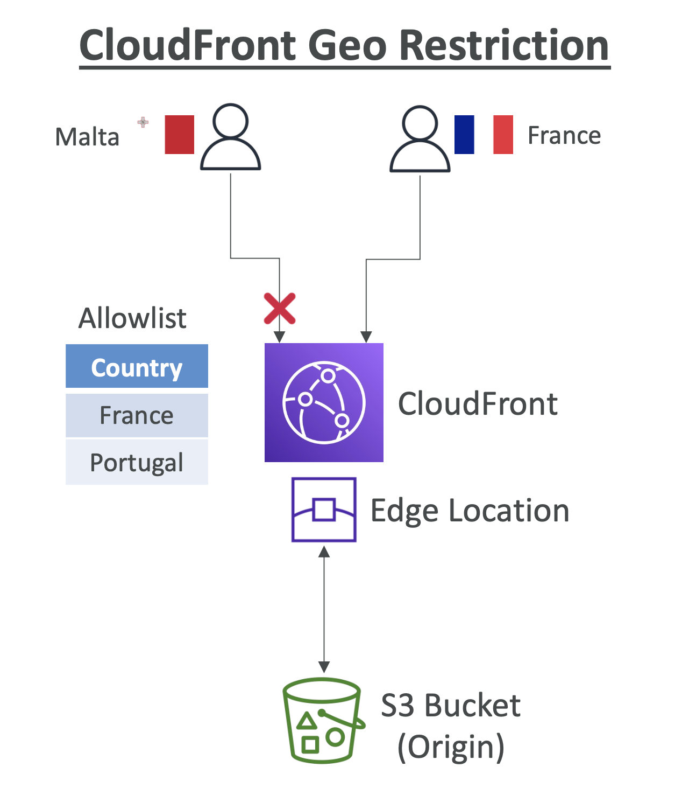
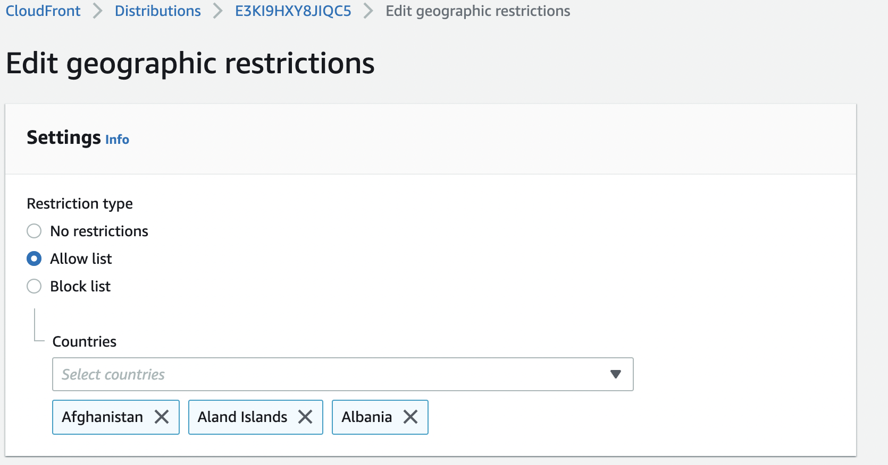

# CloudFront Geo Restrictions

## CloudFront – Restrict Content Geographically

- 특정 지역의 사용자가 콘텐츠/배포(distribution)에 액세스하는 것을 방지

  

- **CloudFront Geo Restriction**
  - 국가 수준에서 액세스 제한 (써드파티 GeoIP 데이터베이스 사용해서 국가 결정)
  - **Allow list**: 허용 목록. 승인된 국가 중 하나에서만 액세스 허용
  - **Block list**: 차단 목록. 금지된 국가 중 하나에서 액세스 방지
  - 전체 CloudFront 배포에 적용
- 사용 사례: 저작권법을 준수하기 위한 콘텐츠 액세스 제어

---

AWS Management Console 로 들어가서
CloudFront > Distribution > **Geo-Restrictions**
: 옵션 선택 가능

  
