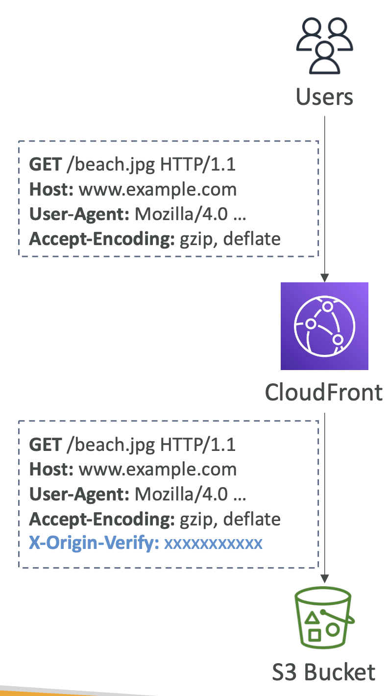

# CloudFront Origin Headers

## CloudFront – Origin Custom Headers

- **정의:** CloudFront에서 오리진으로 전송할 때, 요청에 사용자 정의 헤더 추가
- 각 오리진 별, 고정된 헤더 값을 정의할 수 있음.
- 커스텀 오리진과 S3 오리진 지원.
- **사용 사례**:
  - CloudFront 또는 특정 지역(distribution)에서 오는 요청을 식별
  - **컨텐츠 액세스 제어**: 올바른 사용자 정의 헤더를 포함한 요청할 때만 원본이 응답하도록 

  

## CloudFront HTTP Headers

- 뷰어 요청에 따라 추가되는 동적인 지정된 HTTP 헤더
- 헤더 종류
  - 뷰어의 **장치 유형** 헤더 (User-Agent 기반)
    - `CloudFront-Is-(Android/Desktop/IOS/Mobile/SmartTV/Tablet)-Viewer`
  - 뷰어의 **위치** 헤더 (뷰어의 IP 주소 기반)
    - `CloudFront-Viewer-(City/Country/Latitude/Longitude, ...)`
  - 뷰어의 **요청 프로토콜 및 HTTP 버전** 헤더
    - `CloudFront-Forwarded-Proto` & `CloudFront-Viewer-Http-Version`
- **헤더 포함 방법**
  1. 캐시 키에 포함
    - **Legacy Cache Settings** 또는 **Cache Policies** 사용
  2. 오리진에서 수신할 수 있음
    - **Origin Request Policies** 사용
