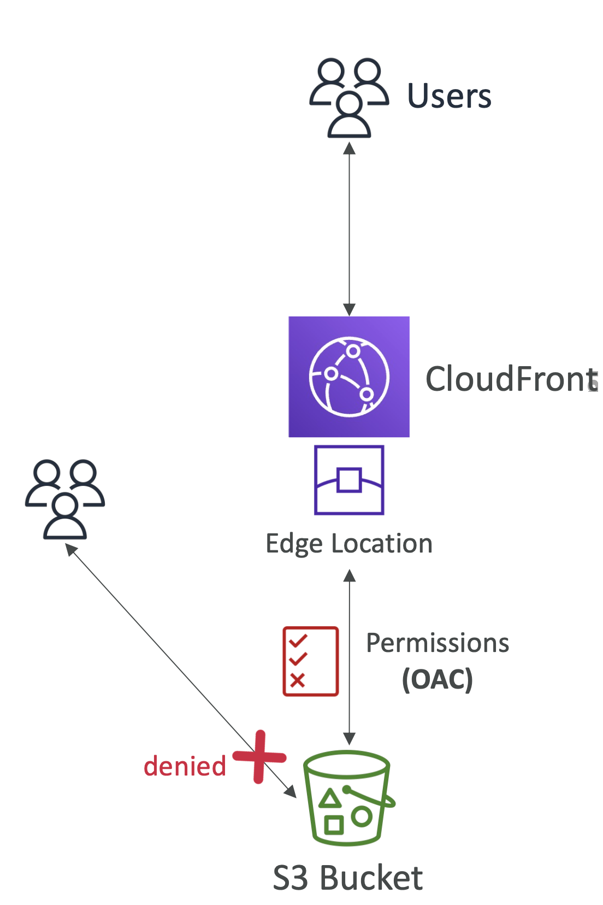
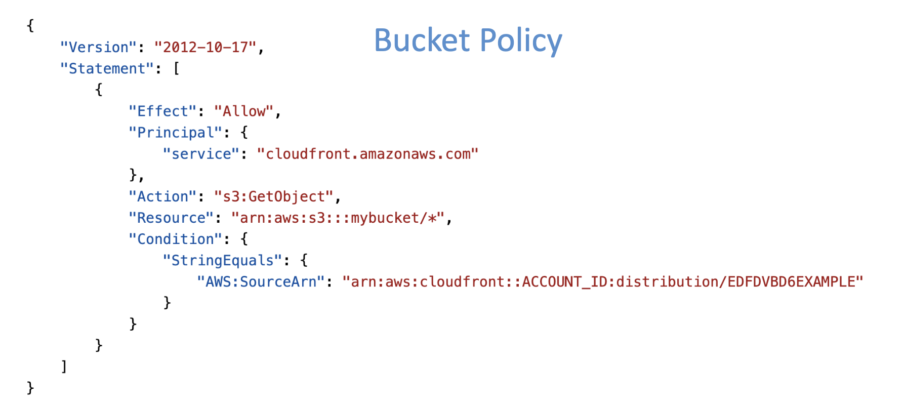
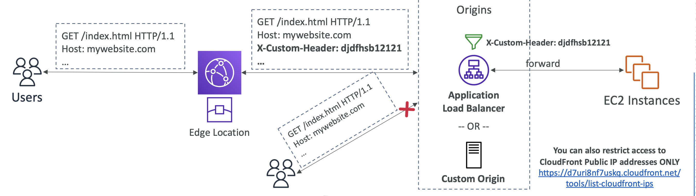
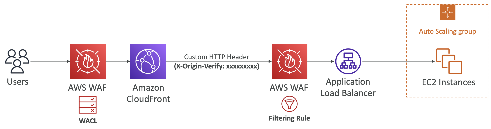
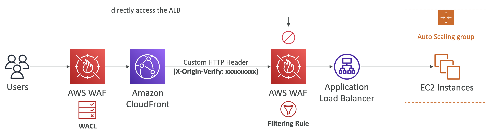
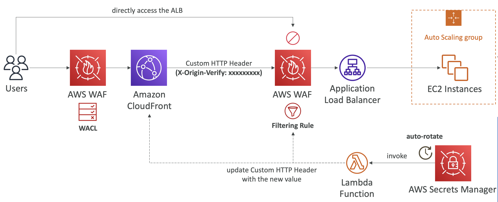

## CloudFront – Restrict Access to S3 Buckets

  

- **아키텍처:** S3 버킷에 직접 액세스 방지 (CloudFront를 통한 액세스만 허용)
1. **Origin Access Control (OAC) 생성**
   - 분산에 연결
2. **S3 버킷 정책 수정**
   - OAC만 GetObject 작업을 허용하도록 수정

  

 

## CloudFront – Restrict Access to Application Load Balancers and Custom Origins

  

- ALB 나 Custom Origins에 직접 액세스 방지 (CloudFront를 통한 액세스만 허용)
1. **CloudFront 설정**
   - ALB에 요청을 전송하기 위한 커스텀 HTTP Header 추가
2. **ALB 설정**
   - ALB에서 커스텀 HTTP Header가 포함된 요청만 오리진 서버에 포워딩하도록 설정
- 커스텀 헤더 이름이랑 값을 노출하지 않도록 주의

 

## Solution Architecture – Enahnce CloudFront Origin Security with AWS WAF & AWS Secrets Manager

ALB + WAF 사용: CloudFront 앞에 WAF 규칙을 배치하여 사전 보안 제공

**사용자 정의 HTTP 헤더:** CloudFront가 추가하는 사용자 정의 헤더(e.g. `X-Origin-Verify`)를 WAF가 확인하여 요청이 ALB에 도달하기 전에 필터링

  

직접 WAF에 액세스 시도 시, CloudFront가 추가하는 사용자 정의 헤더가 없기 때문에 거부

  

**관리:** 시크릿 헤더 이름과 값을 AWS Secrets Manager에 자동 회전 정책으로 설정하고, Lambda 함수를 통해 정기적으로 CloudFront와 WAF 규칙을 업데이트 (e.g. 30일마다 업데이트).

  

