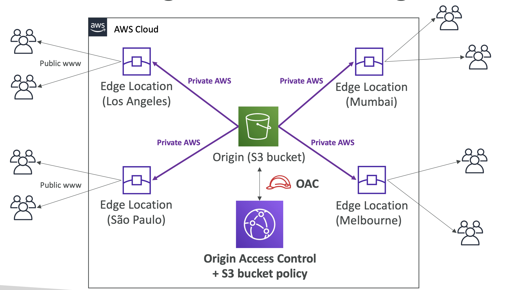
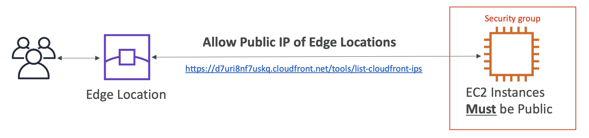
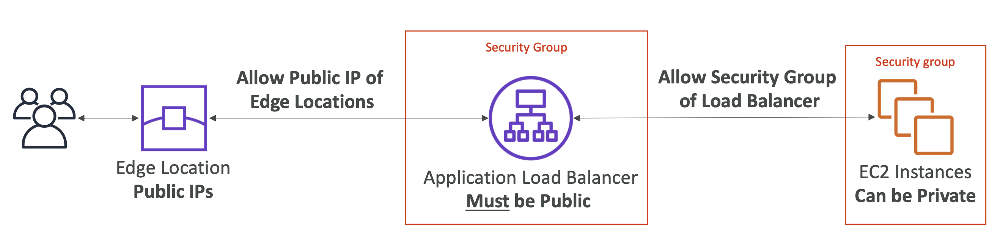
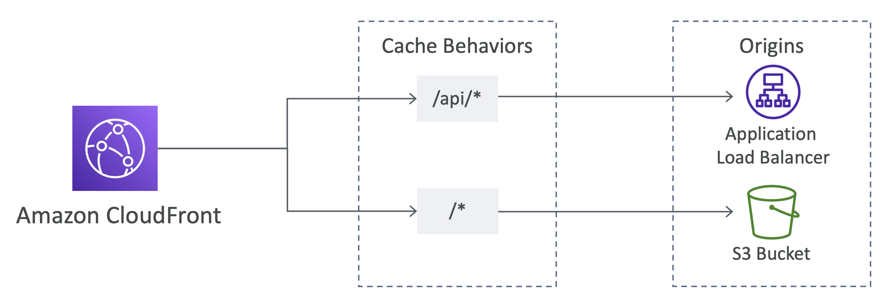
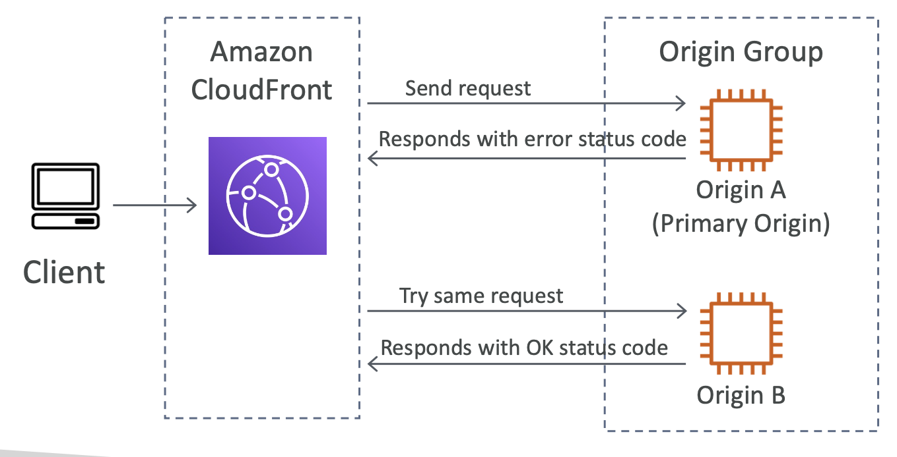
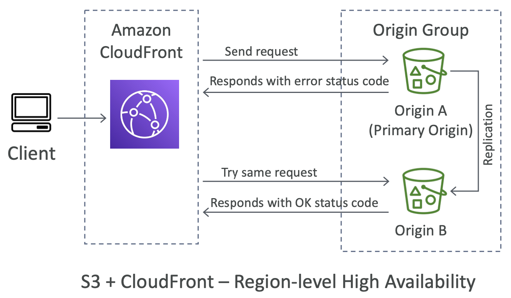

# CloudFront Origins

- **S3 Bucket**
    - 파일 배포
    - CloudFront Origin Access Control (OAC)을 사용한 보안 강화 – 이전 OAI
    - CloudFront를 사용하여 S3로 파일 업로드
- **웹사이트 설정**
    - 버킷에서 **Static Website hosting** ⎯ 정적 웹사이트 호스팅 ⎯ 활성화
- **MediaStore Container & MediaPackage Endpoint**
    - AWS 미디어 서비스를 사용하여 비디오 온 디맨드 (VOD) 또는 라이브 스트리밍 비디오 제공
- **사용자 정의 오리진 (HTTP)**
    - EC2 인스턴스
    - Elastic Load Balancer (CLB 또는 ALB)
    - API 게이트웨이 (더 많은 제어를 위해, 혹은 API 게이트웨이 엣지 사용)
    - 원하는 모든 HTTP 백엔드

 

### CloudFront Origins – S3 as an Origin

CloudFront는 콘텐츠 전송 네트워크(CDN)으로 여러 종류의 기원을 제공.

  

- 첫 번째는 S3 버킷으로, 다양한 파일 배포에 사용됨.
- **S3 버킷과 CloudFront 간의 보안**: S3 버킷 정책에 OAC(Origin Access Control)를 묶어 CloudFront에서만 S3 버킷에 액세스할 수 있도록 보장.
- 파일 업로드를 가속화하기 위해 S3로 파일을 인그레스할 때도 사용할 수 있음.
- **웹사이트 호스팅:** S3에서 정적 웹사이트 호스팅을 활성화하고 CloudFront를 사용하여 전 세계적으로 웹사이트 콘텐츠를 배포.

 

### CloudFront Origins – ALB or EC2 as an origin

**✔️ EC2 인스턴스 Public 접근 허용** 

  

엣지 로케이션이 콘텐츠를 가져올 수 있도록, 반드시 퍼블릭 접근이 가능해야 함. 

 

**✔️ Application Load Balancer:** 

  

엣지 로케이션이 공개적으로 접근 가능. 백엔드 EC2 인스턴스는 비공개로 유지될 수 있음.

 

### CloudFront - Multiple Origins

CloudFront에서 서로 다른 경로를 서로 다른 기원으로 라우팅할 수 있음

> **Example.**
> 
> - `/images/*` → S3 버킷 라우팅
> - `/api/*` → 사용자 정의 HTTP 백엔드 라우팅
> - `/*` (기본 경로)  → 다른 오리진 라우팅

  

 

### CloudFront – Origin Groups

**Origin Groups**

- 고가용성 및 Failover 향상
- Primary Origin & Secondary Origin
  - 프라이머리 오리진이 실패할 경우 세컨더리 오리진이 사용됨

<table>
  <tr>
    <th>EC2 Instance</th>
    <th>S3 Bucket</th>
  </tr>
  <tr>
    <td>
    
        Primary EC2와 Secondary EC2를 오리진으로 설정
    </td>
    <td>
        
        장애 조치를 위해 지역 간 S3 복제를 사용
    </td>
  </tr>

