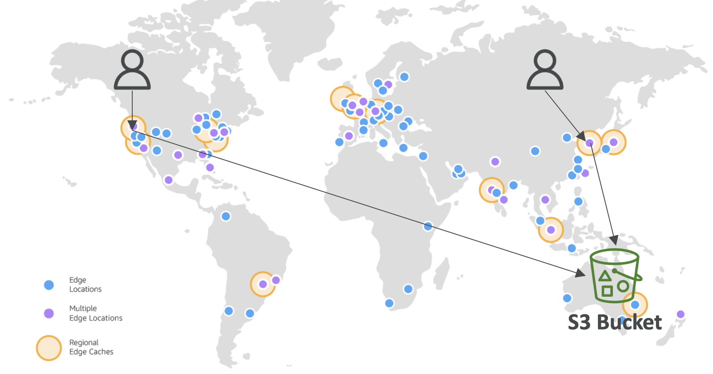
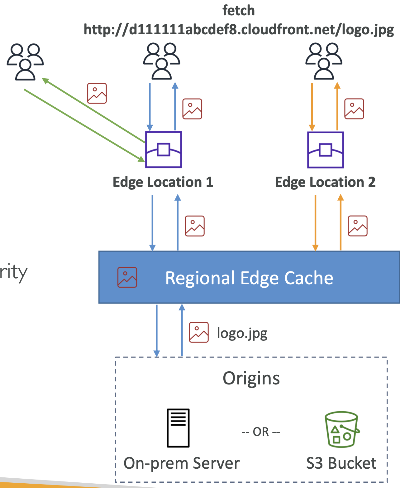

# AWS CloudFront

### Content Delivery Network (CDN)

 

https://aws.amazon.com/cloudfront/features/  

- 읽기 성능 개선, 전 세계 엣지에 콘텐츠가 캐시됨.
  - > 캐나다에 있는 사용자가 호주의 S3 버킷에서 콘텐츠를 가져오려고 하면, 사용자 가까운 엣지 로케이션을 통해 연결됨. 
    > 해당 엣지 로케이션은 S3 버킷에서 콘텐츠를 가져와 캐시함. 
    > 이후 캐나다의 다른 사용자의 요청은 이 엣지 로케이션에서 직접 제공되어 지연 시간이 줄어듦.

- 전 세계적으로 225개 이상의 AWS 접속 지점 존재. (그중 215개 이상이 Edge Locations & 13개가 지역 Edge 캐시)
  - 예를 들어, 호주에 있는 S3 버킷에 콘텐츠가 있고 전 세계 사용자가 이를 액세스하려고 할 때 CloudFront는 사용자와 가까운 엣지 로케이션에서 콘텐츠를 캐시하여 성능을 향상시킴
- 네트워크와 응용 계층 공격에 대한 보호 제공
  - ex. AWS Shield와의 통합으로 **DDoS 공격**으로부터 보호할 수 있음
- AWS Shield, AWS WAF 및 Route 53과 통합 → 안전한 HTTPS 엔드포인트를 생성할 수 있음
- 외부 HTTPS 노출 및 내부 HTTPS 백엔드와 통신 가능
- WebSocket 프로토콜 지원

 

## Edge Locations & Regional Edge Caches

  

- 1\. 사용자가 리소스를 요청
- 2\. 엣지 로케이션에서 해당 콘텐츠가 있는지 확인.
- 3.1. 캐시가 존재하면, 엣지 캐시 반환.
- 3.2. 없으면 → 지역 엣지 캐시에 쿼리 → 그래도 없으면 기원 서버에 요청.
- 계층적 캐싱 구조
    - 실서버가 한 번의 요청만 처리하면서 많은 사용자를 서비스할 수 있게 함.
    - 전 세계적으로 콘텐츠를 효과적으로 제공하고 보호할 수 있음.

 

### Edge Locations

- 사용자에게 콘텐츠를 빠르게/직접 제공
- 더 인기있는 콘텐츠 캐시

 

### Regional Edge Caches

- 엣지 로케이션에 콘텐츠 제공
- 갑자기 인기를 얻을 수 있는 콘텐츠 캐시
- 엣지 로케이션보다 큰 캐시 (객체가 더 오래 유지됨)
- 성능 향상, 실서버(Origin Server) 부하 감소
- 동적 콘텐츠는 이를 통과하지 않음 (오리진 서버로 직접 호출)

 

## CloudFront Components

- **Distribution**
  - 도메인에 의해 식별됨 (예: `d11111abcdef8.cloudfront.net`)
  - 이 도메인 이름을 사용하여 웹사이트에 액세스할 수 있음
  - Route53 CNAME (루트) 또는 Alias (루트 & 비-루트)을 사용하여 분산 도메인 이름을 가리키도록 할 수 있음
- **Origin**
  - 실제 콘텐츠 위치 (S3 버킷, ALB, HTTP 서버, API 게이트웨이 등)
- **Cache Behavior**
  - 캐시 구성 (객체 만료, TTL, 캐시 무효화)

