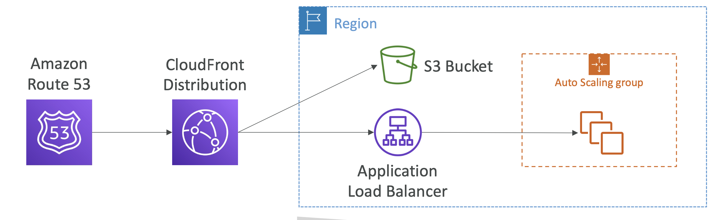
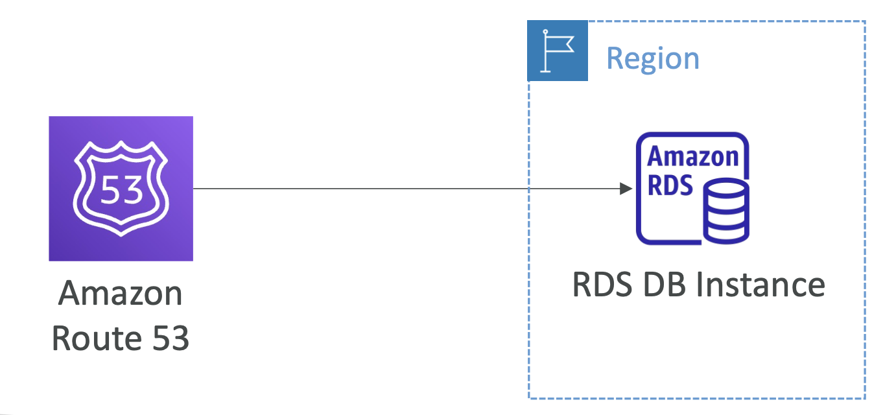
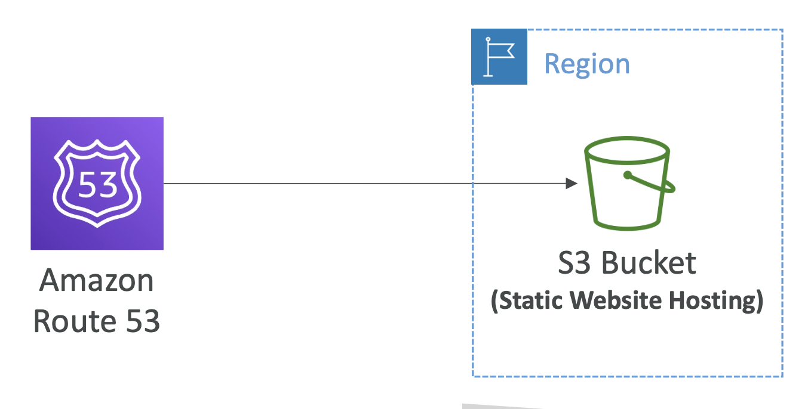
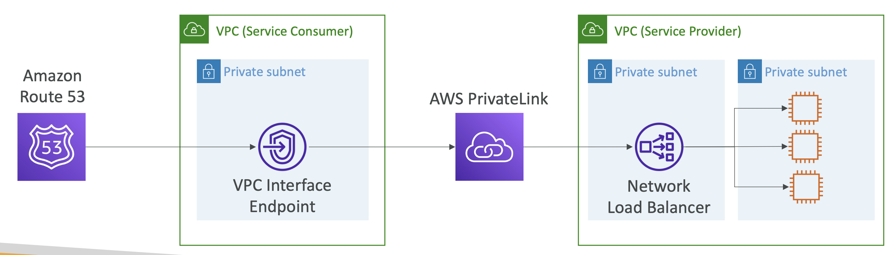

# Common Route 53 scenarios

## Route 53 Scenarios – 1. EC2 Instance

- 도메인이 퍼블릭 또는 탄력적 IP를 가진 EC2 인스턴스를 가리키는 경우
- **예시**: `example.com` => `54.55.56.57` (`A`)

  

 

## Route 53 Scenarios – 2. EC2 DNS name

EC2 인스턴스의 DNS 이름을 가리키는 레코드 생성

**EC2 인스턴스 생성** → 두 개의 IP (퍼블릭/프라이빗), 하나의 퍼블릭 DNS 이름

- **퍼블릭 DNS 1개**
  - 이 DNS 이름은 AWS 외부에서 생성하면 퍼블릭 IPv4로 연결되고, AWS 내부에서 생성하면 프라이빗 IPv4로 연결됨
- 따라서 이 DNS 이름에 대해 별칭 레코드를 만들 수 없고, CNAME 레코드만 만들 수 있음

 

#### Example. 예시

**Record**: `app.example.com` => `ec2-12-34-56-78.us-west2.compute.amazonaws.com` (`CNAME`)

  

EC2 인스턴스의 DNS 이름을 값으로 하는 `CNAME` 레코드를 만든 후 `app.example.com`을 요청 시,

- **AWS 외부의 클라이언트**: EC2 인스턴스의 **퍼블릭 IP**로 해석됨
- **VPC 내의 인스턴스나 다른 리소스**: EC2 인스턴스의 **프라이빗 IP**로 해석됨

 

## Route 53 Scenarios – 3. Application Load Balancer

- 도메인이 AWS Application Load Balancer(ALB)를 가리키는 경우
- 두 가지 방법: 
  1. `Alias` 레코드 (**Recommended**)
     - `Alias` 레코드는 Apex 도메인과 Non-Apex 도메인 모두에 적용 가능
  2. `CNAME`: Non-Apex 레코드
- ✅ **최대한 Alias 레코드를 사용 권장**

**Example**:
- e.g. `example.com` => `my-load-balancer-1234567890.us-west-2.elb.amazonaws.com` (`Alias`)
- `lb.example.com` => `my-load-balancer-1234567890.us-west-2.elb.amazonaws.com` (`Alias` or `CNAME`)

  

> [!NOTE]
> **Apex Domain**
> 
> : 하위 도메인이 없는 최상위 도메인
> 
> = naked domain = bare domain
> 
> fyi. Apex: the highest point

 

## Route 53 Scenarios – 4. CloudFront Distribution

- CloudFront도 Apex 또는 Non-Apex `Alias` 또는 `CNAME`을 생성할 수 있음
- **Example**:
  - `example.com` => `d2222222abcdef8.cloudfront.net` (`Alias`)
  - `cdn.example.com` => `d2222222abcdef8.cloudfront.net` (`Alias` or `CNAME`)
- CloudFront는 내부적으로 여러 오리진에 연결됨
  - `/application/` => ELB
  - `/images/*` => S3

  

 

## Route 53 Scenarios – 5. API Gateway

- API Gateway 지역적(Regional)/엣지(Edge) 최적화 DNS 이름을 가리키는 도메인 이름
- **Example**:
  - `example.com` => `b123abcde4.execute-api.us-west-2.amazonaws.com` (`Alias`)

  

 

## Route 53 Scenarios – 6. RDS DB Instance

- RDS DB 인스턴스의 DNS 이름을 가리키는 도메인 이름
- `CNAME` 레코드만 생성 가능 (다른 레코드 타입은 지원하지 않음)
- **예시**:
  - `db.example.com` => `myexampledb.a1b2c3d4wxyz.us-west-2.rds.amazonaws.com` (`CNAME`)

  

 

## Route 53 Scenarios – 7. S3 Bucket

- 도메인 이름이 S3 웹사이트 엔드포인트를 가리키는 도메인 이름
- S3 엔드포인트에 대한 `Alias` 레코드를 생성해야 함
- ✅ **도메인 이름은 버킷 이름과 반드시 동일해야 함**
- **예시**:
  - `example.com` => `s3-website-us-west-2.amazonaws.com` (`Alias`)
  - → 버킷 명이 `example.com`인 경우에만 동작

  

 

## Route 53 Scenarios – 8. VPC Interface Endpoint

- VPC 인터페이스 엔드포인트(AWS PrivateLink)를 가리키는 도메인 이름
- **예시**:
  - `example.com` => `vpce-1234-abcdev-us-east-1.vpce-svc-123345.us-east-1.vpce.amazonaws.com` (`Alias`)

  

- VPC Interface Endpoint: Service Provider와 Service Consumer VPC를 연결하기 위한 VPC Interface Endpoint의 연결을 위해 클래식 프라이빗 링크 설정
- VPC 인터페이스 엔드 포인트를 가리키는 Route 53 별칭을 만들 수 있음

