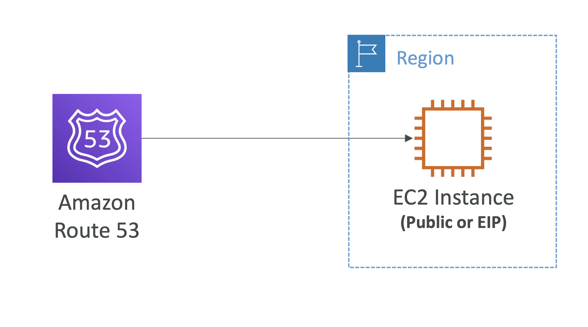
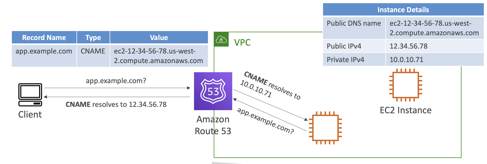

# Common Route 53 scenarios

## Route 53 Scenarios – EC2 Instance

- 도메인이 퍼블릭 또는 탄력적 IP를 가진 EC2 인스턴스를 가리키는 경우
- **예시**: `example.com` => `54.55.56.57 (A)`

  

 

## Route 53 Scenarios – EC2 DNS name

- **예시**: `app.example.com` => `ec2-12-34-56-78.us-west2.compute.amazonaws.com` (CNAME)

  

 
