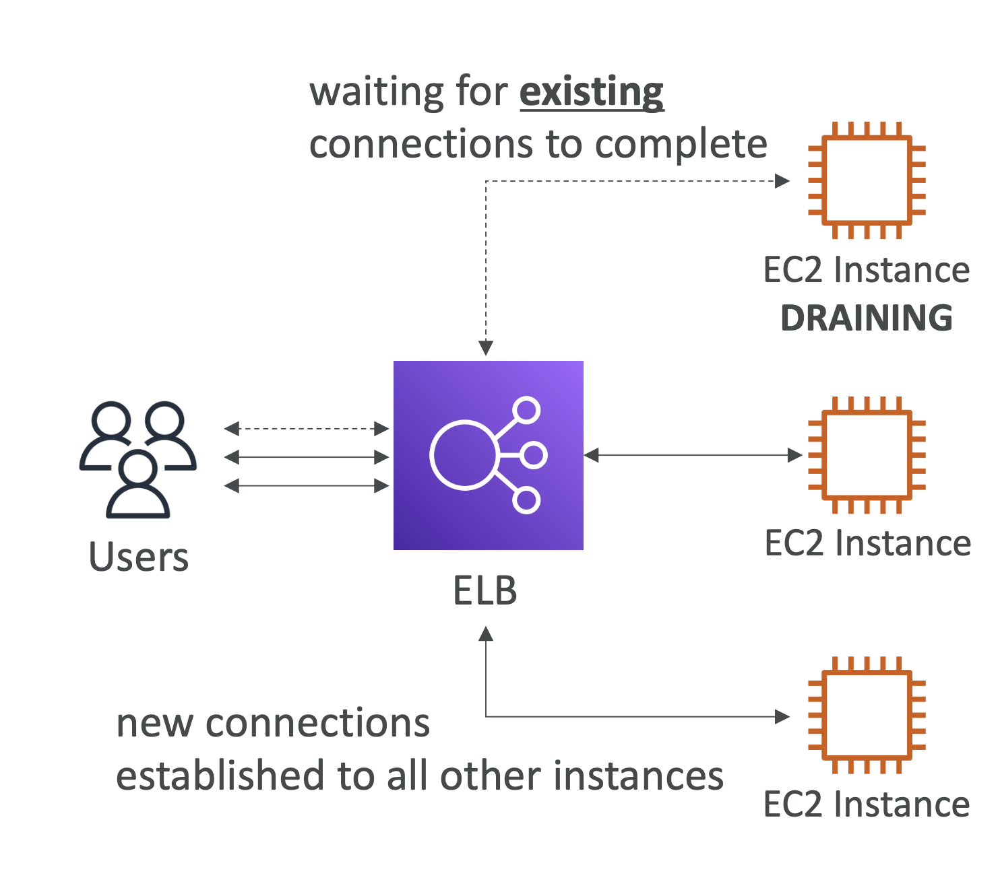

# Connection Draining

  

<pre>
세 개의 EC2 인스턴스가 있고, ELB는 EC2 인스턴스에 대한 트래픽을 분산.
이제 EC2 인스턴스 중 하나를 종료해야 함.
이 때, ELB는 EC2 인스턴스를 종료하기 전에 연결을 종료할 수 있는 시간을 주어야 함. 
→ 이때 Connection Draining 사용

<b>Connection Draining</b>은 ELB에서 제공하는 기능으로,
EC2 인스턴스를 종료하기 전에 기존 커넥션과 요청을 유지하도록 하는 기능.

모든 기존 작업이 종료되면, 커넥션이 종료되고, 
이후 새로운 사용자가 ELB에 연결하려고 하면, 
ELB는 EC2 인스턴스가 Draining 상태이기 때문에, 
다른 EC2 인스턴스와만 새로운 연결을 설정.

가령, 첫 번째 EC2 인스턴스가 Draining 상태일 때,
ELB는 두 번째 EC2 인스턴스나 세 번째 EC2 인스턴스와 연결시킴.
</pre>

- **피처 이름**
  - Connection Draining – for CLB
  - Deregistration Delay – for ALB & NLB

- "인-플라이트 요청"이 완료될 때까지 인스턴스를 비정상으로 표시하지 않음
- 등록 해제 중인 인스턴스에 대한 요청을 중지함
- 1초에서 3600초(기본값: 300초)
- 비활성화 가능(값을 0으로 설정)
- 요청이 짧은 경우 낮은 값으로 설정
  - 가령, 요청이 1초 미만인 경우, Draining을 30초 정도로 설정
  - → EC2 인스턴스가 빠르게 드레인되고 오프라인 상태가 되기 때문
