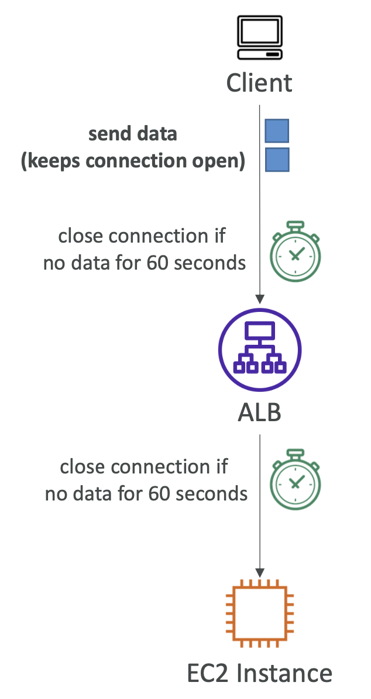

# Connection Idle Timeout

- ELB의 커넥션을 위한 Idle Timeout 기간: client-ELB 커넥션 및 ELB-target 커넥션
    - 커넥션은 해당 기간 동안 데이터가 전송/수신되지 않으면 종료됨
    - 해당 기간이 만료되기 전에 최소 1바이트가 전송되면 커넥션이 열림
- CLB, ALB 및 NLB에서 지원됨
- CLB 및 ALB에 대해 구성할 수 있음 (기본값 60초)
- NLB에 대해 구성할 수 없음
    - TCP의 경우 350초, UDP의 경우 120초
    - 사용 예시: 파일 업로드 중 타임아웃 방지 ← 의도적으로 NLB를 사용해서 타임아웃 방지
- EC2 인스턴스의 웹 서버 설정에서 HTTP keep-alive를 활성화하는 것이 좋음
    - ELB가 백엔드 커넥션을 재사용하도록 하여 keep-alive 타임아웃이 만료될 때까지 유지됨

