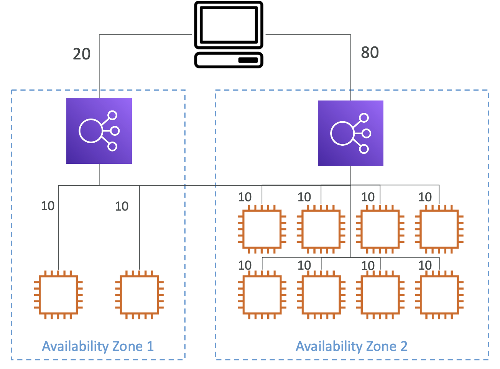
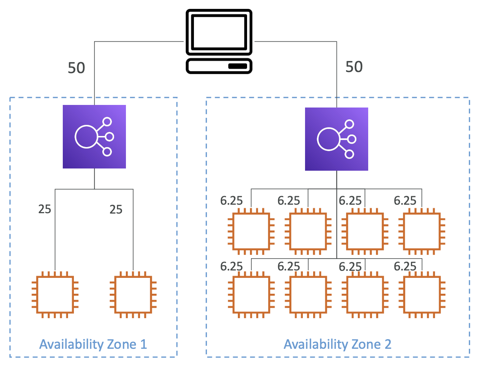

# Cross-Zone Load Balancing

<table>
<tr>
<th>With Cross Zone Load Balancing</th>
<th>Without Cross Zone Load Balancing</th>
</tr>
<tr>
<td></td>
<td></td>
</tr>
<tr>
<td>요청이 모든 AZ에 위치한 모든 등록된 인스턴스에 고르게 분포됨</td>
<td>요청이 Elastic Load Balancer의 노드 인스턴스에서 분포됨</td>
</tr>
</table>

두 옵션 간 좋고 나쁘고는 없으며, 어떤 선택이든 간, 개발 환경에 따라 결정하면 됨

 

## Cross-Zone Load Balancing

- **Application Load Balancer**
  - **디폴트 값**: `Enabled` 
  - ALB 레벨에서는 Enabled를 수정할 수 없지만, **타겟 그룹 레벨에서 비활성시킬 수 있음**
  - 상호 AZ 데이터 전송 간 **요금 없음**
- **Network Load Balancer & Gateway Load Balancer**
  - **디폴트 값**: `Disabled`
  - 활성화 시, 상호 AZ 데이터 전송 간 요금 발생 💰💰💰
- **Classic Load Balancer**
  - **디폴트 값**: `Disabled`
  - 상호 AZ 데이터 전송 간 **요금 없음**

 
