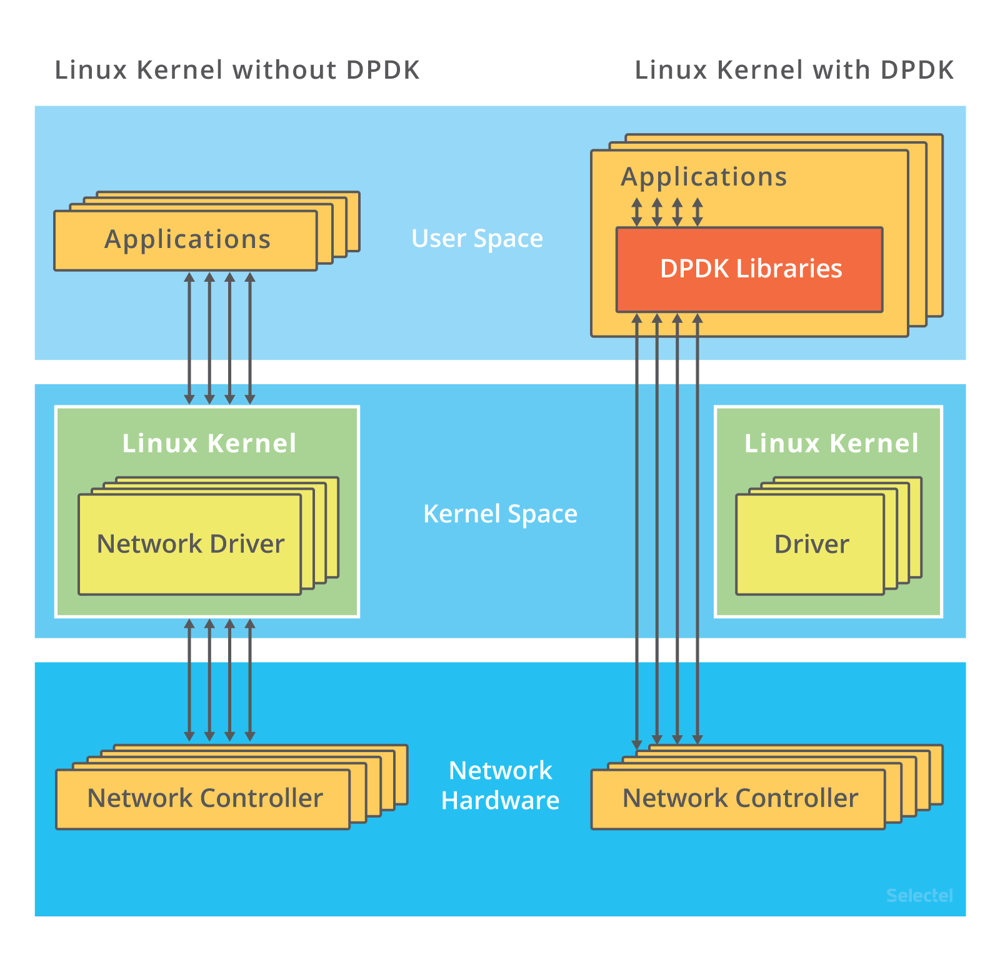
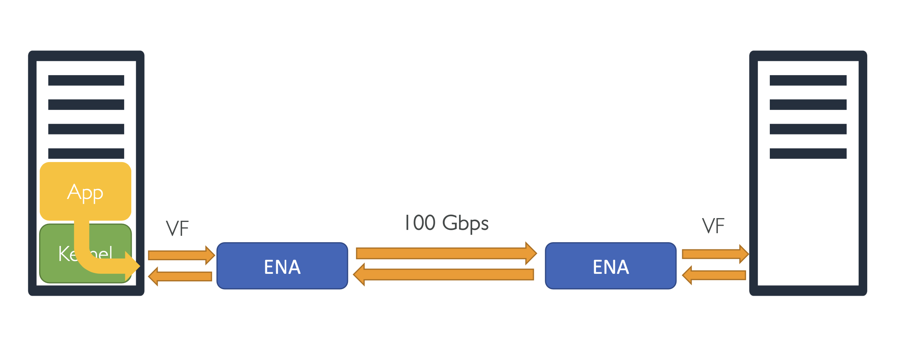
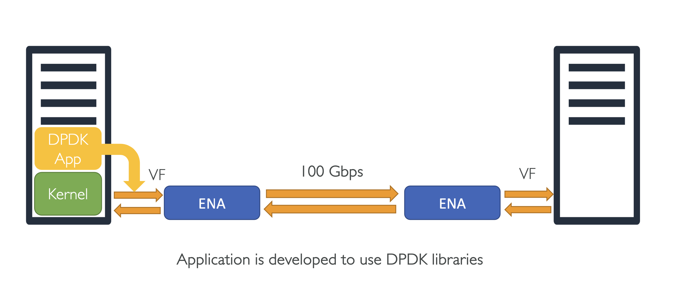
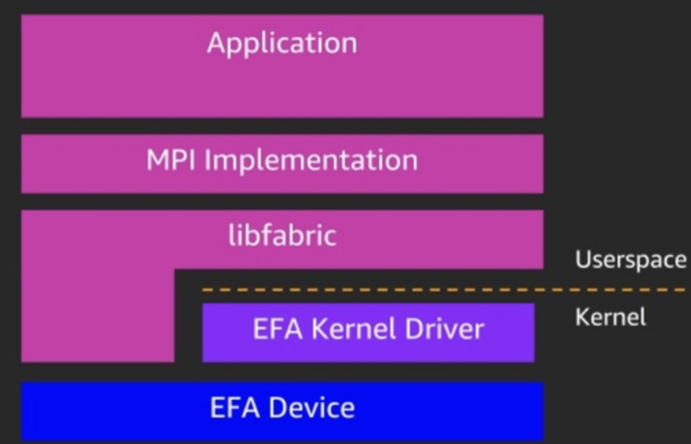

## Additional Network optimization techniques - DPDK & EFA

### Additional Tuning & Optimization - DPDK

 
<small>Ref. https://embedx.medium.com/introduction-to-dpdk-architecture-and-principles-40db9a61a6f5</small>
 

- Intel Data Plane Development Kit (DPDK) 는 fast packet processing 을 위한 libraries 와 drivers 세트
  - 패킷이 네트워크를 통해 전달되기 전, 빠른 패킷 처리 프로세에 대해서 이야기 해볼 예정
- 향상된 Networking 과 SR-IOV는 인스턴스와 하이퍼바이저 사이의 패킷 처리 오버헤드를 줄이는 거라면, **DPDK**는 **운영 체제** 내부의 패킷 처리 오버헤드를 줄임
  - 즉, 운영 체제 내에 DPDK 라이브러리를 적용하면, 보통 처리할 수 있는 패킷 보다 훨씬 더 많은 패킷을 처리할 수 있다는 의미
  - (While Enhanced Networking and SR-IOV reduce overhead of packet processing between Instance and Hypervisor, DPDK reduces overhead of packet processing inside the Operating System.)
- DPDK 제공
  - Kernel bypass 를 통한 저지연 (Lower Latency)
  - Packer 프로세싱의 더 많은 통제? More control of packer processing
  - 더 적은 CPU 오버헤드

#### Packet processing without DPDK

  

기본적으로, 패킷은 운영체제(혹은 커널이라고 해도 됨) 또한 거쳐가면서 처리됨

1. 패킷은 Application에서 Kernel로 전달 
2. 이후 패킷은 Kernel에서 ENA 혹은 Intel Virtual Function 같은 Virtual function driver 로 전달됨
3. 최종적으로, VM이 해당 패킷을 받음
   

#### Packet processing with DPDK

  

DPDK을 사용하면 커널을 bypass해서 사용할 수 있는데,
DPDK 라이브러리 패킷은 EC2 인스턴스에 붙어있는 드라이버로 직접 붙기 때문에 더 많은 패킷을 소화할 수 있음

1. 패킷은 Application에서 ENA 혹은 Intel Virtual Function 같은 Virtual function driver 로 직접 전달됨
2. 최종적으로, VM이 해당 패킷을 받음
   - 즉, 패킷 또한 운영체제(혹은 커널이라고 해도 됨)에 의해 처리된다는 의미 

 

### EFA - Elastic Fabric Adapter

  

- 특별한 종류의 ENA - Capability가 추가됨
- 저지연과 높은 처리량을 제공 (lower latency and higher throughput)
- Linux 운영체제에서 OS bypass 기능 제공
- Window 에 적용할 경우 그냥 ENA 처럼 동작 
- EFA를 사용하면, HPC 애플리케이션은 Libfabric API와 인터페이스하기 위한 MPI를 사용. 이는 운영 체제 커널을 우회하고 EFA 장치와 직접 통신하여 네트워크에 패킷을 전송.
  - With an EFA, HPC applications use MPI to interface with the Libfabric API which bypasses OS kernel and communicates directly with the EFA device to put packets on the network
  - **MPI**: Message Passing Interface
    - 병렬 프로그래밍을 위해 사용하는 통신 프로토콜
    - HPC(High Performance Computing) 작업에서는, 하나의 작업을 여러 대의 컴퓨터가 나눠서 처리할 수 있음
    -  → 궁극적으로, 네트워크 스루풋을 증가시킴

