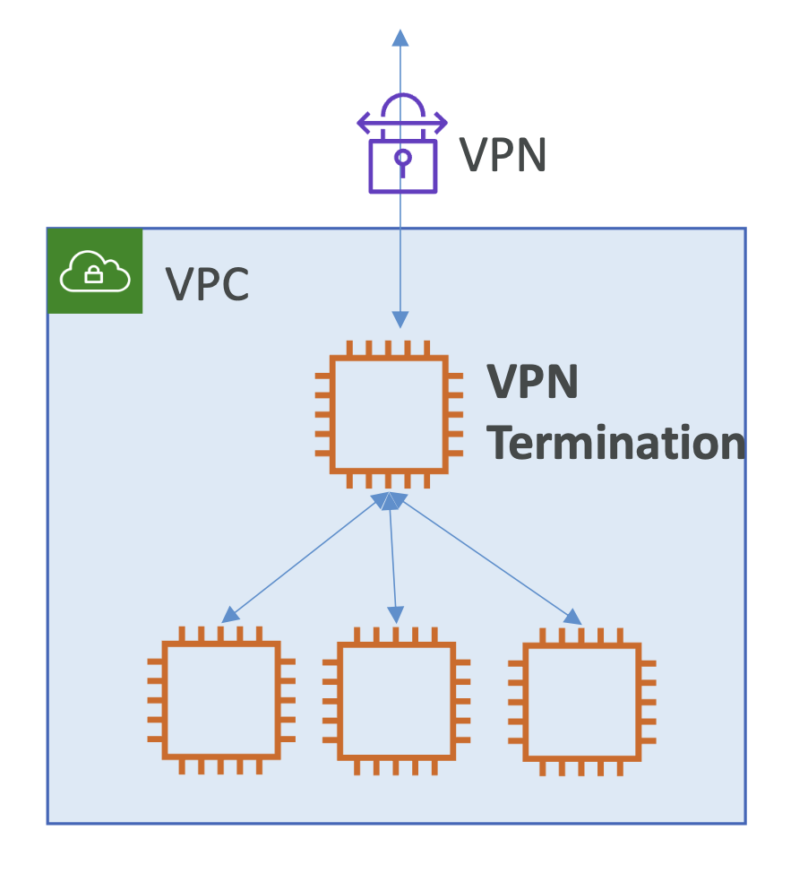
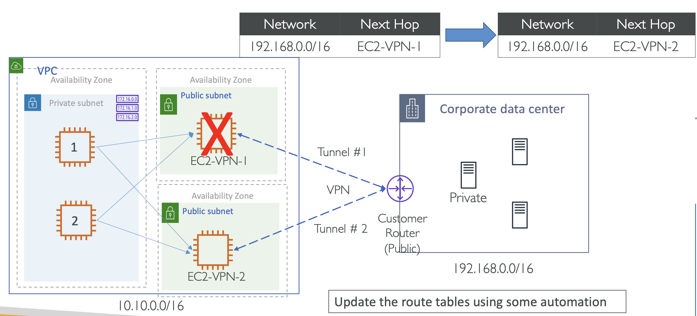

# EC2 based VPN

아래 아키텍처에서는 VPC에서 실행되는 EC2 인스턴스를 VPN 종단으로 사용.

  

EC2 인스턴스에는 VPN 소프트웨어가 설치되어 있으며, 외부 연결이 이 EC2 인스턴스에서 종료되고 VPC 내의 애플리케이션으로 트래픽을 라우팅 함. 

 

### VPN termination on EC2

|             | 관리형 VPN (AWS Site-to-Site VPN) | EC2 기반 VPN                                                                 |
|-------------|--------------------------------|----------------------------------------------------------------------------|
| **프로토콜 지원** | IPsec 프로토콜만 지원                 | GRE 또는 DMVPN 사용 가능 (단, AWS 환경에서는 GRE 기본 차단 → 터널링 소프트웨어 필요)                 |
| **CIDR 범위** | 중첩 X                           | OS 레벨에서 IP 테이블 규칙을 구성하여 중첩 IP 범위를 처리할 수 있음                                 |
| **전이적 라우팅** | 지원 X                           | EC2 인스턴스가 트래픽을 IGW, NAT 게이트웨이, VPC 피어링, VPC 엔드포인트 서비스 등을 통해 라우팅 가능         |
| **고급 기능**   | -                              | OpenVPN, StrongSwan, pfSense 등 다양한 VPN 소프트웨어 설치 가능 (고급 위협 보호 기능 포함 가능)     |
| **대역폭**     | 최대 1.25 Gbps 지원                | 단일 EC2 인스턴스는 최대 5 Gbps 지원, 수평 확장 및 여러 ENI 활용 시 더 높은 대역폭 가능                 |

 

### Considerations for EC2 based VPN

- **Source/destination 검사 비활성화:** VPN 종단점인 EC2 인스턴스에서 출발지/목적지 검사를 비활성화해야 트래픽이 EC2 인스턴스를 통해 애플리케이션 서버로 향할 수 있기 때문.
- **IP forwarding 활성화:** EC2 인스턴스에서 OS 레벨의 IP 포워딩을 활성화.
- CloudWatch 상태 체크를 세팅해서 **EC2 자동 복구 설정**.
- VPN 대역폭은 EC2 인스턴스 유형과 크기에 따라 다름 → VPC 밖에서 5Gbps까지 가능
- AWS는 서드파티 소프트웨어 VPN 어플라이언스를 제공하지 않음
  - **파트너 VPN 솔루션:** AWS Marketplace에서 서드파티 VPN 소프트웨어를 사용할 수 있으며, 이 소프트웨어는 고가용성과 자가 치유 기능을 제공할 수 있음. 
    - e.g. Cisco, Juniper, Palo Alto

 

### HA solution with EC2 based VPN

  

- **Vertical scaling**:
  - 성능 향상을 위해 수평 확장 고려
- **Horizontal scaling**
  - 수직 확장을 지원하는 아키텍처를 가질 수 있음
- NLB가 IPsec 프로토콜을 지원하지 않기 때문에 네트워크 로드 밸런서를 사용할 수 없음. 
  - IPsec가 non-Transmission Control Protocol (TCP) 이기 때문
  - IPSec protocol `50`
