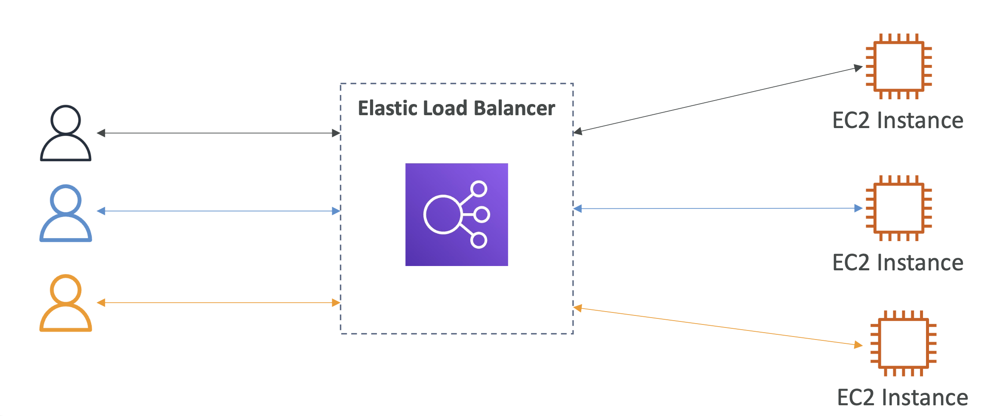

# AWS Elastic Load Balancer

## What is load balancing?

로드 밸러스는 다운스트림 서버로 트래픽을 포워팅하는 서버들

사용자는 여러 서버에 접근하지 않고, 그 앞단의 Load Balancer 에 접근하면 됨

더 많은 사용자가 있을수록 더 많은 부하가 EC2 인스턴스에 분산됨

  

 

## Why use a load balancer?

- 여러 다운스트림 인스턴스에 부하를 분산
- 애플리케이션에 대한 단일 액세스 포인트(DNS)를 노출
- 다운스트림 인스턴스의 장애를 원활하게 처리
- 인스턴스에 대한 정기적인 헬스 체크 수행
- 웹사이트에 대한 SSL 종료(HTTPS) 제공
- 쿠키로 Stickiness 강제 적용
- 가용 영역 간 고가용성
- 공용 트래픽과 사설 트래픽 분리

 

## Why use an Elastic Load Balancer?

- Elastic Load Balancer는 AWS에서 제공하는 로드 밸런서
    - AWS는 로드 밸러스가 정상 동작하도록 보장
    - AWS는 업그레이드, 유지 관리, 고가용성을 처리
    - AWS는 몇 가지 configuration knob만 제공
    - AWS는 몇 가지 구성 옵션configuration knobs만 제공 (조절 가능한 파라미터나 세팅 값 등)
- AWS는 자체 로드 밸런서를 설정하는 것이 더 저렴하지만, 많은 노력이 필요
- AWS는 많은 AWS 제공/서비스와 통합됨
    - EC2, EC2 Auto Scaling Groups, Amazon ECS
    - AWS Certificate Manager (ACM), CloudWatch
    - Route 53, AWS WAF, AWS Global Accelerator

## Health Checks

- Health Checks는 로드 밸런서에 매우 중요함
- 로드 밸런서가 트래픽을 전달하는 인스턴스가 요청에 응답할 수 있는지 알 수 있도록 함
- 헬스 체크는 포트와 경로(/health가 일반적)에서 수행됨
- 응답이 200(OK)이 아니면 인스턴스는 비정상으로 간주됨

  

## Types of load balancer on AWS

- AWS는 **4가지 종류의 관리형 로드 밸런서** 제공
- **Classic Load Balancer** (v1 - old generation) – 2009 – CLB
  - HTTP, HTTPS, TCP, SSL (secure TCP)
  - Old generation 으로, 콘솔 창에서 deprecated 표시되어 있지만, 아직까지 사용 가능
- **Application Load Balancer** (v2 - new generation) – 2016 – ALB
  - HTTP, HTTPS, WebSocket
- **Network Load Balancer** (v2 - new generation) – 2017 – NLB
  - TCP, TLS (secure TCP), UDP
- **Gateway Load Balancer** – 2020 – GWLB
  - Layer 3 (Network layer) – IP Protocol

- 전반적으로 최신 세대 로드 밸런서를 사용하는 것이 더 많은 기능을 제공하므로 권장됨
- 일부 로드 밸런서는 **내부**(프라이빗) 또는 **외부**(퍼블릭) ELB로 설정할 수 있음

 

## Load Balancer Security Groups

<table>
<tr>
<td colspan="2">

</td>
</tr>
<tr>
<th>Load Balancer Security Group:</th>
<th>Application Security Group: Allow traffic only from Load Balancer</th>
</tr>
<tr>
<td>

<table>
<tr>
  <th>Type</th>
  <th>Protocol</th>
  <th>Port Range</th>
  <th>Source</th>
  <th>Description</th>
</tr>
<tr>
  <td>HTTP</td>
  <td>TCP</td>
  <td>80</td>
  <td>0.0.0.0/0</td>
  <td>Allow HTTP from an...</td>
</tr>
<tr>
  <td>HTTPS</td>
  <td>TCP</td>
  <td>443</td>
  <td>0.0.0.0/0</td>
  <td>Allow HTTPS from a...</td>
</tr>
</table>

</td>
<td>

<table>
<tr>
  <th>Type</th>
  <th>Protocol</th>
  <th>Port Range</th>
  <th>Source</th>
  <th>Description</th>
</tr>
<tr>
  <td>HTTP</td>
  <td>TCP</td>
  <td>80</td>
  <td>sg-0354sfff2d4a563de</td>
  <td>Allow HTTP from an...</td>
</tr>
</table>

EC2의 보안 그룹 정책에서 Source 값은 로드 밸러서의 보안 그룹으로 설정

</td>
</tr>
</table>

 

