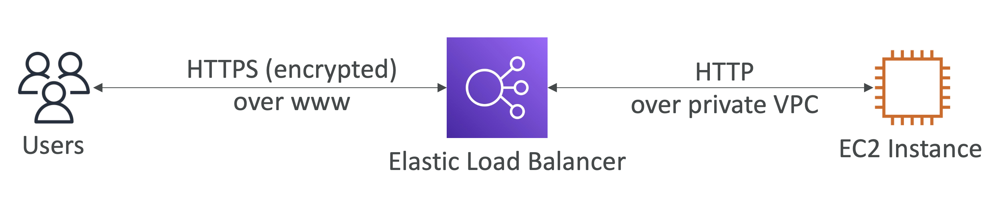

# ELB SSL/TLS

## Elastic Load Balancer – SSL Certificates

  

- 로드 밸런서는 X.509 인증서 (SSL/TLS server certificate) 사용
- ACM (AWS Certificate Manager)을 사용해서 인증서를 관리할 수 있음
- 자체 인증서를 직접 생성해서 올릴 수도 있음
- **HTTPS listener**:
  - 디폴트 인증서를 명시해야함
  - 다중 도메인을 지원하기 위해 선택적인 인증서 리스트를 추가할 수 있음
  - 클라이언트는 닿고자 하는 호스트명을 명시하기 이해 SNI(Server Name Indication)를 사용할 수 있음
  - Security Policy를 명시할 수 있음: 컴파일런스, 기능, 호환성, 보안 등의 목적

 

