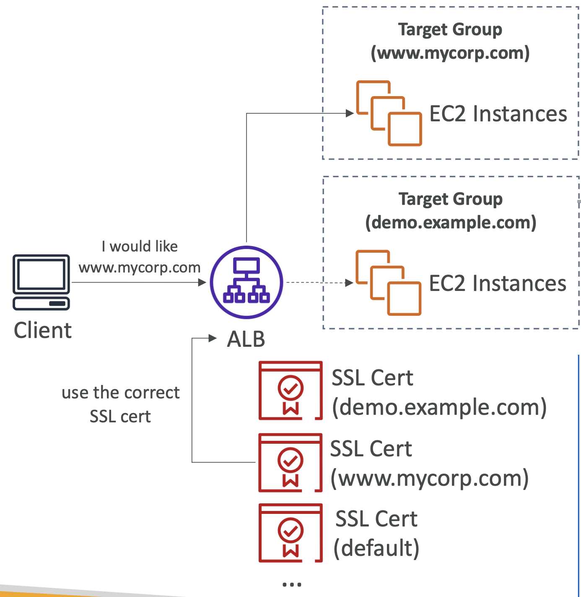

# ELB SSL/TLS

## Elastic Load Balancer – SSL Certificates

  

- 로드 밸런서는 X.509 인증서 (SSL/TLS server certificate) 사용
- ACM (AWS Certificate Manager)을 사용해서 인증서를 관리할 수 있음
- 자체 인증서를 직접 생성해서 올릴 수도 있음
- **HTTPS listener**:
  - 디폴트 인증서를 명시해야함
  - 여러 도메인을 지원하기 위해 선택적인 인증서 리스트를 추가할 수 있음
  - 클라이언트는 닿고자 하는 호스트명을 명시하기 이해 SNI(Server Name Indication)를 사용할 수 있음
  - 보안 정책을 명시할 수 있음: 컴파일런스, 기능, 호환성, 보안 등의 목적

 

## SSL – Server Name Indication (SNI)

  

- SNI 는 단일 웹 서버 위에 여러 SSL 인증서를 로딩할 때의 문제점을 해결 (다중 웹사이트에 서빙하기 위함)
  - 가령, `demo.example.com`에 접근할 수 있으면서 동시에 `www.mycorp.com`에 접근하려고 할 때
- "신규" 프로토콜로, 클라이언트가 연결할 SSL 핸드셰이크의 타겟 호스트명의 호스트명을 지정할 때 필요
  - 클라이언트가 `www.mycorp.com`에 연결하고자 하면, SNI 기능 덕분에 ALB는 어떤 SSL 인증서를 사용해야 하는지 알 수 있음
- 서버는 올바른 인증서를 찾거나, 디폴트 인증서를 반환
- ALB & NLB 에서만 작동

 

## Elastic Load Balancers – SSL Certificates

- **Classic Load Balancer**
  - 오직 하나의 SSL 인증서만 지원
  - SSL 인증서는 여러 개의 SAN (Subject Alternate Name)을 가질 수 있지만, SAN을 추가/편집/제거할 때마다 SSL 인증서를 변경해야 함
  - 다중 호스트명과 다중 SSL 인증서를 위해서는 반드시 여러 개의 CLB를 사용해야함
  - 가능하면 SNI(Server Name Indication)과 함께 ALB를 사용하는 것이 나음
- **Application Load Balancer**
  - 다중 SSL 인증서를 가진 다중 리스너를 지원
  - Server Name Indication (서버 이름 표시, SNI)를 통해 동작
- **Network Load Balancer**
  - 다중 SSL 인증서를 가진 다중 리스너를 지원
  - Server Name Indication (SNI)를 통해 동작

 

### HTTPS/SSL Listener – Security Policy

- SSL 프로토콜들의 조합, SSL 암호화 및 서버 우선 순위 옵션이 SSL 협상 중에 지원됨
- 미리 정의된 보안 정책(예: `ELBSecurityPolicy-2016-08`)
- **ALB 및 NLB**
  - **프론트엔드 연결**: 미리 정의된 보안 정책을 사용할 수 있음
  - **백엔드 연결**: `ELBSecurityPolicy-2016-08` 보안 정책이 항상 사용됨
- **`ELBSecurityPolicy-TLS` 정책 사용**
  - https://docs.aws.amazon.com/ko_kr/elasticloadbalancing/latest/application/describe-ssl-policies.html#tls-security-policies
  - 특정 TLS 프로토콜 버전을 요구하는 규정 준수 및 보안 표준을 충족하기 위함
  - 이전 버전의 SSL/TLS(레거시 클라이언트)를 지원하기 위함
- **Forward Secrecy가 필요한 경우, `ELBSecurityPolicy-FS` 정책 사용**
  - https://docs.aws.amazon.com/ko_kr/elasticloadbalancing/latest/application/describe-ssl-policies.html
  - 암호화된 데이터의 도청에 대한 추가 보호 장치를 제공
  - **고유한 무작위 세션 키**를 사용

 

