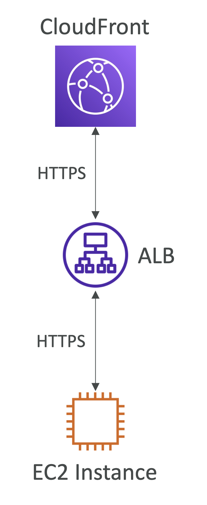

# End-to-End Encryption in CloudFront

## End-to-End Encryption: CloudFront, ALB, EC2

  

- **CloudFront**
  - Origin protocol policy: HTTPS Only
  - Custom origin에 SSL/TLS 인증서 설치 필요
  - Origin 인증서는 다음 둘 중 하나에 반드시 포함되어 있어야 함
    - CloudFront에 설정된 **Origin 도메인 필드**
    - Origin에 포워딩된 "`Host`" 헤더의 도메인 (Origin에 포워딩된다면)
  - Self-signed certificate 사용 불가능
- **Application Load Balancer**
  - AWS Certificate Manager가 제공하는 인증서나 ACM으로 가져와서 사용
- **EC2 Instance**
  - ACM은 EC2를 지원하지 않음
  - 타사 SSL 인증서 사용 가능 (도메인 이름 상관 없음)
  - Self-signed certificate 사용 가능 (ALB 자체에서는 인증서를 직접 확인하지 않음)
