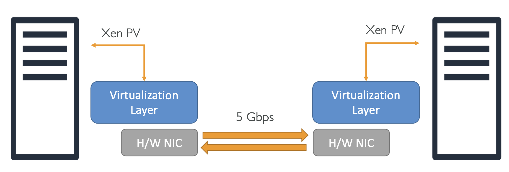
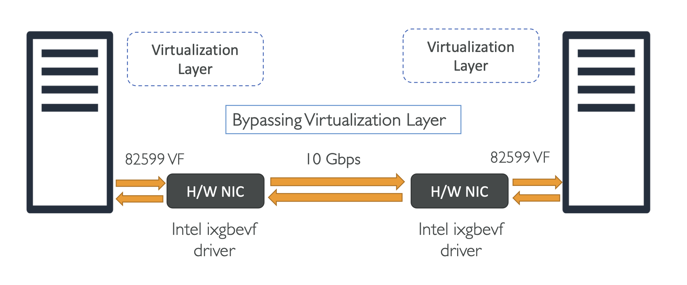
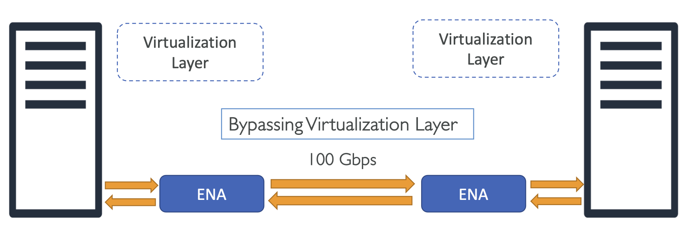

# Enhanced Networking

### What is it?

두 시스템 사이의 네트워크 성능을 향상시키는 것

```
   System 1                            System 2
  +--------+                          +--------+
  |        | <--- High-Bandwidth ---> |        |       
  |        |                          |        |    
  +--------+                          +--------+
```

- 초당 1만개 이상의 패킷 처리 가능 (Over 1M PPS performance)
- 인스턴스간 지연 감소
- SR-IOV with PCI passthrough, 일관된 성능을 위해 hypervisor을 먼저 처리
  - 시스템 간 통신 시 '여러 홉으로 뛰게 하는 장애물'을 최대한 많이 제거하는 것
- Enabled using intel **ixgbevf driver** or **Elastic Network Adapter (ENA)**

<br>

### SR-IOV and PCI for Enhanced Networking

- **SR-IOV**: Single Root I/O Virtualization
- **PCI**: Peripheral Component Interconnect. 주변 연결 장치

VM과 Network Card가 직접 연결되게, 즉 VM과 물리 NIC가 통신할 수 있도록 만듦 

- SR-IOV와 PCI passthrough: 높은 I/O 성능과 낮은 CPU 사용률을 제공하는 장치 가상화 방법
- SR-IOV는 단일 물리적 NIC가 마치 여러 개의 vNIC로 나타낼 수 있게 해줌
- PCI passthrough는 ENI와 같은 PCI 장치가 하이퍼바이저를 우회하여 게스트 운영 체제에 물리적으로 연결된 것처럼 보이게 함 
- 궁극적으로 이 두 기술을 결합하면 낮은 지연 시간과 높은 데이터 전송 속도(>1 M PPS)를 실현할 수 있음

<br>

### Enhanced Networking pre-requisites

- 인스턴스 유형에 따라 Enhanced Networking은 다음 네트워크 드라이버 중 하나를 사용하여 활성화할 수 있음
  - Option 1: Intel 82599 VF (aka. VF ixgbevf driver) 사용 - 최대 10 Gbps
  - Option 2: Elastic Network Adapter (ENA) 최대 100 Gbps
- 두 옵션을 모두 지원하는 EC2 인스턴스 패밀리의 경우 둘 중 하나를 선택할 수 있음 (배타적 관계라 함께 사용할 수는 없음)

**Remember:** 
- Enhanced Networking을 사용하려면 **EC2 운영 체제(AMI)**와 **Enhanced Networking 로 명시된 인스턴스 유형** 필요

<br>

### Supported Instance types

- Instances supporting **Elastic Network Adapter (ENA) for speed upto 100 Gbps**
  - A1, C5, C5a, C5d, C5n, C6g, F1, G3, G4, H1, I3, I3en etc
- Instances supporting **Intel 82599 Virtual Function (VF) interface for speed upto 10 Gbps**.
  - C3, C4, D2, I2, M4 (excluding m4.16xlarge), and R3 etc

<br>

### Verifying enhanced networking

<table>
<tr>
<th>Intel VF ixgbevf</th>
<th>ENA</th>
</tr>
<tr>
<td>

<pre><code>$ ethool -i eth0</code></pre>

_driver: ixgbevf_

> C3, C4, D2, I2, R3, M4 (not m4.16xlarge)

</td>
<td>

<pre><code>$ ethool -i eth0</code></pre>

_driver: ena_

> C5, F1, G3, P2, P3, R4, I3, X1, X1e, m4.16xlarge

</td>
</tr>
</table>

<br>

### EC2 Networking 

#### ✔️ default

일반적인 네트워크 흐름은 아래와 같음

<br><br>

시스템 내에 EC2가 있고, 가상화 레이어(Virtualization Layer)를 거쳐 물리 NIC를 통해 네트워크를 통하게 됨

이후 2개의 물리 NIC가 데이터를 교환 

EC2는 기본적으로 5Gbps 대역폭을 지원

<br>

#### ✔️ Intel VF

기본적으로 가상화 레이어(Virtualization Layer)는 무시되어 플로우에서 제외됨

<br><br>

위 그림과 같이 Intel Virtual Function 같은 드라이버를 사용하면 하드웨어 네트워크 인터페이스 카드와 직접 통신하는 것을 볼 수 있음

10Gbps 대역폭까지 지원

<br>

#### ✔️ ENA

ENA도 동일하게, 가상화 레이어(Virtualization Layer)는 무시되어 플로우에서 제외됨

대신 ENA를 사용 

<br><br>

ENA는 최대 100Gbps 대역폭을 지원

이 때, Flow 는 두 머신 사이의 point-to-point 연결을 의미하는데, 일반적으로 5-tuple 형식을 띔

**5-tuple**: (Source IP, Destination IP, Protocol No, Source Port, Destination Port)

그래서, 100Gbps에 도달할 만큼 사용하고 싶다면 multiple search flow를 사용해야 함

- multi-flow: 두 EC2 서버 사이의 multiple parallel connection을 의미 
- single-flow 는 10Gbps 까지만 사용할 수 있음

