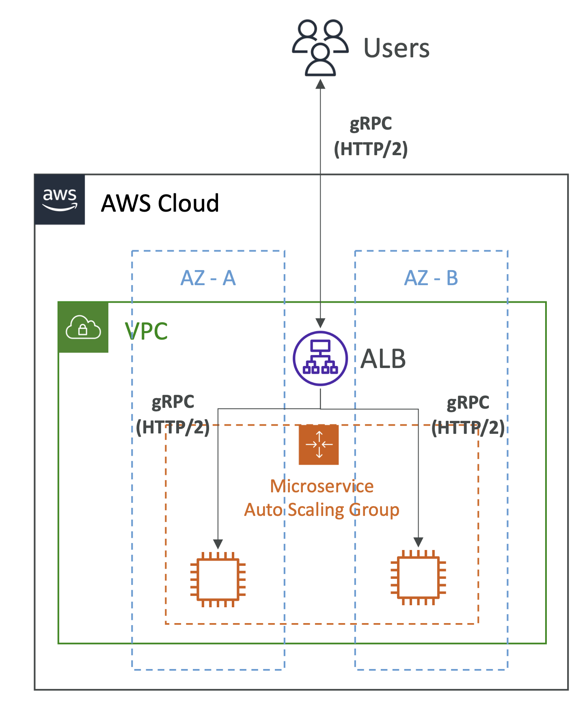

# gRPC & ALB

## Application Load Balancer & gRPC

- gRPC는 HTTP/2를 사용하는 마이크로서비스 통합을 위한 인기 있는 선택
- **Application Load Balancer**는 gRPC를 완전히 지원
  - 타겟 그룹에서 gRPC 상태 검사를 지원
  - 적절한 서비스로 라우팅하기 위한 콘텐츠 기반 라우팅 기능
  - 모든 종류의 gRPC 통신 (양방향 스트리밍bidirectional streaming 포함) 지원
    - 사용자는 gRPC를 사용하여 ALB에 바로 연결할 수 있음
  - 리스너 프로토콜: HTTPS (다른 프로토콜은 지원하지 않음)
- **Note**: gRPC는 NLB와 함께 작동하지만 "HTTP-specific" 기능이 없음
  - HTTP-specific: HTTP 만의 기능. Health check, Content based routing 등

  

 

