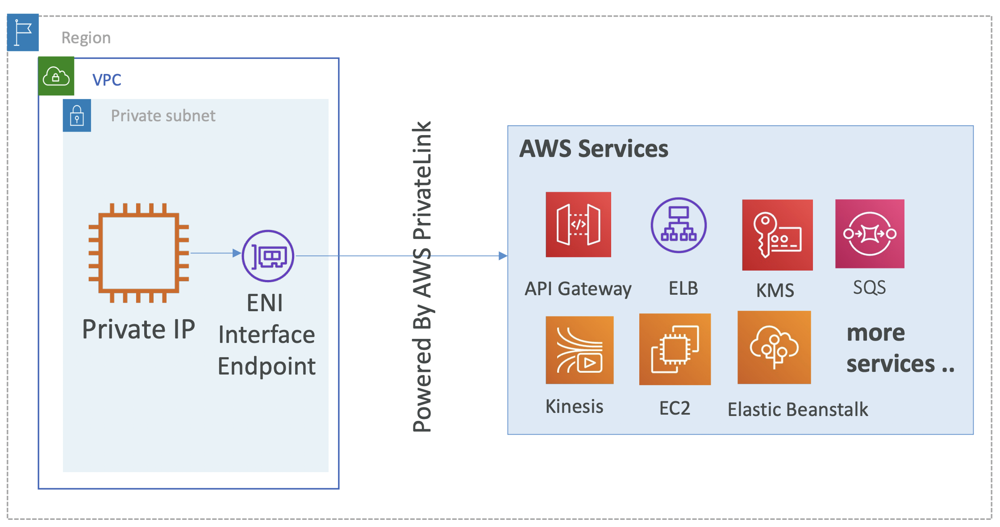
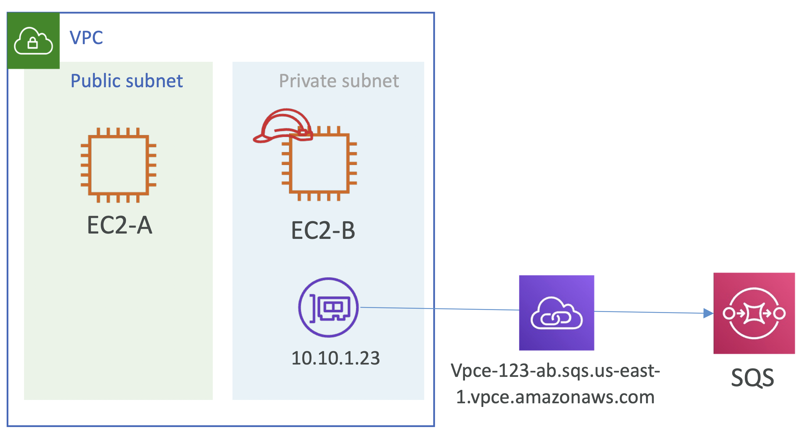

# Hands On: Create VPC interface endpoint and access SQS

## VPC Interface Endpoint - Accessing AWS Services

<br><br>

## Create VPC interface endpoint

아래 도식을 기반으로 설정

<br><br>

### 📌 1. VPC 와 Public / Private Subnets 생성

### 📌 2. 각 Subnets 하위에 EC2 instance 실행

### 📌 3. Private Subnet 하위에 SQS 서비스를 위한 Interface endpoint 생성

#### ✔️ Service category

- [x] AWS services
- [ ] Find service by name
- [ ] Your AWS Marketplace services

#### ✔️ Service Name

| Service Name                 | Owner  | Type          |
|------------------------------|--------|---------------|
| com.amazonaws.ap-south-1.sqs | amazon | **Interface** |

#### ✔️ VPC

VPC 선택 + Private Subnet 선택

#### ✔️ Enable DNA name

☑️ Enable for this endpoint

#### ✔️ Security Group

VPC에 Endpoint Interface를 위한 Security Group 생성

**Inbound rules**

| Type  | Protocol | Port range | Source       |
|-------|----------|------------|--------------|
| HTTPs | TCP      | 443        | 10.10.0.0/16 |

**Outbound rules**

| Type        | Protocol | Port range | Source    |
|-------------|----------|------------|-----------|
| Any traffic | All      | All        | 0.0.0.0/0 |

#### ✔️ Policy

- [x] Full Access
- [ ] Custom


#### ERROR

<pre><h4>❗️ Error creating VPC Endpoint</h4>Enabling private DNS requires both enableDnsSupport and enableDnsHostnames VPC attributes set to tru for vpc-030f9...
</pre>

- VPC 콘솔 창 > Actions > Edit DNS resolution
- VPC 콘솔 창 > Actions > Edit DNS enableDnsHostnames

---

이후, Endpoint 성공적으로 생성

| Subnet ID               | Availability Zone      | IPv4 Addresses  | IPv6 Addresses | Network Interface ID | Outpost ID |
|-------------------------|------------------------|-----------------|----------------|----------------------|------------|
| subnet-0e153cccce4f...  | ap-south-1a(aps1-az1)  | 10.10.1.114     | -              | eni-06e0d8de...      | -          |

- **Detail**
  - **DNS names**: vpce-098fa...-sqs.ap-south-1.cpce.amazonaws.com (Z2KV...)
  - **Private DNS names**: sqs.ap-south-1.amazonaws.com
- **Policy**
  - ```Bash
    {
        "Statement": [
            {
                "Action": "*",
                "Effect": "Allow",
                "Resource": "*",
                "Principal": "*",
            }
        ]
    }
    ```

<br>

### 📌 4. SQS 생성

- SQS 생성
- IAM 생성

<br>

### 📌 5. Private EC2 접속 후, Interface endpoint를 사용해서 SQS (PutMessage) 접근

PuTTY 를 통해 접근 후, 아래와 같이 SQS 접근 시도

#### 1. NO Connectivity

```bash
[ec2-user-ip] $ ping google.com
PING google.com (142.250.76.206) 56(84) bytes of data.
...
--- google.com ping statistics ---
2 packets transimmited, 0 received, 100$ packet loss, time 1014ms
```

#### 1. NO Connectivity

```bash
$ ping google.com
PING google.com (142.250.76.206) 56(84) bytes of data.
...
--- google.com ping statistics ---
2 packets transimmited, 0 received, 100$ packet loss, time 1014ms
```

#### 2. Send SQS Message

```bash
$ aws sqs send-message --queue-url https://sqs.ap-south-1.amazonaws.com/382992842938/endpoint-demo --message-body "Hi, this is the test message" --region ap-south-q
{
  "MD5OfMessageBody": "51b0a325...39163aa0",
  "MessageId": "da68f62c-0c07-4bee-bf5f-7e856EXAMPLE"
}
```


### Delete SG Inbound Rule

Inbound Rule 을 삭제하고 SQS 메세지를 전송 시도하면, 막힘

```bash
$ aws sqs send-message --queue-url https://sqs.ap-south-1.amazonaws.com/382992842938/endpoint-demo --message-body "Hi, this is the test message" --region ap-south-q

```

위 명령어 이후 응답 없음


