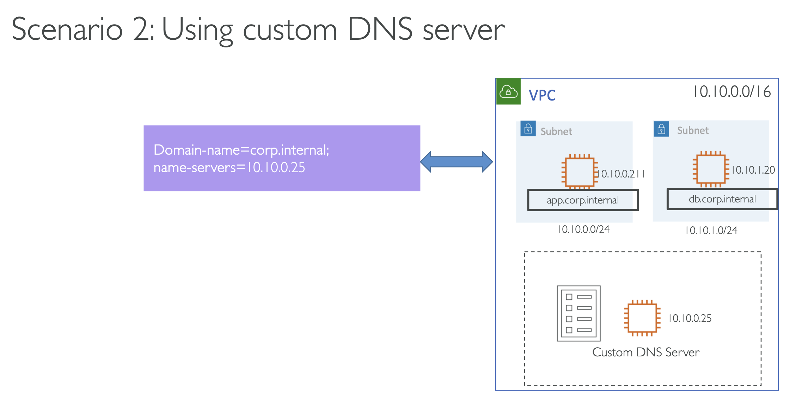
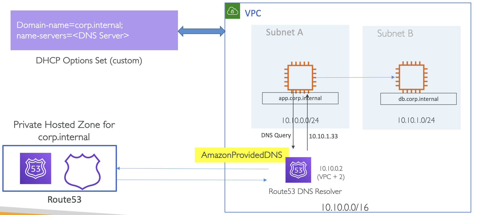
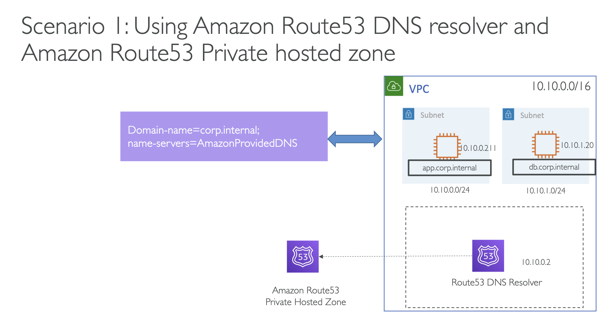

# Hands on exercises scenarios

## Scenario 1: VPC DNS with Route53 Private Hosted zone

<i>Using Amazon Route53 DNS resolver and Amazon Route53 Private hosted zone</i>

VPC 가 있고 그 내에 몇 가지 EC2 인스턴스 존재.

`.corp.internal` 이라는 커스텀 도메인 이름을 붙이려고 함.

두 인스턴스의 이름은 각각 앱서버 - `app.corp.internal` 와 DB 서버 - `db.corp.internal` 이고,
앱 서버에서 DB 서버를 도메인으로 호출하고자 함

<br><br>

위 상황에서는 Default DNS Server 를 사용할 것이기 때문에 따로 DHCP OptionSet 을 변경할 필요가 없음

하지만, 기본 형식인 `ip-<private-ipv4-address>.region.compute.internal` 를 
DHCP 옵션의 `Domain-name` 을 사용자가 원하는 이름인 `.corp.internal` 으로 설정하여 변경할 수 있음


### Hands-on

<br><br>

기본 DNS Server 인 `AmazonProvidedDNS` Server 를 사용

때문에 기본적으로 DHCP Options Set 의 name server 영역은 수정하지 않지만,
커스텀 도메인 이름을 원하기 때문에 커스텀 해봄

#### Steps

1. VPC 생성 후, Public & Private subnet 생성
2. (선택) DHCP Option sets 의 도메인을 `corp.internal`으로 설정한 후 생성한 VPC에 연결
   - Amazon Console 에서 아래와 같이 설정
   - **Domain name**: `corp.internal`
   - **Domain name servers**: `AmazonProvidedDNS`   
3. 퍼블릭 서브넷에 앱 서버를 위한 EC2 인스턴스 하나를 생성하고, 프라이빗 서브넷에 DB 서버를 생성
4. Security Group 생성해서 SSH 와 ICMP IPv4 를 Allow 하도록 설정
5. Route 53 Private hosted zone 을 생성해 만들어둔 VPC에 연결
6. EC2 인스턴스의 프라이빗 IPs를 가리키는 A records 생성
7. 퍼블릭 EC2 인스턴스에 SSH 로 접근해보고, 다른 인스턴스에 해당 DNS 이름으로 접근 해보기
   - **SSH 접속 확인**: 
   - ```
     $ cat /etc/resolv.conf
     ...
     nameserver: 10.10.0.2
     search corp.internal
     ```
   - **이후 DB 접속 확인**: `$ ping db`
     - `db.corp.internal` 로 찾아보기 때문에 조회 성공 

<br>

## Scenario 2: VPC DNS with custom DNS server

<i>Using custom DNS server</i>

두 번째 시나리오는 AWS Default DNS Server 가 아닌 사용자 커스텀 DNS 서버를 사용하는 방식.

여기서 중요한 부분은, DHCP 옵션의 `name-servers` 를 커스텀 DNS Server의 IP 로 설정하여 변경할 수 있음

<br><br>

### Step 1 – Setup a VPC and launch instances

<br><br>

**1.1.** Create a VPC with public and private subnets

- Launch DNS server ec2 instance:
  - Security group to allow UDP 53 from

**1.2.** VPC CIDR, SSH (22)

- Launch an app server & db server ec2 instances:
  - Security group to allow SSH (22), ICMP IPv4 All (ping)

### Step 2a – Setup DNS server

**2a.1.** Login to DNS server

**2a.2.** Install DNS server packages

```
$sudo su
$yum update –y
$yum install bind bind-utils –y
```

### Step 2b – Configure DNS server

몇 가지 파일을 생성해야 함

**2a.3.** Create file /var/named/corp.internal.zone

<pre lang="bash">
$TTL 86400
@   IN  SOA     ns1.corp.internal.  root.corp.internal. (
        2013042201    ;Serial
        3600          ;Refresh
        1800          ;Retry
        604800        ;Expire
        86400         ;Minimum  TTL
)
; Specify our two nameservers
    IN    NS  dnsA.corp.internal.
    IN    NS  dnsB.corp.internal.
; Resolve nameserver hostnames to IP, replace with your two droplet IP addresses. 
dnsA IN A 1.1.1.1
dnsB IN A 8.8.8.8

; Define hostname -> IP pairs which you wish to resolve 
@   IN  A   10.10.0.<b>x</b>
app IN  A   10.10.0.<b>x</b>
db  IN  A   10.10.1.<b>x</b>
</pre>

`x` → IP 에 맞게 수정

**TOBE:**

```
...
@   IN  A   10.10.0.180
app IN  A   10.10.0.180
db  IN  A   10.10.1.214
```

### Step 2c – Configure DNS server

**2a.4.** Create file `/etc/named.conf`

`X` → with your DNS server IP 에 맞게 수정

<pre lang="bash">
options {
  directory "/var/named";
  dump-file "/var/named/data/cache_dump.db";
  statistics-file "/var/named/data/named_stats.txt"; 
  memstatistics-file "/var/named/data/named_mem_stats.txt"; 
  allow-query { any; };
  allow-transfer { localhost; 10.10.0.<b>X</b>; };
  recursion yes; 
  forward first; 
  forwarders {
    10.10.0.2; 
  };
  dnssec-enable yes;
  dnssec-validation yes;
  dnssec-lookaside auto;
  /* Path to ISC DLV key */
  bindkeys-file "/etc/named.iscdlv.key"; 
  managed-keys-directory "/var/named/dynamic";
};
zone "corp.internal" IN {
  type master;
  file "corp.internal.zone"; 
  allow-update { none; };
};
</pre>


**TOBE:**

```
...
  allow-transfer { localhost; 10.10.0.179; };
...
```

### Step 2d – Configure DNS server

Restart **named** service

```
$ service named restart
$ chkconfig named on
```

변경된 설정 적용하기

### STEP 3 – Create DHCP Option set

<br><br>

- Create new DHCP Option set
  1. Set **Domain name** = `corp.internal`
  2. Set name server = <code>10.10.0.<b>X</b></code> (DNS server IP)
- Reboot DNS server and App server (to update DHCP)

### STEP 4 – Verify custom domain names

1. Login to App server
2. Check `/etc/resolv.conf`
3. Resolve DNS for db server
   
```
$ nslooup db.corp.internal
$ nslookup db
$ ping db
```
