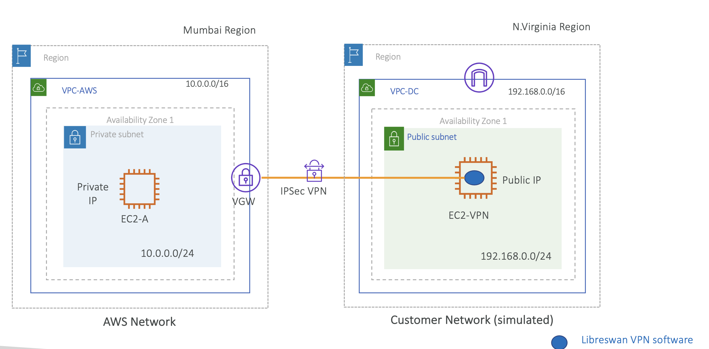

# Hands On: Setup AWS Site-to-Site VPN

- **목표**: 회사 내의 데이터센터에서 AWS EC2 인스턴스으로 프라이빗 접근
- **데모**: 회사 데이터센터가 없기 때문에 N.Virginia Region 리전의 VPC-DC로 Customer Network 대체
- **데모 순서**
    1. AWS Network의 VGW (= VPN Gateway)
    2. Data Center

    - Internet Gateway를 설치할 Public Subnet 과
    - EC2-VPN: SSH를 통한 VPN 소프트웨어 설치

    3. VPN Gateway 와 VPN 소프트웨어가 설치된 장치(EC2)를 IPSec VPN으로 연결
    4. Customer Network에서 AWS EC2의 Private IP로 `ping` 시도 후 연결 확인

  
 

### High level steps

#### ✔️ 1. 서로 다른 리전에 VPC 생성

다이어그램에 표시된 것처럼 두 개의 다른 리전에 VPC 생성.

<table width="100%">
<tr>
<th width="10%"></th>
<th width="45%">1️⃣ AWS Network</th>
<th width="45%">2️⃣ On-premises DC Network</th>
</tr>
<tr>
<th>VPC</th>
<td>

- **Name**: VPC-AWS
- **CIDR**: 10.0.0.0/16

</td>
<td>
    
- **Name**: VPC-DC
- **CIDR**: 192.168.0.0/16
    
</td>
</tr>
<tr>
<th>Subnet</th>
<td>
    
**Private Subnet**

- **Name**: VPC-AWS-Private-1
- **CIDR**: 10.0.0.0/16

</td>
<td>

**Public Subnet**

- **Name**: VPC-DC-Public-1
- **CIDR**: 192.168.0.0/24

</td>
</tr>

<tr>
<th>Route Table</th>
<td>

- **Name**: VPC-AWS-Private-RT
- **Association**: VPC-AWS-Private-1

| Destination    | Target     |
|----------------|------------|
| 10.0.0.0/16    | Local      |
| 192.168.0.0/16 | vgw-xxxxxx |

⭐️ **중요**: VGW 로 향하는 라우트 설정

</td>
<td>

- **Name**: VPC-DC-Public-RT
- **Association**: VPC-DC-Public-1

| Destination    | Target     |
|----------------|------------|
| 192.168.0.0/16 | Local      |
| 0.0.0.0/0      | igw-xxxxxx |

사용자의 데이터센터에서 시작하는 트래픽은 인터넷 게이트웨이를 통해 라우팅 되어야 함

이 때, 트래픽은 암호화된 상태
    
</td>
</tr>
<tr>
<th>Internet Gateway</th>
<td>-</td>
<td>
    
**Internet Gateway**

- **Name**: VPC-DC-IGW
- Attach to VPC-DC

</td>
</tr>
</table>

Main Route Table이 자동 생성되지만, 항상 전용 Route Table을 따로 생성하는게 좋음

 

#### ✔️ 2. 두 VPC에 EC2 인스턴스 생성

<table width="100%">
<tr>
<th width="10%"></th>
<th width="45%">1️⃣ AWS Network</th>
<th width="45%">2️⃣ On-premises DC Network</th>
</tr>
<tr>
<th>VPC</th>
<td>VPC-AWS</td>
<td>VPC-DC</td>
</tr>
<tr>
<th>EC2</th>
<td>

Amazon Linux 2023 AMI를 사용하여 Libreswan을 설치할 수 있도록 함

- **Name**: EC2-A
- **Security Group**: EC2-A-SG
    - **Inbound**: ICMP - 192.168.0.0/16

</td>
<td>

- **Name**: EC2-VPN
- **Security Group**: EC2-VPN-SG
- **Inbound**: ICMP - 10.0.0.0/16

Public IP를 가짐

MyIP 또는 0.0.0.0/0에서 SSH를 열어야함</td>
</tr>
</table>

 

#### EC2 Security Group 설정

두 EC2 인스턴스의 보안 그룹에서 다른 네트워크에서 ICMP 트래픽을 허용

**1️⃣ AWS Network: EC2-A-SG**

| Protocol          | Port Range | Source         |
|-------------------|------------|----------------|
| **ICMP IPv4 All** | All        | 192.168.0.0/16 |

사용자 데이터 센터에서 들어올 `ping` 통신을 허용할 ICMP 프로토콜 추가

 

**2️⃣ On-premises DC Network: EC2-VPN-SG**

| Protocol          | Port Range | Source      |
|-------------------|------------|-------------|
| SSH               | 22         | MyIP        |
| **ICMP IPv4 All** | All        | 10.0.0.0/16 |

 

#### ✔️ 3. 각 VPC에 맞게 Virtual/Customer Gateway를 생성

<table width="100%">
<tr>
<th width="10%"></th>
<th width="45%">1️⃣ AWS Network</th>
<th width="45%">2️⃣ On-premises DC Network</th>
</tr>
<tr>
<th>VPC</th>
<td>VPC-AWS</td>
<td>VPC-DC</td>
</tr>
<tr>
<th>EC2</th>
<td>EC2-A</td>
<td>EC2-VPN</td>
</tr>
<tr>
<th>Gateway</th>
<td>

**VGW 생성**

- **Name**: VPC-AWS-VGW

Mumbai 리전에 Virtual Private Gateway (VGW)를 생성하고 VPC-AWS에 연결.

VPC-AWS의 Private 서브넷 라우팅 테이블에 모든 트래픽 (0.0.0.0/0) 경로를 VGW를 통해 라우팅하는 라우트를 추가.

</td>
<td>

**Customer GW 생성**

- **Name**: DC-CGW

EC2-VPN Public IP를 사용하여 Customer gateway를 생성.
</td>
</tr>
</table>
 

#### ✔️ 4. VPN 생성

Mumbai 리전에 VPN 연결 생성.
VPC-DC CIDR을 사용하여 정적 라우팅과 함께 EC2-VPN Public IP를 사용.

<table width="100%">
<tr>
<th width="45%"></th>
<th width="45%">1️⃣ AWS Network</th>
<th width="45%">2️⃣ On-premises DC Network</th>
</tr>
<tr>
<th>VPC</th>
<td>VPC-AWS</td>
<td>VPC-DC</td>
</tr>
<tr>
<th>Gateway</th>
<td><b>Virtual Gateway</b>: VPC-AWS-VGW</td>
<td><b>Customer Gateway</b>: DC-CGW</td>
</tr>
<tr>
<th>VPN Connection</th>
<td colspan="2">

**VPN Connection 생성**

- **Name**: AWS-DC
- **Type**: Virtual Private Gateway
- **Virtual GW**: VPC-AWS-VGW
- **Customer GW**: DC-CGW
- **Routing Option**
    - Static
    - Openswan은 BGP를 지원하지 않음
- **Static IP prefixes**: 192.168.0.0/16
- **Local IPv4 network CIDR**: 192.168.0.0/16
- **Remote IPv4 network CIDR**: 10.0.0.0/16

</td>
</tr>
</table>

 

#### ✔️ 5. VPN 설정 파일 다운로드

VPN 연결 콘솔에서 Openswan을 위한 VPN 구성 파일을 다운로드.
VPN 소프트웨어는 AMI에 따라 다른데, 이 경우 Amazon Linux 2023 AMI를 사용하여 Libreswan을 사용.

 

#### ✔️ 6. Libreswan 설치

**EC2-VPN**에 Libreswan을 설치. Libreswan fedora 저장소를 추가해야함.

libreswan을 설치한 후 VPN 구성 파일의 지침을 따름.
환경에 맞게 IP 및 CIDR 범위와 같은 다양한 필드의 값을 바꿔야함. IPSec VPN 서비스를 시작.

 

#### ✔️ 7. 접속 테스트

**EC2-VPN**에서 AWS 측 EC2-A 인스턴스의 Private IP에 접근 후 성공 확인.

EC2-VPN에 할당된 Public IP 확인: `3.93.37.75`

 

