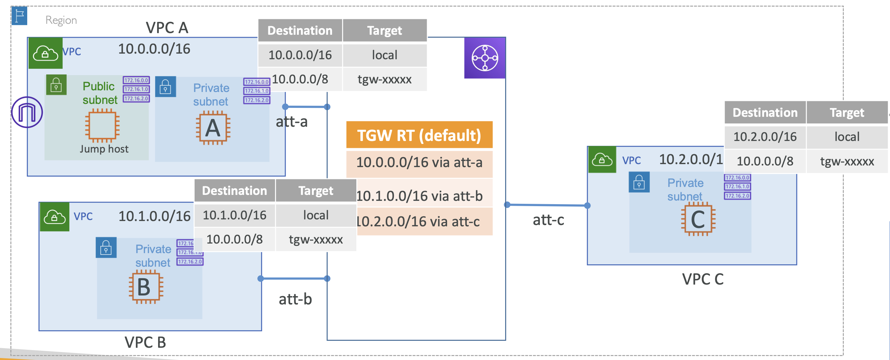
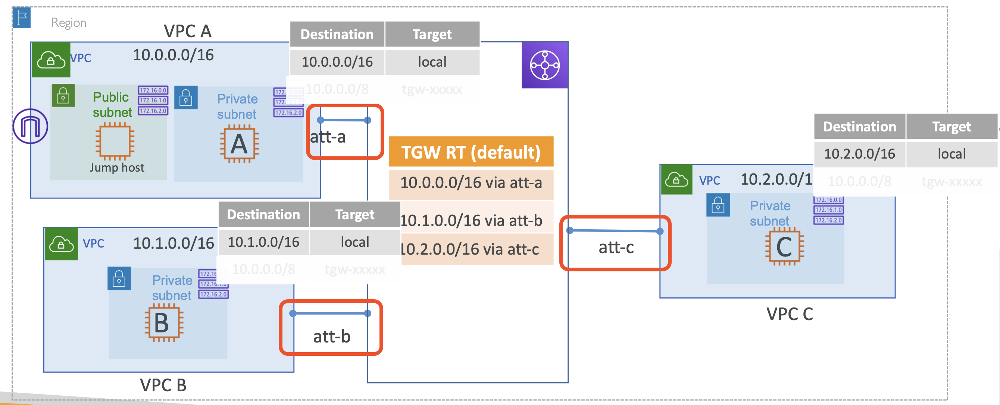

# Hands On: Transit Gateway & VPCs with full routing

## Transit Gateway Lab – Three VPCs with full connectivity

  

### Lab setup

#### 1. 세 개의 VPC + Private Subnets 생성

3개의 VPCs 생성 후 각각 Private Subnets 생성.

  

VPC A에는 Public Subnet 추가로 생성 (Host 넘기기 위함 - to jump host)

**VPC-A-Public Subnet - Route Table**

| Destination   | Target           |
|---------------|------------------|
| `10.0.0.0/16` | `local`          |
| `0.0.0.0/0`   | `igw-05412cd...` |

 

#### 2. Transit Gateway 생성

  

**Transit Gateway**
- Name: VPC-A-B-C-TGW
- Configure:
    - [x] DNS support
    - [x] VPC ECMP support
    - [x] Default route table association
    - [x] Default route table propagation
    - [ ] Multicast support

<pre><b>Transit Gateway Configuration</b>
✔️ <b>DNS support</b>: 인입되는 트래픽이 연결된 VPC connection에 대해 동일한 DNS로 Resolve 됨
✔️ <b>VPC *ECMP support</b>: 연결된 VPN를 사용하면서 중요한 워크로드를 수행중이라면 (dominating) 최대 50GB까지 대역폭을 차지(leverage)할 수 있음.
  - ❗ECMP 없을 때 VPN 제한은 각 터널 당 1.25gbps 임
✔️ <b>Default route table association</b>: Attachment 생성 시 Transit gateway의 Default Rotue Table에 연결됨
✔️ <b>Default route table propagation</b>: Attachment 생성 시, Transit gateway의 Default Rotue Table에 전파
✔️ <b>Multicast support</b>: 어떤 머신이든 트래픽을 multicast 그룹에 속한 다른 머신으로 보낼 수 있음

- <b>❗Association vs. Propagation</b>
  Transit Gateway(TGW) Association은 TGW가 별도의 라우트 테이블을 운영하는 것을 의미하고, Propagation은 라우트 테이블을 전파하는 것을 의미
  - <b>Attachment</b>: 단순한 연결(connection)일 뿐
  - <b>Association</b>: 각 Attachment는 하나의 TGW 라우트 테이블에 연결되어야 함. 하나의 TGW 라우트 테이블은 하나 또는 다수의 Attachment를 가질 수 있음
  - <b>Propagation</b>: 온프레미스는 BGP 및 Static Routing을 사용하고, VPC의 CIDR은 API를 통해 동적으로 전파. Propagation을 활성화하면 routes에 Propagation에 지정한 VPC의 CIDR이 자동으로 등록됨.
</pre>

 

#### 3. VPC attachments 생성

_Transit Gateway을 위한 VPC attachments 생성_

  

**Attachment Type**:
- [x] VPC
- [ ] VPN
- [ ] Peering Connection
- [ ] Connect

VPC-A를 선택 후 Transit gateway 와 연결할 서브넷을 선택

(선택한 AZ에 대해서, 해당 서브넷 하위 모든 자원이 연결됨)

VPC-B, VPC-C에 대한 Attachment도 생성

그럼, Transit Gateway Route table에 각 Attachment의 Route Entry가 추가된 것을 확인할 수 있음

**Transit Gateway Route Table - Propagations**

| Attachment ID      | Resource type | Resource ID  | State      |
|--------------------|---------------|--------------|------------|
| tgw-attach-0a033.. | VPC           | vpc-0e0e1... | associated | 
| tgw-attach-0817b.. | VPC           | vpc-05064... | associated | 
| tgw-attach-0f964.. | VPC           | vpc-09033... | associated | 

**Transit Gateway Route Table - Routes**

| CIDR        | Attachment                          | Resource Type | Route Type | Route State |
|-------------|-------------------------------------|---------------|------------|-------------|
| 10.0.0.0/16 | tgw-attach-0a033.. \| vpc-0e0e1...  | VPC           | propagated | active      |
| 10.1.0.0/16 | tgw-attach-0817b.. \|  vpc-05064... | VPC           | propagated | active      |
| 10.2.0.0/16 | tgw-attach-0f964.. \| vpc-09033...  | VPC           | propagated | active      |

But, 하지만 아직 연결이 되지 않음 → Subnet의 route table 설정이 안되어 있음

 

#### 4. Subnet의 route table 수정

  

모든 Private subnet의 route table 수정

Transit gateway attachment 으로 향할 `10.0.0.0/8` 추가

 

#### 5. VPC A → VPC B,C using Private IP

VPC A에 연결 -> EC2-A에 SSH 접속 -> EC2-B나 EC2-C의 Private IP로 ping 시도

EC2 생성 시, Security Group 설정 필요 

 
 

# Hands On: Transit Gateway & VPCs with restricted routing

## Transit Gateway Attachment specific routing

### Routing control with attachment Route Tables

Transit Gateway를 사용하되, 특정 연결을 제한하고 싶을 때가 있음

  

가령, VPC A와 VPC C가 통신하지 않도록 제한하고자 함.

 

### Create attachment specific route table

위처럼 특정 연결을 제어하기 위해 Transit Gateway는 VRF(Virtual Routing and Forwarding)를 지원

  

모든 Attachment 레벨마다 Route table을 가지고 있음

| **att-a RT**           |
|------------------------|
| 10.1.0.0/16 via att-b  |

**이 때, 한 번 Attachment Route Table을 생성하면 더 이상 Transit Gateway의 Default Route Table을 따르지 않음** 

 

### Lab setup

  

VPC A가 VPC B와는 통신 가능하되, VPC C와 통신이 불가하도록 설정해보자.

  

이 번엔 각 Attachment 마다, 각자의 Route Table를 갖도록 설정 

### Lab Steps

#### 1. 세 개의 VPC + Private Subnets 생성

세 개의 VPC와 하위 Private Subnets 생성

VPC A에는 jump host가 될 Public Subnet도 생성

 

#### 2. Transit 생성

default route table association / default route table propagation 비활성

**Transit Gateway**
- Name: VPC-A-B-C-TGW
- Configure:
    - [x] DNS support
    - [x] VPC ECMP support
    - [ ] Default route table association
    - [ ] Default route table propagation
    - [ ] Multicast support

 

#### 3. 세 개의 VPC attachment 생성

각 VPC에 해당하는 Transit gateway VPC attachments 생성

 

#### 4. 세 개의 Transit gateway route tables 생성

각 Attachment 에 해당하는 세 개의 Transit gateway route tables 생성 후, 각 Attachment 에 연결

 

#### 5. Add 'att-b' to 'att-a route table' 

`VPC A → VPC B` 연결되도록 Route propagation 생성

Create propagation 버튼 클릭 후 연결할 Attachment 선택하면 생성 됨

 

#### 6. Add 'att-a', 'att-c' to 'att-b route table' 

`VPC B → VPC A`, `VPC B → VPC C` 가 연결되도록 Route propagation 생성

 

#### 7. Add 'att-b' to 'att-c route table' 

`VPC C → VPC B` 가 연결되도록 Route propagation 생성

 

#### + Subnet의 route table 수정

모든 Private subnet route table 수정

Transit gateway attachment 으로 향할 `10.0.0.0/8` 추가

 

#### 8. VPC A → VPC B,C 

VPC A > Jump host에 연결 -> EC2-A에 SSH 접속 -> EC2-B나 EC2-C의 Private IP로 ping 시도

EC2-B은 연결 되고, EC2-C는 연결 거부됨 

 

#### 9. VPC B → VPC A,C

동일하게 EC2-B에서 VPC A와 C에 SSH 혹은 ping을 시도하면 두 VPC 연결 모두 성공하는 것을 확인할 수 있음

