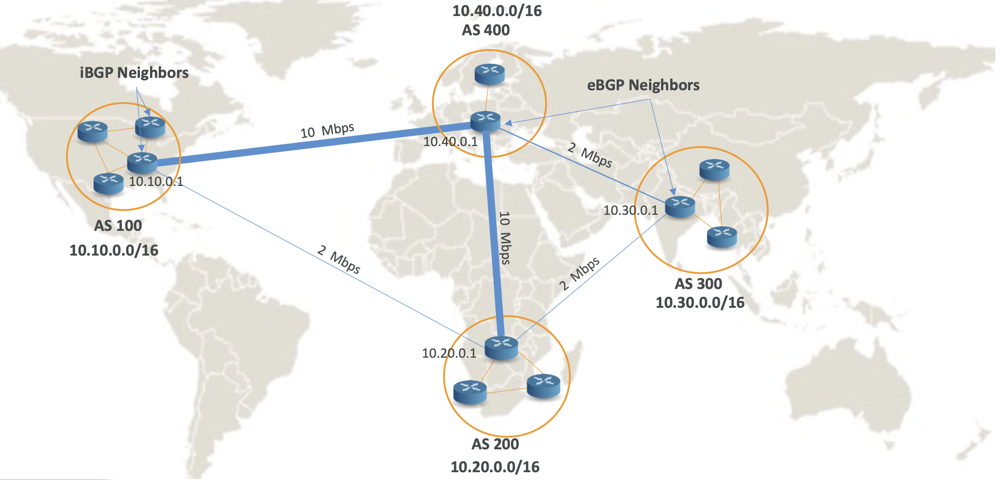
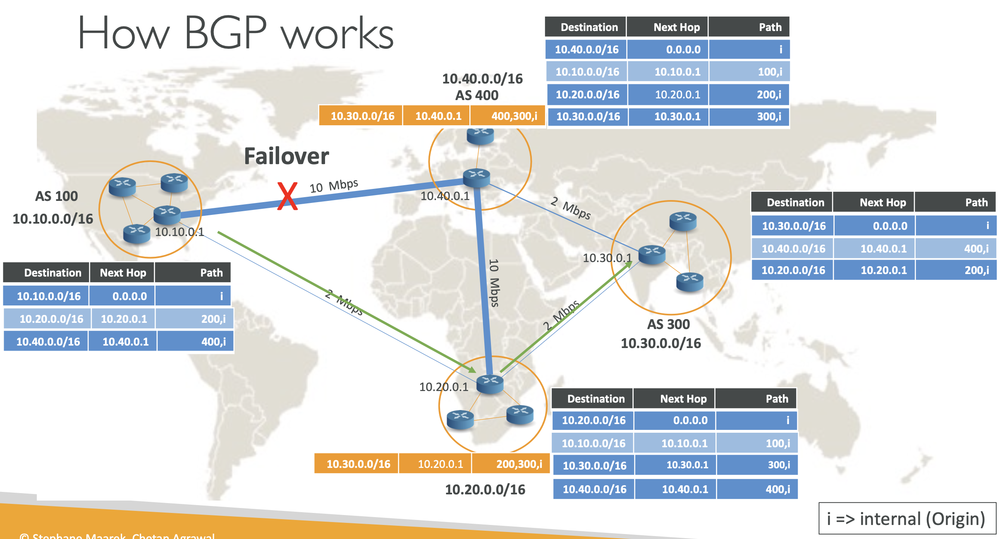
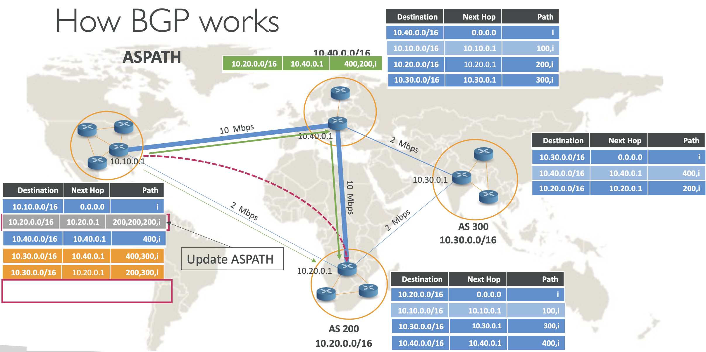
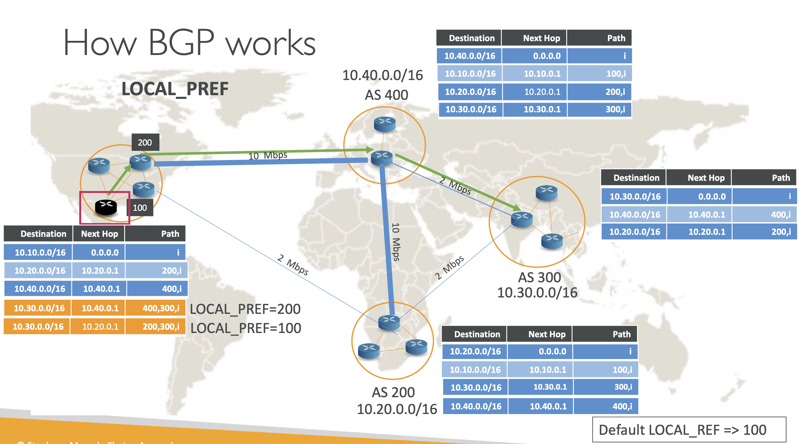
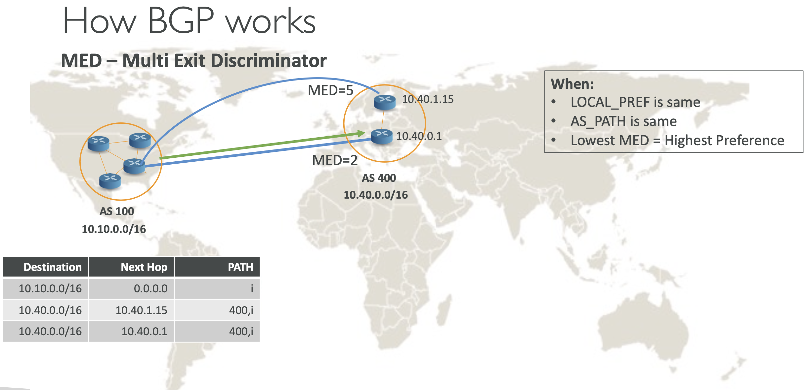

# How Border Gateway Protocol (BGP) works?

## Dynamic Routing using Border Gateway Protocol (BGP)

- Dynamic Routing은 **Path-Vector** protocol로, 피어 네트워크 혹은 AS (ASPATH) 사이 목적지로 가는 최적의 경로를 서로 교환
- `iBGP` – Internal BGP. Routing within AS.
- `eBGP` – External BGP. Routing between AS’s.
- 라우팅 결정에 영향을 주는 요소들:
  - Weight (Cisco routers specific – works within AS)
  - `ASPATH` – Series of AS’s to traverse the path (Works between AS)
    - 도착지까지 홉의 개수를 고려
  - `LOCAL_PREF` – Local Preference (Works within AS)
  - `MED` – Multi-Exit Discriminator (Works between AS)

  

- **IBGP neighbors**: `AS100` 내에 위치한 라우터들이 각각 경로를 교환하고, 동일한 AS내에 위치하기 때문에 IBGP neighbors라고 함
- **EBGP neighbors**: `AS100`와 `AS200`에 라우터들 또한 각각 경로를 교환하는데, 이 때 서로 다른 AS내에 위치하기 때문에 EBGP neighbors라고 함

 

## How BGP works

BGP의 경로 테이블의 데이터 교환 방법

### 1. IBGP

- 필요한 데이터: `Destination`, `Next hop`, `AS path`

  

IBGP를 위해 아래 엔트리를 가지고 있음

| Destination  | Next Hop | Path |
|--------------|----------|------|
| 10.10.0.0/16 | 0.0.0.0  | i    |

여기서 `i`는 internal 를 의미하며, 따라서 AS 100 내의 트래픽은 인터널로 통함

### 2. EBGP neighbors

- `AS 100` ---(`10.20.0.0/16`, `10.20.0.1`, `200,i`) 참조 -→ `AS 200`
- `AS 100` ---(`10.40.0.0/16`, `10.40.0.1`, `400,i`) 참조 -→ `AS 400` 

### 3. AS 100 → AS 300

#### 3-1. AS 200, AS 400 → AS 100 전파

- AS 400, AS 200가 AS 300와 연결되어 있음.
- AS 100가 둘 모두에 연결되어 있기 때문에, 각 라우터에서 전파를 받음

전파를 받을 땐, 각 라우터가 갖고 있는 엔트리 Path에 본인 AS 번호를 입력해서 전달

- `AS 400` ---(`10.30.0.0/16`, `10.40.0.1`, `400,300,i`) propagation -→ `AS 100`
- `AS 200` ---(`10.30.0.0/16`, `10.20.0.1`, `200,300,i`) propagation -→ `AS 100`

#### 3-2. AS 100 경로 찾기

AS 100 에서 AS 300로 가는 방법은 두 가지가 있음 

- AS 100 → AS 400 → AS 300: (`10.30.0.0/16`, `10.40.0.1`, `400,300,i`) 엔트리를 참조하여 찾아감
- AS 100 → AS 200 → AS 300: (`10.30.0.0/16`, `10.20.0.1`, `200,300,i`) 엔트리를 참조하여 찾아감

만약, AS 400가 이용 불가능한 상태라면 그 다음 엔트리를 찾아 AS 300으로 도달

  

--- 

# BGP Route selection - ASPATH, LOCAL_PREF, MED

## 1. ASPATH

AS 100에서 AS 200으로 가는 방법은 여러 가지임

1. AS 100 → AS 200 - Path: 200,i → 1 hop
2. AS 100 → AS 400 → AS 200 - Path: 400,200,i → 2 hop
3. ...

경로가 많이 갖게 되고 여기서 가장 짧은 길이인 1번 방법 찾아감

하지만, 2번 같은 경우 10 Mbps + 10 Mbps 이기 때문에 대역폭이 훨씬 더 큼

AS 400을 통하는 방법은 dummy hop을 추가할 수 있음

1. AS 100 → AS 200 - Path: **200,200,**200,i → 3 hop 
2. AS 100 → AS 400 → AS 200 - Path: 400,200,i → 2 hop

## 2. LOCAL_PREF

400이나 200으로 갈 때 IBGP 라우터 중 어떤 라우터를 타고 갈까?

ibgp400에서 시작할 경우, ibgp100 이 될 수도 ibgp200을 타고 갈 수도 있음

  

각 라우터 엔트리에 LCAL_PREF 를 설정해서 어떤 라우터를 타고 IBGP에서 떠날지 결정할 수 있음

| Destination  | Next Hop  | Path      |                    |
|--------------|-----------|-----------|--------------------|
| 10.30.0.0/16 | 10.40.0.1 | 400,300,i | ← LOCAL_PREF=200   |
| 10.30.0.0/16 | 10.20.0.1 | 200,300,i | ← LOCAL_PREF=100   |

따라서 400을 타고 300을 가는 경우 로컬 라우터 200을 타고 가게됨

 

## 3. MED: Multi Exit Discriminator

**언제 적용?**
- LOCAL_PREF is same
- AS_PATH is same
- Lowest MED = Highest Preference

  

MED 값을 설정해서 동일한 경로들의 우선 경로를 설정

MED=2로 설정된 라우터(10.40.0.1)가 MED=5로 설정된 라우터(10.40.1.15)보다 우선순위가 높기 때문에 전자로 향함

## Quick recap of BGP Route selection order and attributes

- **Highest Weight** (가중치)
  - Cisco 라우터에서만 사용하는 속성
  - 동일 AS 내에서만 적용되며, 원본 라우터(originating router)가 설정함
  - 외부 BGP 라우터 간에는 교환되지 않음
- **Highest local preference** (로컬 우선순위)
  - External BGP로 나갈 라우터를 결정 (아웃바운드 라우터)
  - 동일 AS 내의 Internal BGP 라우터들에 의해 설정됨
  - External BGP 라우터 간에는 교환되지 않음
  - Default: 100
- **Shorted AS Path**
  - AS Path는 마치 홉이 긴 것처럼 조작할 수 있음
- **Lowest Multi Exit Discriminator** (MED, 다중 출구 판별자)
  - 두 개의 AS 간에 여러 경로가 존재할 때 사용
  - AS 간에 MED 값이 교환됨

