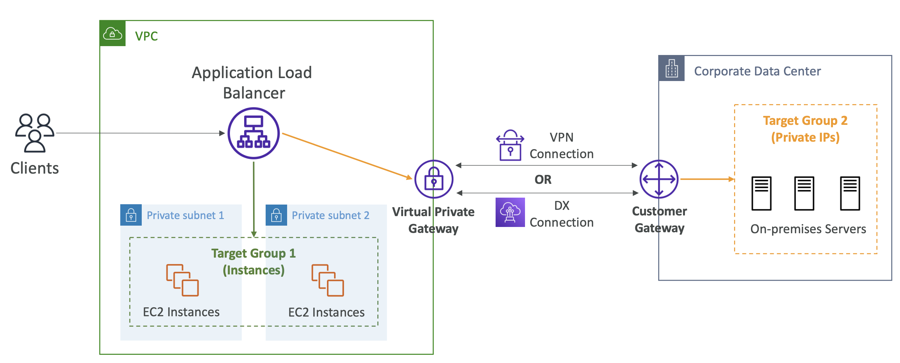
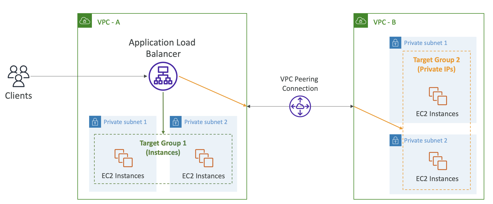
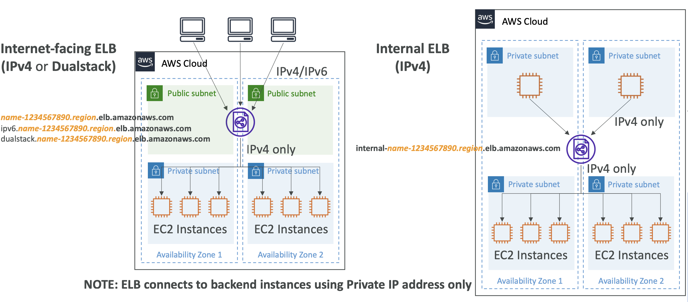

# Hybrid Connectivity

## Load Balancing across on-premises servers

  

**배경**
- VPC 내에 하나의 ALB를 가지고 있음
- ALB는 EC2 인스턴스들로 구성된 타겟 그룹 (Target Group 1) 으로 로드 밸런싱 수행 중

**요구 사항**
- 이제 온프레미스 서버로 구성된 타겟 그룹에 대한 로드 밸런싱을 수행하고 싶음
- 타겟 그룹은 프라이빗 IP를 사용해야 함

**해결**
- 이를 위해 VPC를 우리의 기업 데이터 센터에 연결하기 위해 VPN 또는 직접 연결을 설정해야 함
- 연결이 설정되고 VPC와 데이터 센터 간에 네트워크 연결이 이루어지면, 우리는 타겟 그룹을 생성할 수 있음
- 타겟 그룹은 프라이빗 IP를 사용해야 하기 때문에, 프라이빗 그룹 내에서 프라이빗 IP를 사용
- 프라이빗 IP를 사용하는 ALB는 온프레미스 서버를 확인하는 데 필요한 연결성을 가지고 있어야 함
    - VPC에 Virtual Private Gateway, 온프레이스에 Customer Gateway를 설치하고, VPN Connection 혹은 Direct Connect 등으로 연결
- ALB에서 온프레미스 서버로 트래픽을 직접 보낼 수 있음

 

## Load Balancing across Peered VPCs

  

- 피어링된 VPC와 연결도 아주 비슷한 방식

**배경**
- `VPC-A`에 ALB가 있고, 다른 VPC에 EC2 인스턴스가 있다고 가정
    - 다른 계정의 또 다른 VPC일 수도 있음
- ALB에서 이 다른 VPC로 트래픽을 보내고 싶음

**요구 사항**
- 먼저 VPC 피어링 연결을 설정

**해결**
- 타겟 그룹 지정
- 두 VPC 간에 프라이빗 트래픽이 흐를 수 있음
- ALB가 EC2 인스턴스까지 트래픽을 보낼 수 있도록 프라이빗 IP를 사용

 

## Internet-facing vs. Internal Load Balancer

  

마지막으로, 인터넷-페이싱과 인터널 로드 밸런서의 차이점.
인터넷-페이싱 로드 밸런서는 ALB가 퍼블릭 서브넷에 위치하고 EC2 인스턴스는 프라이빗 서브넷에 위치하며 IPv4만 사용중

EC2 인스턴스는 ALB가 연결을 종료하기 때문에 프라이빗 IP 주소에서만 트래픽을 수신

IPv6을 지원하는 경우 IPv6 DNS 엔드포인트를 사용할 수 있음

IPv4와 IPv6 모두 지원하는 경우 dual stack을 사용할 수 있음

내부 ELB는 IPv4 모드에서만 사용할 수 있으며 모든 트래픽은 AWS 계정 내에서 프라이빗 IP 주소를 사용

IPv4를 사용하고 있지만, 사용자와 ALB의 커넥션에서 IPv4 과 IPv6를 사용할 수 있음

이제, 당신은 다른 도메인 이름들을 가질 것. 그래서 당신은 IPv4 도메인 이름을 가질 것. IPv6는 IPv6 DNS 엔드포인트와 동일한 이름을 가질 것. 그래서 만약 당신이 그 이름에 대한 DNS 쿼리를 한다면, 당신은 IPv6를 결과로 얻을 것이다. 또는 만약 당신이 단지 IPv6 또는 IPv4에 리다이렉트되기를 원한다면, 당신의 커넥션의 호환성에 따라 dual stack 엔드포인트를 사용할 것이다. 그리고 dual stack은 dual stack dot the name이다. 그리고 이것은 당신에게 IPv6를 줄 것이다, 만약 그것이 당신의 네트워크에 의해 지원된다면, 아니면 IPv4를 줄 것이다. 하지만 만약 당신이 IPv6를 엔드포인트로 사용하고 있다면, EC2 인스턴스에 보내질 트래픽은 IPv4가 될 것이다. 왜냐하면 당신의 ELB가 연결을 종료하기 때문이다. 이제 내부 ELB를 사용하고 있다면, 당신은 그것을 IPv4 모드에서만 사용할 수 있고 모든 트래픽은 AWS 계정 내에서 프라이빗 IP 주소를 사용하게 될 것이다. 그리고 당신의 로드 밸런서의 DNS 이름은 internal dash로 시작해야 한다. 그리고 그 다음에 당신의 로드 밸런서의 이름이 올 것이다.

## Questions

### Q1

당신의 회사는 AWS에 버스트 웹 애플리케이션을 배포했으며 사용자 경험을 개선하고 싶어합니다. TLS(Transport Layer Security)에 대한 개인 키를 웹 호스트만 보유하는 것이 중요하므로 Classic Load Balancer에는 TCP 포트 443에서 수신 대기하는 리스너가 있습니다. 애플리케이션의 대기 시간을 줄이고 확장 프로세스를 개선하기 위해 사용할 수 있는 몇 가지 접근 방식은 무엇입니까?

1. 애플리케이션 앞에 Application Load Balancer를 사용하여 서로 다른 HTTP 경로 및 호스트가 있는 여러 대상 그룹을 더 잘 활용합니다.
2. Classic Load Balancer에서 향상된 네트워킹을 구성하여 대기 시간을 줄입니다.
3. Amazon Certificate Manager(ACM)를 사용하여 Amazon CloudFront에 새 인증서를 배포하여 엣지에서 콘텐츠를 처리합니다.
4. 애플리케이션 앞에 Network Load Balancer를 사용하여 네트워크 성능을 높입니다.

### Q2

왜 DNS CNAME을 사용하여 Application Load Balancer 또는 Classic Load Balancer를 참조하는 것이 좋습니까?
1. IP 주소는 로드 밸런서가 확장됨에 따라 변경될 수 있습니다.
2. DNS CNAME은 IP 주소보다 짧은 대기 시간을 제공합니다.
3. 클라이언트의 소스 IP를 보존하려고 합니다.
4. IP 주소는 공개적이며 인터넷에 열려 있습니다.