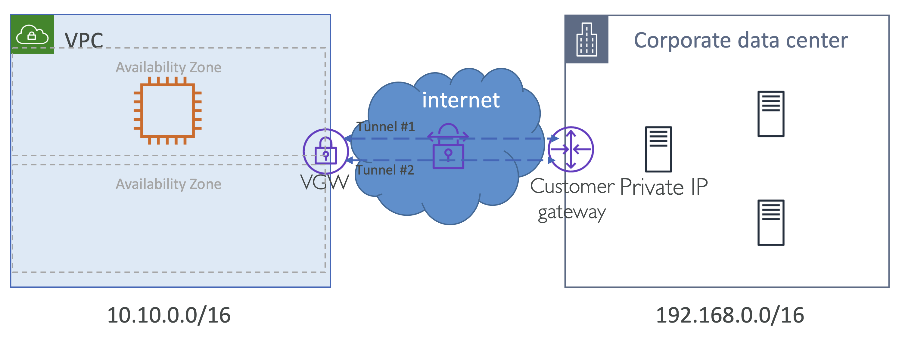

# Introduction to AWS Site-to-Site VPN

 

## VPN Basics
- VPN은 호스트가 인터넷 같은 신뢰할 수 없는 네트워크 중개자를 통해, **암호화된 형식**으로, 프라이빗하게 통신할 수 있게 함
- AWS는 Layer 2가 아닌 Layer 3을 지원
- **두 가지 형식의 VPN**
  - Site-to-Site VPN
    - 두 개의 서로 다른 네트워크 연결
  - Client-to-Site VPN
    - 클라이언트 장치(e.g., 노트북)와 네트워크 연결
- **VPN 종류**
  - **IPSec (IP Security) VPN**: AWS가 관리하는 VPN으로 지원
  - **GRE, DMVPN 같은 다른 VPN들**: AWS가 관리하는 VPN으로 지원되지 않음
    - **GRE**: Generic routing encapsulation
    - **DMVPN**: Dynamic Multipoint VPN

 

## How Site-to-Site VPN works in AWS

- VPN connection은 AWS의 Virtual Private Gateway (VGW) 종단으로 연결됨
  - `AWS VGW endpoint` 🔗---🔗 `Customer data center`
- VGW는 HA(High Availability)를 위해 서로 다른 AZ에 2 Tunnel endpoints를 생성

  

1. AWS [Virtual Private Gateway] 
2. Customer Data Center [Customer Gateway]
3. 위 두 요소를 갖게 되면, AWS는 HA를 위해 두 개의 터널을 생성함
   - 물론, 한 터널이 다운되면, 다른 터널 하나만 작동하는 HA 구성

 

## Virtual Private Gateway (VGW)
- VPC를 위해 관리되는 Gateway Endpoint
- 단 하나의 VGW만 VPC에 연결할 수 있음
  - 가령, 여러 VPN endpoints에 연결하고자 한다면, 사용자는 여러 브랜치들을 가질 것
- VGW는 '정적 라우팅'과 BGP를 사용하는 '동적 라우팅' 방식 모두 지원
- BGP를 위해서, VGW에 `64512` 부터 `65534` 까지 범위의 프라이빗 ASN(Autonomous System Number)을 지정할 수 있음
- ASN을 정의하지 않았다면, AWS가 Default ASN-`64512` 을 할당
  - ASN은 한 번 할당되면 수정 불가 
- VGW는 암호화와 데이터 무결성을 위해 `AES-256` 와 `SHA-2` 지원

