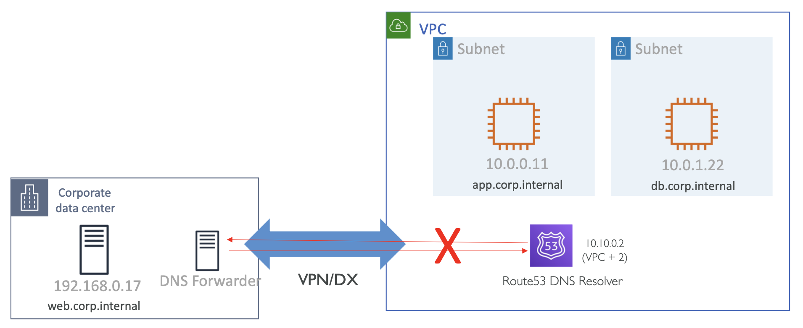
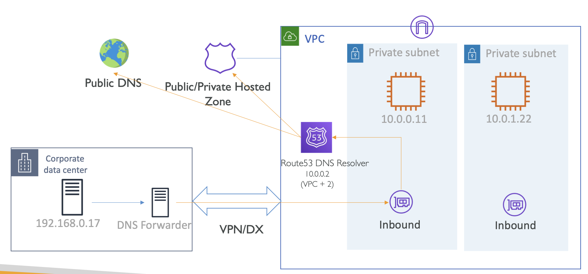
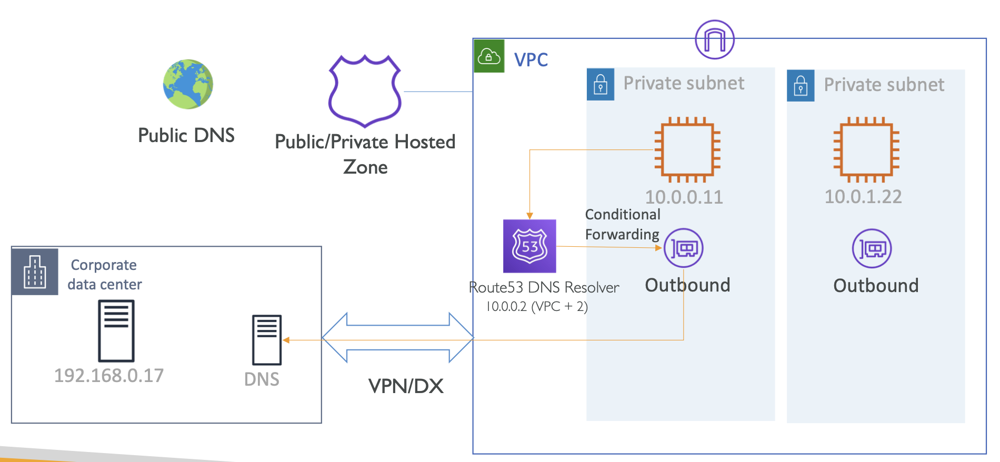

# Introduction to Route53 DNS Resolver Endpoints (Hybrid DNS)

## Route 53 Resolver Endpoints

1. AWS to On-premises (When DNS server is located on-premises)
2. On-premises to AWS (When DNS server is located in AWS)
3. Bi-directional (When DNS server is located at both the sites)

  

### Route53 Resolver Endpoint

- Officially named the `.2` DNS resolver to Route 53 Resolver
- Provides Inbound & Outbound Route53 resolver endpoints
- Provisions ENI in the VPC which are accessible over VPN or DX 
- Inbound -> On-premise forwards DNS request to R53 Resolver
- Outbound -> Conditional forwarders for AWS to On-premise

<table>
<tr>
<th>Route53 Resolver Endpoint - Inbound</th>
<th>Route53 Resolver Endpoint - Outbound</th>
</tr>
<tr>
<th></th>
<th></th>
</tr>
</table>

## VPC DNS & DHCP exam essentials
- VPC has a default DNS server `AmazonProvidedDNS`.
- AWS Provided DNS server runs at `VPC base + 2 IP address`. You can also query DNS server at this IP or `169.254.169.253` virtual IP from within the VPC.
- `AmazonProvidedDNS` resolves DNS from AWS Route53 Private Hosted Zone,VPC internal DNS and Public DNS.
- VPC DNS settings can be changed using DHCP Option sets.
- DHCP Option set **can not be edited**. Create new one and associate it with VPC.
- You can have only one DHCP option set associated with **a VPC at a time**.
- For hostname resolution, we should enable both `enableDnsSupport` and `enableDnsHostname`.
- For hybrid DNS resolution between VPC and on-premises network, use Route53 Resolver endpoints.

