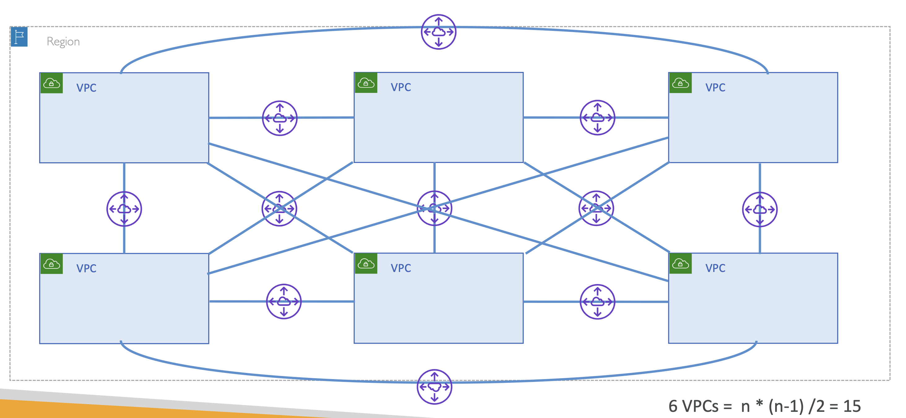
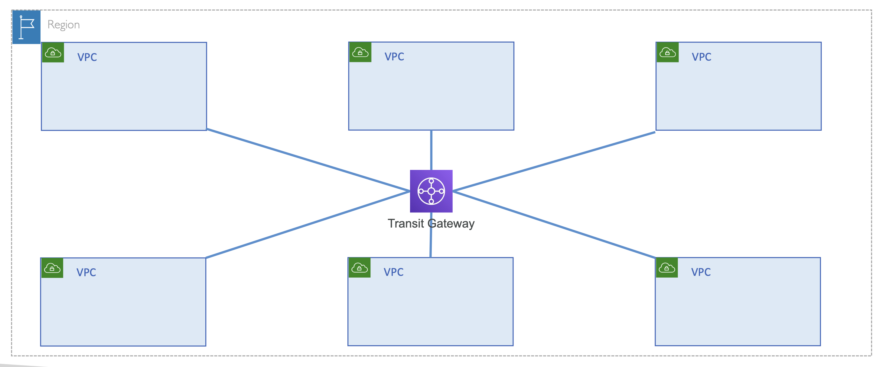
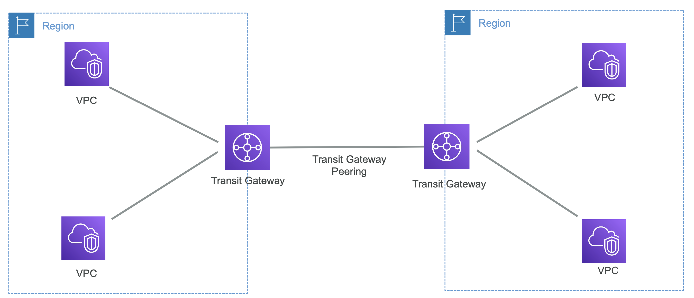
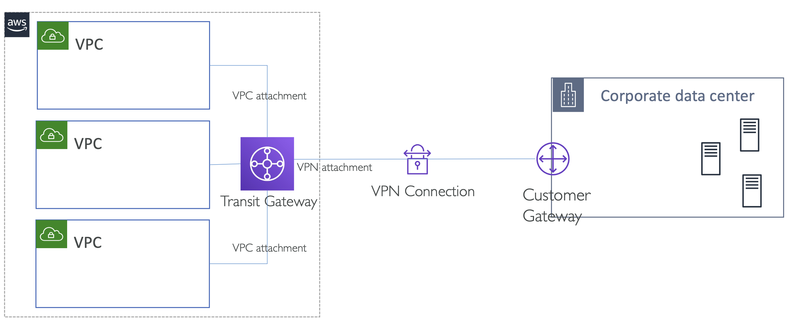
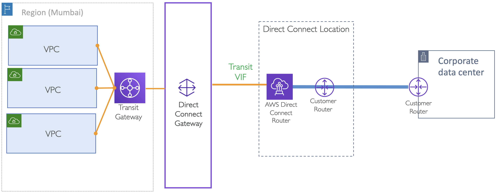
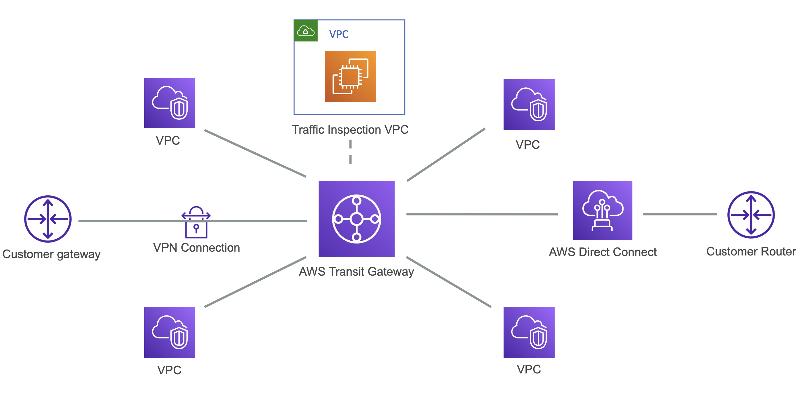

# Introduction to Transit Gateway

## Transit Gateway (TGW)

Trasit Gateway는 여러 VPC와 VPN 연결을 위한 중앙 집중식 네트워크 허브.

2018년, Trasit Gateway는 다중 VPC 관리와 온프레미스 네트워크 간의 하이브리드 연결을 위해 AWS 네트워킹을 단순화하고자 도입

→ VPC 네트워킹 단순화

 

### VPC 네트워킹 단순화 예시

여러 VPC 간 상호 통신을 원할 때, 각 VPC들을 VPC Peering을 연결할 수 있음.

VPC Peering은 연결은 1대 1로 이루어지며, 전파되지 않음.

즉, VPC A가 B와 연결되고 B가 C와 연결되어도, A는 C와 소통할 수 없음.

따라서, VPC A와 C 사이에도 페어링을 설정해야 함

  

위 그림과 같이 구조가 매우 복잡해짐

위처럼 6개의 VPC가 서로 통신했을 때, VPC Peering 15개가 필요

→ 이러한 방식으로는 네트워크를 관리할 수 없음

 

## AWS Transit Gateway

  

- 수천개의 VPC와 온프레미스 네트워크가 상호 통신 되도록(interconnect) 설정
- Transit Gateway에 연결할 수 있는 서비스:
  - 한 개 이상의 VPCs
  - 다른 Transit Gateway와의 피어링 연결
  - Connect SD-WAN/제3자 네트워크 장치
  - VPN
  - Direct Connect Gateway
- Transit Gateway 특징: Multicast support, MTU, Appliance mode, AZ consideration, TGW Sharing
- Transit Gateway 아키텍처: Centralized traffic inspection, egress, interface endpoints 등

 

#### Example: Transit Gateway Architecture

<table>
<tr>
<th>Transit Gateway Peering across AWS regions</th>
<th>Transit Gateway with AWS site-to-site VPN</th>
<th>Transit gateway with Direct Connect</th>
<th>Transit Gateway with 3rd party appliances for traffic inspection</th>
</tr>
<tr>
<td></td>
<td></td>
<td></td>
<td></td>
</tr>
</table>

---

# Transit Gateway VPC attachments and Routing

## Transit Gateway attachments

  

- 주의 사항: CIDRs 범위가 겹치면 안됨

Routing 은 어떻게 될까?
1. VPC A, B, C가 있다고 할 때

# Hands On: Transit Gateway & VPCs with full routing
