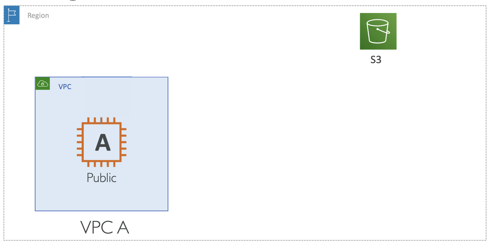
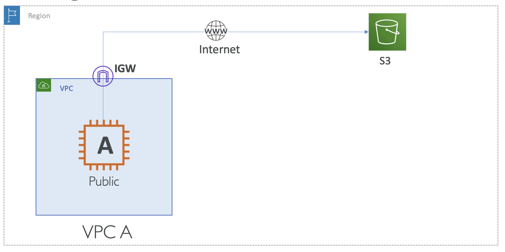
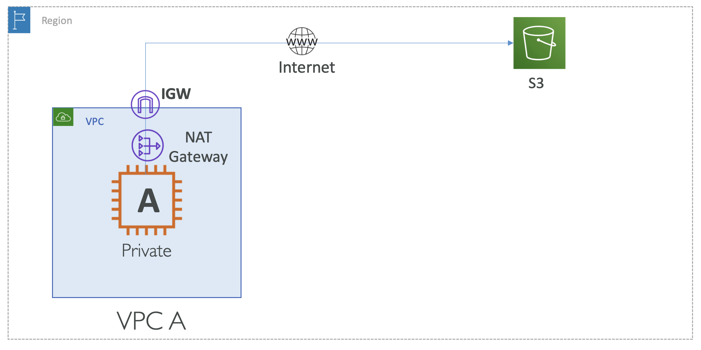
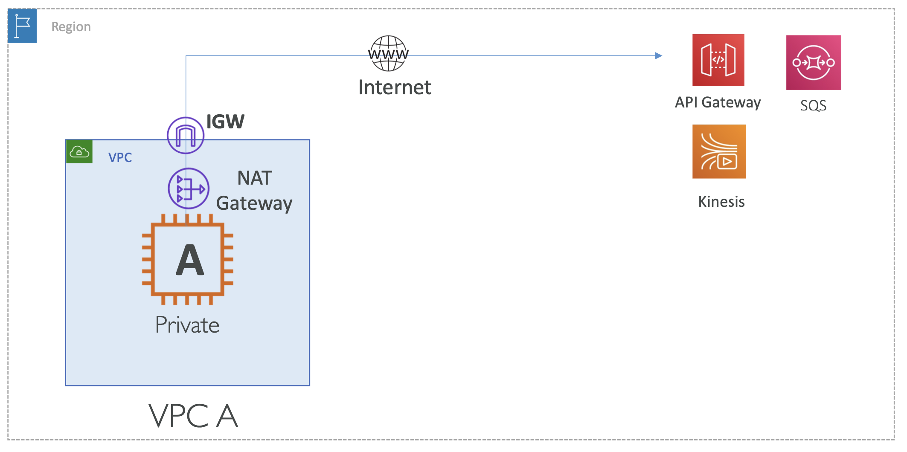
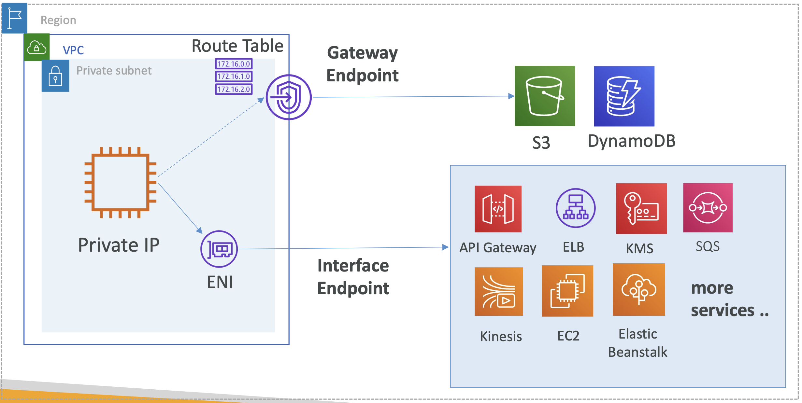

# VPC Endpoints

아래와 같은 자원을 갖고 있을 때, EC2 인스턴스에서 이미지 업로드 및 다운로드를 위해 S3에 접근하고자 함

  

- EC2 Instance A: VPC A 내에서 실행되는 웹 애플리케이션. in Public Subnet
- S3: 데이터 저장소

#### Scenario 1: EC2 Instance A in Public Subnet → S3

만약, EC2 인스턴스가 Public Subnet 내에 위치한다면, 아래와 같은 경로로 접근

  

> EC2 Instance A in Public Subnet → Internet Gateway → S3

#### Scenario 2: EC2 Instance A in Private Subnet → S3

혹은, EC2 인스턴스가 Private Subnet 내에 위치한다면, 아래와 같은 경로로 접근

  

> EC2 Instance A in Private → NAT Gateway → Internet Gateway → S3

S3 말고도 다른 다양한 리소스 - 가령, API Gateway, SQS, Kinesis 등 - 에 접근할 때, API 호출을 통해 접근하고자 할 것임

  

인터넷을 통해 접근할 때 위와 같은 방법으로 접근

하지만, 동일한 AWS 리전 내에 위치한 VPC와 AWS 서비스 사이에서는 VPC Endpoint를 사용하여,
인터넷을 통해 접근하지 않아도,
Private Network를 통해 접근할 수 있음

**VPC endpoints**:
Public 네트워크를 사용하는 대신 Private 네트워크를 사용하여 AWS 서비스에 연결할 수 있게 해줌

## VPC Endpoints

- Endpoints 는 AWS 서비스에 Private Network를 통해 연결할 수 있게 해줌 (public network 대신)
- IGW, NAT GW를 사용하지 않고 AWS 서비스에 접근할 수 있게 해줌
- Endpoint 장치는 수평적으로 확장되며, 중복 및 고가용성을 갖고 있으며 네트워크 트래픽에 대한 제약이 없음

### VPC Endpoints: Gateway and Interface

**두 가지 타입의 Endpoints** (⭐️ 구분 필요)

- **Gateway Endpoint**: 대상을 제공하고 라우트 테이블에 사용해야 함 - S3 및 DynamoDB
- **Interface Endpoint**: ENI (private IP)를 엔트리 포인트로 제공 - 대부분의 다른 AWS 서비스

  

Private IP 를 명시했지만, Public IP를 가졌을 때에도 동일하게 동작

- **S3**와 **DynamoDB**는 Gateway Endpoint를 사용
- 나머지 서비스는 **ENI**를 거치는 Interface Endpoint를 사용
    - Interface Endpoint를 사용하게 되면, 모든 트래픽을 ENI로 보내서 AWS 서비스 수 만큼 트래픽 처리
