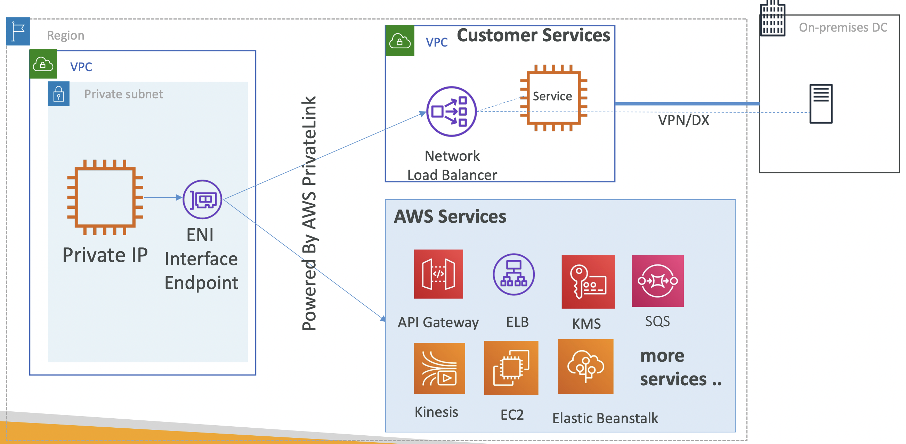
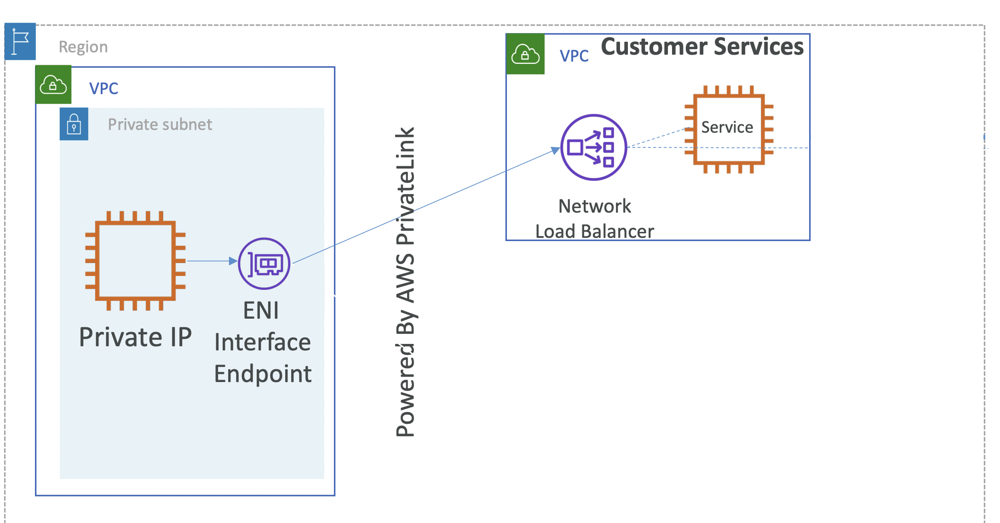
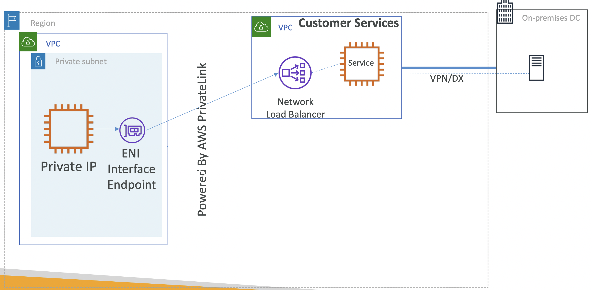

# VPC Interface endpoint (PrivateLink)

## VPC Interface endpoint - Accessing AWS or Customer Services

만약, SAS 앱을 갖고 있는데, 퍼블릭 접근을 막고 싶은 경우.

고객의 VPC의 private subnet에 그들의 워크로드가 존재하기 때문에,
SAS 앱을 고객의 private VPC에 접근하도록 만들고 싶음

이 경우 PrivateLink로 생성한 VPC Interface Endpoint를 사용할 수 있음

  

두 VPC 사이에 private connectivity를 제공한다는 점에서,
VPC Peering과 굉장히 비슷해보이지만,
PrivateLink는 floodgates를 여는게 아님 ⸺ 즉, 출발 VPC에서 도착지 VPC으로 특정 서비스 만을 허용하는 것

*_floodgates_: 물이 흐르는 것을 막는 문

 

#### Customer Services

AWS Services과는 다르게, Network Load Balancer를 앞에 설치해야함

  

해당 로드 밸런서를 endpoint 서비스로써 Expose 해야함

즉, 로드 밸런서가 VPC Endpoint 서비스로써 해당 Interface Endpoint를 통해 접근할 수 있어야 함

**Customer Services - On-premise**

  

_✔️ 온프레미스의 경우, VPN/DX를 거치는 기본 조건 하_

Network Load Balancer에 등록한 후, Expose 하면 ENI를 통해 접근할 수 있음

VPC 내 운영되는 서비스와 동일한 Network Load Balancer 와 함께 사용 가능

 

#### ✔️ Private Subnet -> ENI

Private Subnet에 ENI Interface Endpoint를 생성하면,
해당 Private Subnet 하위 환경으로 부터
**외부 AWS Service** 들이나 **외부 VPC 내 Customer Services** 등에 접근할 수 있음

  
