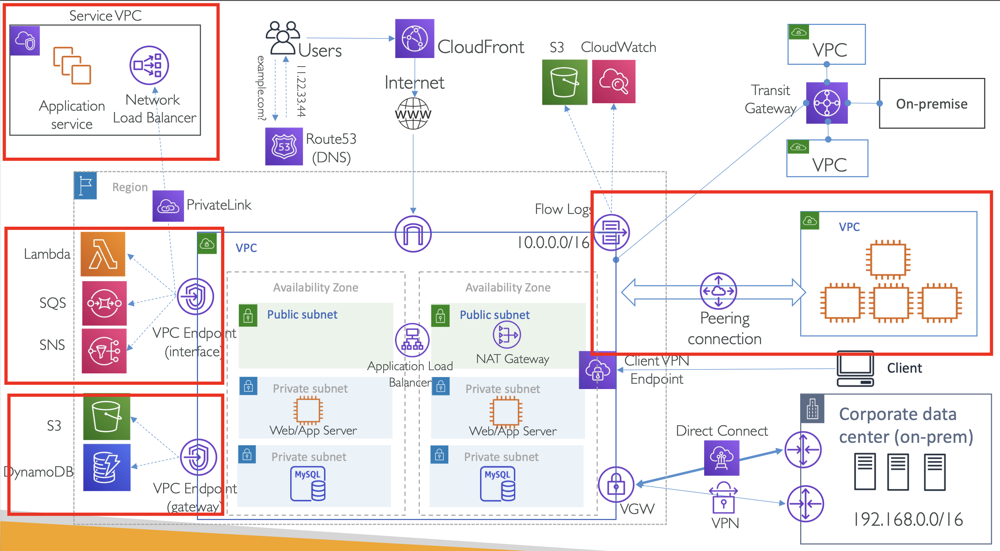

# Introduction to VPC private connectivity options

  

Private Connectivity가 필요한 이유?

## Disadvantages of having Internet based traffic

- Security: 인터넷에 노출되면 보안 리스크가 발생할 수 있음.
- Consistent bandwidth and Latency: 트래픽이 인터넷을 타다보니, 대역폭이나 레이턴시 등을 예상할 수 없음
- Cost: NAT 기기는 시간 당 실행과 데이터 처리에 비용이 발생
- Public 환경이 필요 없는데도 불구하고 서버가 불필요하게 오픈될 수 있음 (가령, 데이터베이스, 앱 서버, 인트라넷 앱 서버 등)

=> 이를 위해 살펴볼만한 내용: VPC Peering, VPC Endpoints, VPC PrivateLink
