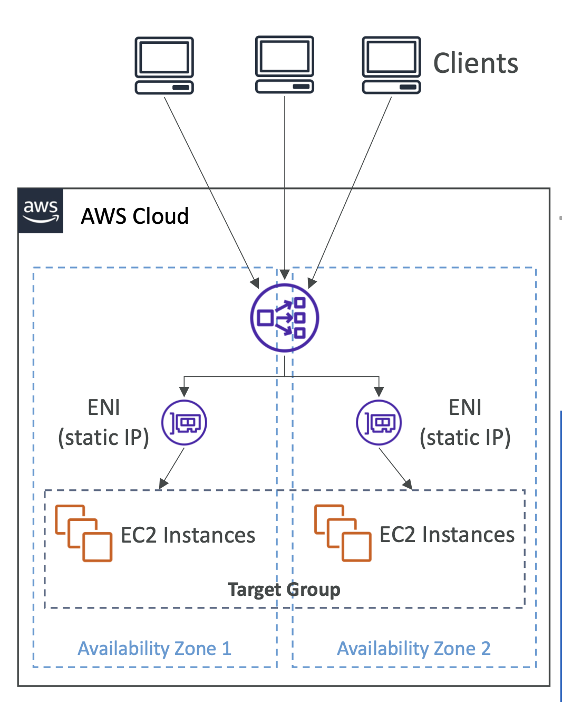

# Network Load Balancer

- Layer 4 (TCP)에서 작동
- 지원 프로토콜: TCP, TLS (secure TCP), UDP
- 초당 수백만 개의 요청 처리 가능
- NLB는 **가용 영역당 하나의 정적 IP를 가지고 있으며**, Elastic IP를 할당할 수 있음 (인터넷에 노출된 NLB)
    - 특정 IP 주소를 화이트리스트하는 데 유용함
- 동일한 머신/포트에서 여러 애플리케이션에 대한 로드 밸런싱 지원 (e.g., 컨테이너, Amazon ECS)
- 지연 시간이 적음 (~100 ms) (ALB는 ~400 ms)
- WebSocket 프로토콜 지원
- Network Load Balancer는 주로 다음과 같은 경우에 사용됨:
    - 극한의 성능, TCP 또는 UDP 트래픽
    - AWS PrivateLink와 함께: 내부 서비스를 비공식적으로 노출

  

- **Target Groups**
    - EC2 Instances (can be managed by an Auto Scaling Group (이하 ASG))
    - ECS Tasks (ECS 자체에서 관리)
    - IP Addresses (private IP addresses only)
        - TCP listeners only (온프레미스 서버에 AWS Direct Connect 또는 VPN 연결을 통해)
        - Inter-region 피어링 VPC 가능

- EC2 인스턴스 ID로 EC2 인스턴스를 등록할 수 없음 (NLB VPC와 피어링된 경우에도)
    - 대신 IP 주소로 등록해야 함

- **Health Checks**
    - 지원되는 프로토콜: HTTP, HTTPS, TCP
    - Active Health Check – 주기적으로 등록된 타겟에 요청을 보냄
    - Passive Health Check – 타겟이 연결에 응답하는 방식을 관찰함. Active Health Check보다 먼저 비정상 타겟을 감지함 (비활성화하거나 구성할 수 없음)

 

### **Client IP Preservation**

\: 클라이언트 IP를 타겟에 포워딩

- 인스턴스 ID / ECS 태스크에 의한 타겟: **활성화됨**
- IP 주소에 의한 타겟 **TCP & TLS**: **🚨 기본적으로 "비활성화"됨**
- IP 주소에 의한 타겟 **UDP & TCP_UDP**: **기본적으로 활성화됨**

✔️ **"비활성화"**된 경우 Proxy Protocol v2 사용 (헤더 추가됨)

 

> 만약, 인스턴스 ID나 ECS 태스크에 의해 타겟을 등록하는 경우,
> 클라이언트의 IP가 보존되고 EC2 인스턴스는 클라이언트로부터 직접 트래픽을 수신하게 됨.
>
> 만약 IP 주소를 사용하여 TCP 또는 Secure TCP (TLS 프로토콜)로 타겟을 등록하는 경우,
> 기본적으로 클라이언트의 IP 보존이 비활성화됨.
>
> 이 경우, 만약 UDP 나 TCP_UDP 프로토콜을 사용하고 있다면, 기본적으로 클라이언트 IP 보존이 활성화됨.
> 이 경우, 만약 비활성되어 있다면, Proxy Protocol v2를 사용하여 활성화할 수 있음.

 

| Listener                                                | Target                                           |
| ------------------------------------------------------- | ------------------------------------------------ |
| TCP                                                     | TCP or TCP_UDP                                   |
| TLS – SSL Termination (Must install certificate on NLB) | TCP or TLS (Must install certificate on targets) |
| UDP                                                     | UDP or TCP_UDP                                   |
| TCP_UDP                                                 | TCP_UDP                                          |

## Network Load Balancer – Availability Zones

<table>
<tr>
<td>

- 특정 AZ에 트래픽을 보내려면 반드시 AZ를 활성화해야 함 (AZ를 활성화하지 않으면 트래픽을 보낼 수 없음)
- AZ를 활성화한 후 에 AZ를 제거할 수 없음
- Cross-Zones Load Balancing은 NLB가 활성화된 AZ에 대해서만 작동함

</td>
<td>

- Cross-Zones Load Balancing은 NLB가 활성화된 AZ에 대해서만 작동함

NLB는 Cross-Zone Load Balancing을 지원하기 때문에 AZ 1과 AZ 2에 활성화된 경우, 트래픽을 상호 분산할 수 있음

</td>
</tr>
</table>

