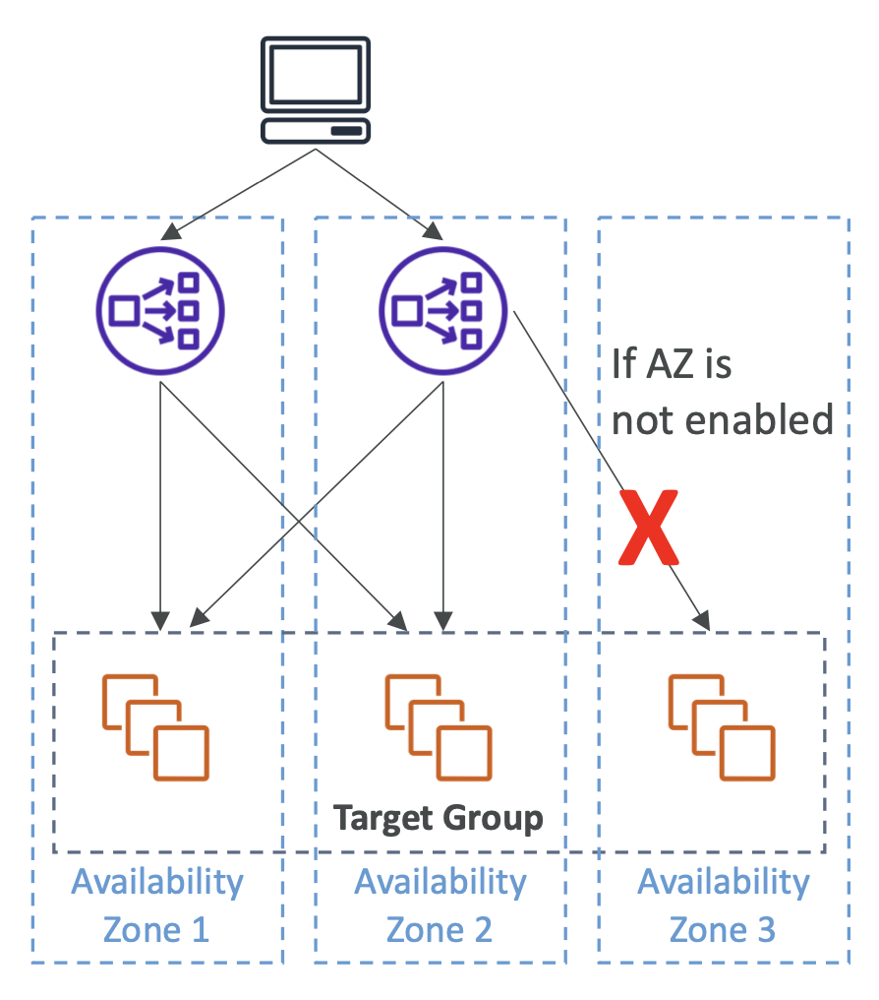

# Network Load Balancer

- Layer 4 (TCP)에서 작동
- 지원 프로토콜: TCP, TLS (secure TCP), UDP
- 초당 수백만 개의 요청 처리 가능
- NLB는 **가용 영역당 하나의 정적 IP를 가지고 있으며**, Elastic IP를 할당할 수 있음 (인터넷에 노출된 NLB)
  - 특정 IP 주소를 화이트리스트하는 데 유용함
- 동일한 머신/포트에서 여러 애플리케이션에 대한 로드 밸런싱 지원 (e.g., 컨테이너, Amazon ECS)
- 지연 시간이 적음 (~100 ms) (ALB는 ~400 ms)
- WebSocket 프로토콜 지원
- Network Load Balancer는 주로 다음과 같은 경우에 사용됨:
  - 극한의 성능, TCP 또는 UDP 트래픽
  - AWS PrivateLink와 함께: 내부 서비스를 비공식적으로 노출

  

- **Target Groups**
  - EC2 Instances (can be managed by an Auto Scaling Group (이하 ASG))
  - ECS Tasks (ECS 자체에서 관리)
  - IP Addresses (private IP addresses only)
    - TCP listeners only (온프레미스 서버에 AWS Direct Connect 또는 VPN 연결을 통해)
    - Inter-region 피어링 VPC 가능

- EC2 인스턴스 ID로 EC2 인스턴스를 등록할 수 없음 (NLB VPC와 피어링된 경우에도)
  - 대신 IP 주소로 등록해야 함

- **Health Checks**
  - 지원되는 프로토콜: HTTP, HTTPS, TCP
  - Active Health Check – 주기적으로 등록된 타겟에 요청을 보냄
  - Passive Health Check – 타겟이 연결에 응답하는 방식을 관찰함. Active Health Check보다 먼저 비정상 타겟을 감지함 (비활성화하거나 구성할 수 없음)

 

## Network Load Balancer TCP & UDP - based Traffic

  

### Client IP Preservation

\: 클라이언트 IP를 타겟에 포워딩

- 인스턴스 ID / ECS 태스크에 의한 타겟: **활성화됨**
- IP 주소에 의한 타겟 **TCP & TLS**: **🚨 기본적으로 "비활성화"됨**
- IP 주소에 의한 타겟 **UDP & TCP_UDP**: **기본적으로 활성화됨**

✔️ **"비활성화"** 된 경우 Proxy Protocol v2 사용 (헤더 추가됨)

  

 

> 만약, 인스턴스 ID나 ECS 태스크에 의해 타겟을 등록하는 경우,
> 클라이언트의 IP가 보존되고 EC2 인스턴스는 클라이언트로부터 직접 트래픽을 수신하게 됨.
>
> 만약 IP 주소를 사용하여 TCP 또는 Secure TCP (TLS 프로토콜)로 타겟을 등록하는 경우,
> 기본적으로 클라이언트의 IP 보존이 비활성화됨.
>
> 이 경우, 만약 UDP 나 TCP_UDP 프로토콜을 사용하고 있다면, 기본적으로 클라이언트 IP 보존이 활성화됨.
> 이 경우, 만약 비활성되어 있다면, Proxy Protocol v2를 사용하여 활성화할 수 있음.

 

| Listener                                                 | Target                                            |
|----------------------------------------------------------|---------------------------------------------------|
| TCP                                                      | TCP or TCP_UDP                                    |
| TLS – SSL Termination (Must install certificate on NLB)  | TCP or TLS (Must install certificate on targets)  |
| UDP                                                      | UDP or TCP_UDP                                    |
| TCP_UDP                                                  | TCP_UDP                                           |

 

## Network Load Balancer – Availability Zones

<table>
<tr>
<td>

- 특정 AZ에 트래픽을 보내려면 반드시 AZ를 활성화해야 함 (추후에 생성한 NLB를 추가할 수 있음)
- AZ를 활성화한 후에 AZ를 제거할 수 없음

만약 `AZ 1`에서만 NLB가 활성화된 경우, NLB는 AZ1에 있는 EC2 인스턴스에 트래픽을 분산할 수 있음

타겟 그룹 내에 `AZ 2`에 있는 EC2 인스턴스가 등록되어 있더라도, NLB는 AZ 2에 트래픽을 보낼 수 없음

</td>
<td>

- Cross-Zones Load Balancing은 NLB가 활성화된 AZ에 대해서만 작동함

NLB는 Cross-Zone Load Balancing을 지원하기 때문에 AZ 1과 AZ 2에 활성화된 경우, 트래픽을 상호 분산할 수 있음

하지만, NLB가 비활성화된 AZ에 있는 EC2 인스턴스에는 트래픽을 보낼 수 없음

</td>
</tr>
</table>

 

## Network Load Balancer – Zonal DNS Name

  

- 리졸빙된 지역적 NLB DNS 이름은 NLB의 모든 노드에 대한 IP 주소를 반환함
  - `my-nlb-1234567890abcdef.elb.us-east-1.amazon.aws.com` ← NLB DNS 이름
  - 이 때, NLB는 모든 활성화된 AZ - `us-east-1a`, `us-east-1b`, `us-east-1c` - 에 대해 IP 주소를 반환함
  - : `172.31.7.90`, `172.31.27.8`, `172.31.44.7`

- **Zonal DNS Name**
  - NLB는 각 노드에 대한 DNS 이름을 가지고 있음
  - 각 노드에 대한 IP 주소를 확인하는 데 사용됨
  - <code><b>us-east-1a</b>.my-nlb-1234567890abcdef.elb.us-east-1.amazon.aws.com</code>
  - 지연 시간과 데이터 전송 비용을 최소화하기 위해 사용됨
  - 애플리케이션별 로직을 구현해야 함

 

<pre><b>Example. '특정 노드'를 리졸빙하고 싶을 때 - 지연 시간 최소화 or 데이터 전송 비용 절감</b>
가끔은 영역적(Zonal) DNS 이름을 사용하고 싶을 수 있음

예를 들어, 애플리케이션이 VPC에 배포되어 있고 세 개의 AZ에 배포되어 있으며 NLB와 통신한다고 가정.
<code>us-east-1a</code>에 있는 인스턴스는 당연히 <code>us-east-1a</code> 내에 있는 NLB 노드를 통해 통신하기를 원할 것.
데이터 전송 비용이 없고 지연 시간이 짧기 때문.

Regional NLB 이름을 사용한다면, 애플리케이션이 한 AZ에서 다른 AZ로 트래픽을 보내는 경우가 발생할 수 있으므로 비용이 발생할 수 있음.
따라서, NLB의 Zonal DNS 이름을 리졸빙하여 비용이 발생하지 않도록 보장하는 IP를 찾으려고 할 것.

이렇게 애플리케이션이 특정 NLB 노드에 트래픽을 보내도록 하려면 애플리케이션별 로직을 구현해야 함
</pre>

 

## Network Load Balancer – Good To Know

- 한 번 AZ를 생성한 후엔 AZ를 비활성화하거나 제거할 수 없음
- 각 AZ에 위치한 NLB의 ENI는 수정할 수 없음 (읽기 전용)
- 로드 밸런서를 생성한 후에 ENI에 연결된 EIP와 프라이빗 IPv4 주소를 변경할 수 없음
- 지원되는 타겟 그룹은 초당 440,000개의 동시 연결을 지원함
  - 초과 시 포트 할당 오류가 발생함
  - 해결 방법: 타겟 그룹에 더 많은 타겟을 추가함
- 인터넷에 노출된 로드 밸런서의 경우, 지정한 서브넷은 **최소 8개의 사용 가능한 IP 주소를 가져야 함 (e.g., 최소 `/28`)**
  내부 로드 밸런서의 경우, 서브넷에서 AWS가 프라이빗 IPv4 주소를 선택하도록 허용하는 경우에만 필요함

 

