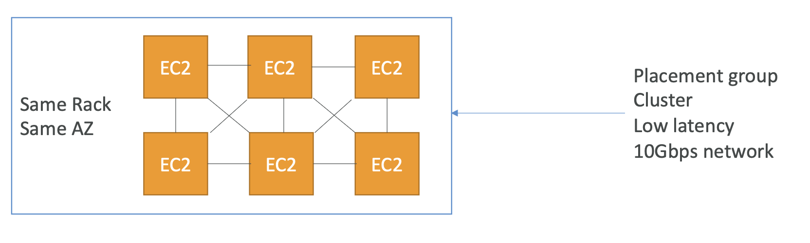
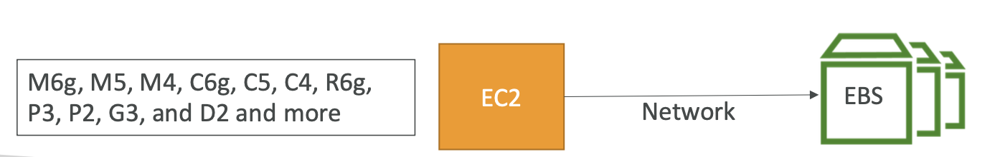

# Placement Groups and EBS Optimized EC2 instances

## Optimizing Network Performance

- Cluster Placement Groups
- EBS Optimized Instances
- Enhanced Networking ⭐️⭐️⭐️ (다음 장)

### ✔️ Cluster Placement Groups

동시에 시작하는 인스턴스가 물리적으로 서로 가까운 EC2 인스턴스 그룹

- 단일 AZ 내의 논리적인 인스턴스 그룹
- HPC 처럼 저지연이 필요한 분산 애플리케이션에 이상적임

<br><br>


### ✔️ EBS Optimized Instances

- EBS 는 Network Drive
  - 때문에, EC2와의 상호작용에는 항상 네트워크를 통해야 하며, 지연이 발생할 수 있다는 의미
  - → EBS 입출력은 네트워크 성능에 영향을 줌
  - EC2는 네트워크 인터페이스를 갖는데, EBS 또한 이를 통하고 있음
  - 입출력이 너무 많으면 인터넷 입출력 대역폭이 줄어들고, 인터넷 입출력이 너무 많으면 입출력 대역폭이 늘어날 것임

```
   Other traffic
         ↑
         |
         ⚡️
    +-- EC2 --+                +--EBS--+ 
    |    🖥️   | ⚡️----------> |       |
    +---------+     Network    +-------+
```

- **Amazon EBS-optimized instances** 는 Amazon EC2 와 Amazon EBS 사이에 지정된 대역폭을 가짐
- Amazon EC2 instance 로 시작하는 트래픽과 Amazon EBS Input/Output (I/O)의 경쟁을 최소화

<br><br>


