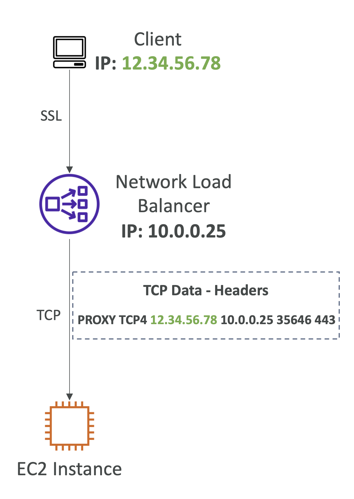

# Proxy Protocol

- 인터넷 프로토콜은 소스(커넥션을 요청하는 곳)에서 목적지(커넥션을 요청받는 곳)로 정보를 전달하는 데 사용됨
- LB가 연결을 종료하면 클라이언트의 소스 IP 주소를 보존할 수 없음
- 소스/대상 IP 주소와 포트 번호를 전달하기 위해 Proxy Protocol을 사용
- 로드 밸런서는 TCP 데이터에 프록시 프로토콜 헤더를 추가
- Classic Load Balancer(TCP/SSL) 및 Network Load Balancer 모두에서 사용할 수 있음

<br/><br/>

<br/><br/>


<table><tr><td colspan="2">

[🔗 Preserving client IP address with Proxy protocol v2 and Network Load Balancer](https://aws.amazon.com/ko/blogs/networking-and-content-delivery/preserving-client-ip-address-with-proxy-protocol-v2-and-network-load-balancer/)

Proxy Protocol은 특정 형식을 따름.

Proxy Protocol은 클라이언트와 서버 간의 원래 연결 정보를 보존하기 위해 사용됨.

Proxy Protocol에는 v1과 v2 두 가지 버전이 있으며, v2는 더 효율적이고 확장성이 좋음.

</td></tr>
<tr>
<th>Proxy Protocol v1</th>
<th>Proxy Protocol v2</th>
</tr>
<tr><td>

Proxy Protocol v1은 텍스트 기반이며, 다음과 같은 형식을 가짐:

```
PROXY TCP4 198.51.100.1 203.0.113.1 56324 443\r\n
```

- `PROXY`: Proxy Protocol을 나타내는 고정 문자열
- `TCP4`: IPv4를 사용하는 TCP 연결
- `198.51.100.1`: 원본 클라이언트의 IP 주소
- `203.0.113.1`: 목적지 서버의 IP 주소
- `56324`: 원본 클라이언트의 포트 번호
- `443`: 목적지 서버의 포트 번호
- `\r\n`: 줄 바꿈 문자

</td>
<td>

Proxy Protocol v2는 바이너리 형식이며, 더 컴팩트하고 효율적.

다음과 같은 형식을 가짐:

- **Source address** – 원본 주소. 연결을 시작한 클라이언트의 원본 IP 주소
- **Destination address** – 목적지 주소. 연결을 수신하는 프록시 또는 로드 밸런서의 IP 주소
- **Source port** – 원본 포트. 클라이언트 측에서 연결이 시작되는 포트 번호
- **Destination port** – 목적지 포트. 프록시 또는 로드 밸런서 측에서 연결이 지향되는 포트 번호
- **Protocol** – 프로토콜. 연결에 사용되는 네트워크 프로토콜 (예: TCP 또는 UDP)
- **Version** – 버전. 사용되는 Proxy Protocol의 버전 (예: v2)
- **Family** – 주소 패밀리. 원본 및 목적지 IP 주소의 주소 패밀리 (예: IPv4 또는 IPv6)
- **Length** – 길이. Proxy Protocol 헤더의 길이
- **Checksum** – 체크섬. 헤더의 무결성을 보장하기 위한 체크섬 값
- **Type-length-value (TLV)** – 타입 길이 값. 맞춤형 데이터 (예: 가상 프라이빗 클라우드(VPC) 엔드포인트 ID)

위 정보들은 Proxy Protocol v2 헤더에 인코딩되어 있으며,
프록시 또는 로드 밸런서가 백엔드 서버에게 클라이언트 연결 정보를 정확하게 전달하는 데 사용.

Proxy Protocol v2는 바이너리 형식이기 때문에 사람이 직접 읽기 어렵지만, 효율성과 확장성을 제공.

이를 통해 서버는 클라이언트의 원래 IP 주소 및 포트 번호를 알 수 있고, 이를 기반으로 로깅이나 접근 제어를 할 수 있음

</td></tr></table>

<br/>

## Proxy Protocol

- **CLB**는 **Proxy Protocol 버전 1**을 사용하고 **NLB**는 **Proxy Protocol 버전 2**를 사용
- **Network Load Balancer의 경우**:
  - **인스턴스 ID 및 ECS 작업이 있는 타겟**: 클라이언트의 소스 IP가 보존됨 ⭕️
  - **IP 주소가 있는 타겟**:
    - **TCP 및 TLS**: 클라이언트의 소스 IP가 보존되지 않음 ❌, Proxy Protocol을 활성화해야 함
    - **UDP 및 TCP_UDP**: 클라이언트의 소스 IP가 보존됨 ⭕️
- 로드 밸런서는 프록시 서버 뒤에 있어서는 안 됨, 그렇지 않으면 백엔드가 중복 구성 정보를 수신하여 오류가 발생할 수 있음
- 프록시 프로토콜은 Application Load Balancer를 사용할 때 필요하지 않음, ALB는 이미 HTTP `X-Forwarded-For` 헤더를 삽입함

⚠️ Proxy Protocol은 오직 NLB가 IP 주소가 있는 타겟의 TCP/TLS로 연결될 때 사용됨

<br/>

<table><tr><td>

### Network Load Balancer: Hots-based targets vs. IP-based targets

#### Hots-based Targets
- NLB가 특정 서버나 컨테이너로 데이터를 보낼 때, NLB는 그 서버나 컨테이너에 직접 연결.
- **소스 IP 보존**: 클라이언트의 원래 IP 주소를 그대로 유지. 서버는 클라이언트의 진짜 IP 주소를 볼 수 있음.

#### IP-based Targets
- 타겟이 IP 주소인 경우, NLB는 지정된 IP 주소로 트래픽을 전달. 이 IP 주소는 서버나 다른 네트워크 장치일 수 있음.
- **소스 IP 보존**:
  - **TCP 및 TLS 프로토콜**: 
    - NLB가 패킷을 수정해 타겟 IP로 전달
    - 때문에, 기본적으로 클라이언트의 IP 주소가 유지되지 않음
    - 서버는 클라이언트 IP 대신 NLB의 IP 주소를 봄
    - 원래 IP 주소를 보존하려면 특별한 설정(Proxy Protocol)을 해야 함
  - **UDP 및 TCP_UDP 프로토콜**:
    - 클라이언트의 IP 주소가 그대로 유지
    - 서버는 클라이언트의 진짜 IP 주소를 볼 수 있음

</td></tr></table>
