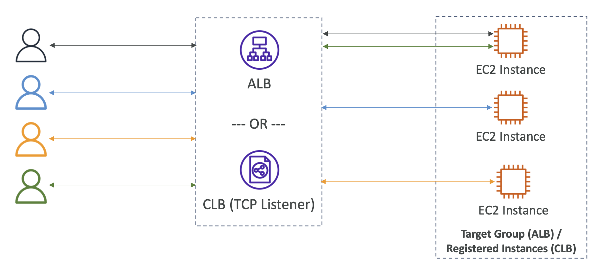

# Request Routing Algorithm

## Request Routing Algorithms – Least Outstanding Requests

- Pending/Unfinished Request의 수가 가장 적은 인스턴스에 요청 전달
- Application Load Balancer와 Classic Load Balancer (HTTP/HTTPS)에서 작동

  

 

## Request Routing Algorithms – Round Robin

- 타겟 그룹으로 부터 대상을 고르게 선택
- Application Load Balancer와 Classic Load Balancer (TCP)에서 작동

  

 

## Request Routing Algorithms – Flow Hash

- 프로토콜, 소스/대상 IP 주소, 소스/대상 포트 및 TCP 시퀀스 번호를 기반으로 대상을 선택
- TCP/UDP 연결은 연결 수명 동안 단일 대상에 라우팅됨
- Network Load Balancer와 작동

  

## Summary

|            | Least Outstanding Requests                                                | Round Robin                                                        | Flow Hash                                                                            |
|------------|---------------------------------------------------------------------------| ------------------------------------------------------------------ | ------------------------------------------------------------------------------------ |
|            |         |  |                    |
| 알고리즘       | Pending/Unfinished Request의 수가 가장 적은 인스턴스에 요청 전달                          | 타겟 그룹으로 부터 대상을 고르게 선택                               | 프로토콜, 소스/대상 IP 주소, 소스/대상 포트 및 TCP 시퀀스 번호를 기반으로 대상을 선택 |
| 동작 위치      | - Application Load Balancer -Classic Load Balancer - → HTTP/HTTPS | - Application Load Balancer -Classic Load Balancer - → TCP | - Network Load Balancer                                                              |
