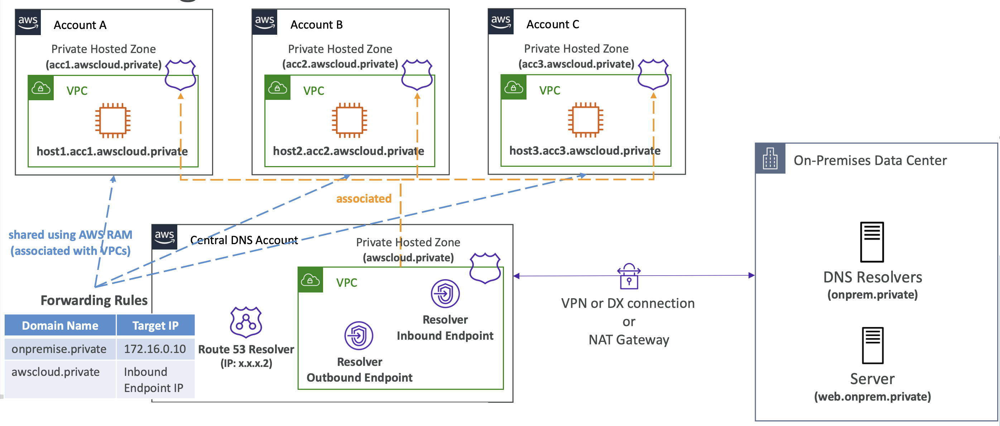

# Route 53 – Resolver DNS Firewall

- 관리형 방화벽으로, VPC에서 Route 53 Resolver를 통해 아웃바운드 DNS 요청을 필터링 가능
- 악성 도메인malicious domains을 차단(Blacklist) 하거나 신뢰할 수 있는 도메인만 허용(Whitelist)
- 이는 VPC 내부의 애플리케이션이 **악성 도메인으로 DNS를 통해 데이터를 유출하는 것(DNS Exfiltration)** 을 방지하기 위한 기능

- AWS Firewall Manager를 통해 관리 및 구성할 수 있음
- CloudWatch Logs 및 Route 53 Resolver 쿼리 로그(Query Logs) 와 통합됨
- **Fail-close vs Fail-Open (DNS Firewall Configuration):**
  - **Fail-close**: DNS 방화벽에서 응답이 없으면 쿼리 차단 (**가용성보다 보안 우선**)
  - **Fail-open**: DNS 방화벽에서 응답이 없으면 쿼리 허용 (**보안보다 가용성 우선**)

   

## Route 53 Solution Architecture Split-View DNS (Split-Horizon)
- 내부와 외부에서 동일한 도메인 이름을 사용
- **퍼블릭과 프라이빗 호스티드 존**이 동일한 이름(예: `example.com`)을 가짐
- 사용 사례:
  - 내부와 외부 사용자에게 **다른 콘텐츠를 제공**하거나,
  - **다른 인증 방식**을 요구해야 할 때

   

## Solution Architecture – Multi-Account DNS Management with Route 53 Resolver

: Route 53 Resolver를 이용한 다중 계정 DNS 관리

  

