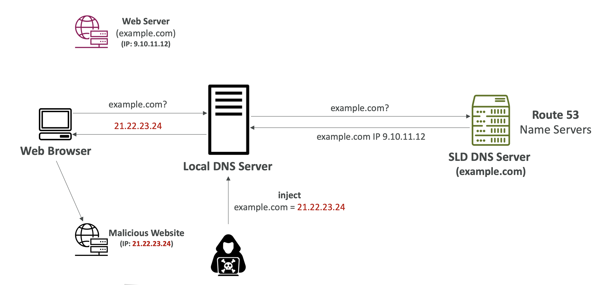
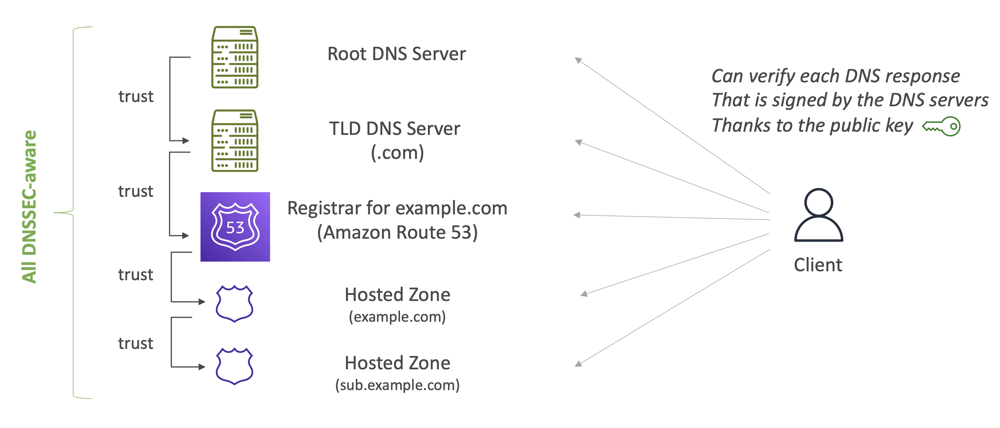

# Route 53 - DNSSEC

## DNS Poisoning (Spoofing)

- DNS는 UDP 프로토콜을 사용하므로 쉽게 해킹될 수 있음
- 따라서, DNSSEC 를 사용하여 데이터를 암호화하고 서명하여 데이터의 무결성을 보장함

  

1. **정상적인 흐름**
   - 사용자가 `example.com`에 접속하려고 함
   - 웹 브라우저는 로컬 DNS 서버에 `example.com`의 IP 주소를 요청
   - 로컬 DNS 서버는 Authoritative DNS 서버(e.g. Route 53)에 요청을 보내 `example.com`의 올바른 IP인 `9.10.11.12`를 받아옴
   - 클라이언트는 이 IP로 접속 → 정상 웹사이트에 연결 

2. **DNS Spoofing**

   - 공격자가 어떤 방식으로든 로컬 DNS 서버에 잘못된 정보 `example.com` = `21.22.23.24`를 주입
   - 그 결과 로컬 DNS 서버는 **가짜 IP 주소**를 응답
   - 클라이언트는 이를 믿고 악성 서버(`21.22.23.24`)에 접속 → 피싱, 데이터 탈취 등의 위험

 

**취약점**

- DNS는 기본적으로 **UDP 기반 프로토콜**로 동작하며, 이는 위조가 상대적으로 쉬움
- **DNSSEC**이 없는 경우, DNS 응답에 대한 **암호학적 서명 또는 무결성 검증**이 없음 → 위조 탐지 불가.

 

**해결**
→ ✅ **DNSSEC**(Domain Name System Security Extensions)은 DNS 응답에 디지털 서명을 추가하여,
  - 데이터의 무결성을 보장하고
  - 위조된 DNS 응답을 탐지 가능하게 함
- 따라서 DNS 스푸핑이나 포이즈닝 같은 공격을 **방지하거나 완화**할 수 있음

 

## Route 53 – DNS Security Extensions (DNSSEC)

- DNS 트래픽을 보호하기 위한 프로토콜은 DNS 데이터의 무결성과 출처를 검증함
- **퍼블릭 호스티드 존**Public Hosted Zone에서만 작동함
- Route 53 은 도메인 등록Domain Registration과 서명Signing 모두에 대해 DNSSEC 를 지원함
- **DNSSEC Signing**
  - 응답이 Route 53 에서 온 것인지 검증하고 변조되지 않았는지 확인함
  - Route 53 은 호스티드 존의 각 레코드를 암호화하여 서명함
  - **두 가지 키** (기억해둬야 함 ⭐️):
    - **관리자가 관리하는 키**: **Key-signing Key** (KSK) - AWS KMS 내 **비대칭 CMK 키**asymmetric CMK 기반
    - **AWS 가 관리하는 키**: **Zone-signing **Key (ZSK)
  - 활성화되면, Route 53 는 호스티드 존의 모든 레코드에 대해 TTL 을 1주일로 설정함
    - TTL 이 1주일 미만인 레코드는 영향을 받지 않음

 

## Route 53 – Enable DNSSEC on a hosted zone

- **1단계 – DNSSEC 서명을 위한 준비**
  - 고객 피드백 등을 통해 **영역 가용성 모니터링**
  - **레코드의 TTL(Time-To-Live)**을 낮춤 (1시간 권장)
  - **SOA 레코드의 최소값**을 5분으로 설정

- **2단계 – DNSSEC 서명 활성화 및 KSK(Key Signing Key) 생성**

  - Route 53 콘솔 또는 CLI를 사용해 **DNSSEC 활성화**
  - 콘솔에서 **KSK 생성** 시, 고객이 관리하는 **CMK(Customer Managed Key)**에 연결되도록 설정

- **3단계 – 신뢰 체인(Chain of Trust) 구축**

  - 호스팅 영역과 상위parent 호스팅 영역 간에 신뢰 체인 생성
  - **상위parent 영역에 DS(Delegation Signer) 레코드 생성**
    - ⭐️ 상위parent 영역에는 반드시 하위child 영역을 신뢰하는 레코드가 존재해야함
  - DS 레코드는 **DNS 레코드를 서명하는 공개 키의 해시**를 포함
  - 도메인 등록기관은 Route 53일 수도 있고, 타사 등록기관도 가능

- **4단계 – (선택 사항) CloudWatch 알람으로 오류 모니터링**
  - `DNSSECInternalFailure`와 `DNSSECKevSigningKeysNeedingAction` 이벤트에 대해 **CloudWatch 알람 설정**

 

## DNSSEC – Chain of Trust

**신뢰 체인**을 통한 퍼블릭키 덕분에 DNS 서버에 인증된 각 DNS 응답을 검증할 수 있음

  

- **Root DNS Server** 가 **TLD DNS Server (.com)** 를 신뢰하고,
- 🔗 **TLD DNS Server** 가 **Registrar for example.com (Amazon Route 53)** 를 신뢰하고,
- 🔗 **Registrar for example.com** 가 **Hosted Zone (example.com)** 를 신뢰하고,
- 🔗 **Hosted Zone** 가 **하위 Hosted Zone (sub.example.com)** 를 신뢰

