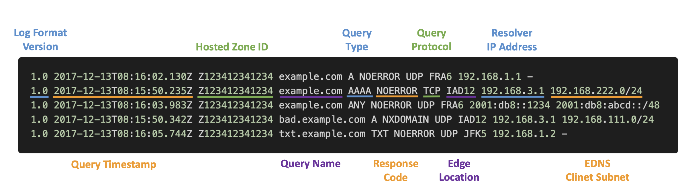
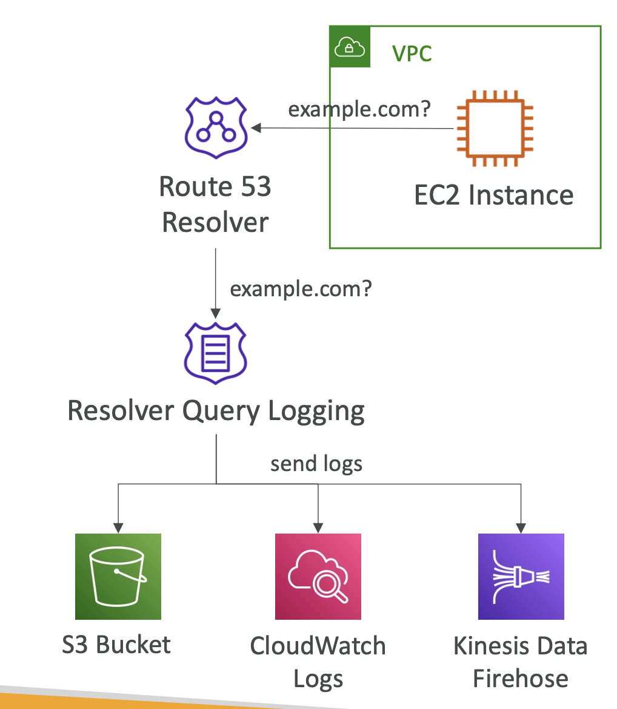
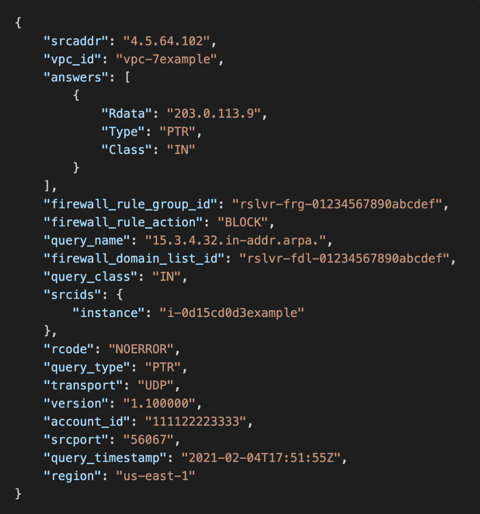

# Route 53 – DNS Query Logging

- Route 53 Resolver가 받은 퍼블릭 DNS 쿼리에 대한 정보 기록
- 퍼블릭 호스티드 존에 대해서만 적용
- 로그를 CloudWatch Logs로 전송 가능 (S3로 내보낼 수 있음)

  

 

- VPC 내의 리소스가 수행한 모든 DNS 쿼리 기록
  - Private Hosted Zones
  - Resolver Inbound & Outbound Endpoints
  - Resolver DNS Firewall
- 로그를 CloudWatch Logs, S3 버킷 또는 Kinesis Data Firehose로 전송 가능
- AWS Resource Access Manager (AWS RAM)를 사용하여 다른 AWS 계정과 구성 공유 가능

  

 

#### Example

  